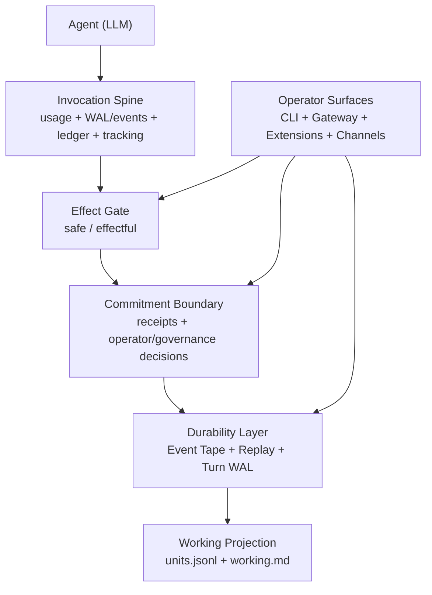

# Brewva

<p align="center">
  <a href="https://github.com/arcthur/brewva/actions/workflows/ci.yml?branch=main"></a>
  <a href="https://github.com/arcthur/brewva/releases"></a>
  <a href="LICENSE"></a>
</p>

Brewva is an AI-native coding-agent runtime built with Bun and TypeScript. It keeps agent execution explicit, evented, and recoverable: intelligence can explore and propose, but the runtime authorizes effects and records durable system commitments.

**Intelligence explores. Kernel authorizes effects. Tape remembers commitments.**

## What Brewva Optimizes For

- Deterministic runtime boundaries for context, tools, verification, cost, and state mutation
- A shared invocation spine with an explicit `safe | effectful` execution boundary
- Tape-first durability and replay, with working state rebuilt from event history
- Explicit proposal and governance boundaries instead of implicit agent-side mutation
- Replay-first approval and rollback flows instead of hidden in-memory authority
- Bounded autonomy through policy-driven execution, context pressure controls, and failure handling
- Extensible operator surfaces through CLI, gateway, extensions, channel adapters, and ingress packages

The runtime is optimized around one question:

`Why can we trust this agent action?`

## Architecture



Current runtime shape:

- `safe` execution keeps read-only and observational work on the direct path.
- `effectful` execution records receipts, preserves rollbackability for reversible mutations, and routes approval-bound effects through `effect_commitment`.
- when no host `governancePort` authorizes an approval-bound effect, Brewva opens a replayable operator desk instead of silently permitting the action.
- pending and approved commitment requests are rebuilt from tape after restart, so approval flow is replay-first rather than process-local.

Repository-level change fitness may still integrate with Brewva through host
policy or imported evidence, but that remains adjacent to the default runtime
architecture rather than a kernel-owned merge or release gate.

Implementation detail and system boundaries:

- `docs/architecture/system-architecture.md`
- `docs/architecture/design-axioms.md`
- `docs/architecture/control-and-data-flow.md`
- `docs/reference/proposal-boundary.md`
- `docs/reference/runtime.md`
- `docs/reference/events.md`
- `docs/journeys/working-projection.md`

## Package Surfaces

- `@brewva/brewva-runtime`: runtime contracts, replay, projection, verification, governance, cost, and WAL durability
- `@brewva/brewva-tools`: runtime-aware tools for code, tape, task, schedule, observability, and explicit subagent flows
- `@brewva/brewva-gateway/runtime-plugins`: runtime hook wiring, integration guards, and hidden-context composition
- `@brewva/brewva-cli`: interactive CLI, print/json modes, replay/undo, daemon, and the user-facing front door into gateway-hosted channels
- `@brewva/brewva-gateway`: local control-plane daemon, worker supervision, and subagent/session orchestration
- `@brewva/brewva-channels-telegram`: Telegram adapter and transport
- `@brewva/brewva-ingress`: webhook worker/server ingress for Telegram edge delivery
- `distribution/brewva` and `distribution/brewva-*`: launcher and per-platform binary packages
- `distribution/worker`: edge deployment templates for webhook ingress

## Skill Surface

- Core skills: `repository-analysis`, `discovery`, `strategy-review`, `design`, `implementation`, `debugging`, `review`, `qa`, `ship`, `retro`
- Domain skills: `agent-browser`, `frontend-design`, `github`, `goal-loop`, `predict-review`, `structured-extraction`, `telegram`
- Operator skills: `git-ops`, `runtime-forensics`
- Meta skills: `self-improve`, `skill-authoring`

Protocol-oriented skills:

- `goal-loop` coordinates bounded continuity, explicit cadence, and objective
  iteration facts across repeated runs
- `predict-review` provides read-only multi-perspective debate and ranked
  hypotheses through public delegation tools
- `self-improve` distills repeated evidence, including loop-history facts, into
  improvement hypotheses and backlog items

For taxonomy details and project overlays, see `docs/guide/features.md` and `docs/reference/skills.md`.

One common delivery chain is:

`discovery -> strategy-review -> design -> implementation -> review -> qa -> ship -> retro`

This remains advisory and model-native. Runtime still owns verification,
derived workflow inspection surfaces, replay, and effect governance rather
than a kernel-managed stage planner.

## Quick Start

### Repository Mode

```bash
bun install
bun run build
bun run start -- --help
bun run start
```

### Local `brewva` Command

```bash
bun run install:local
brewva --help
brewva "Summarize recent runtime changes"
```

The local installer targets macOS and Linux and can build missing binaries automatically.

For complete installation, CLI, daemon, and channel setup guidance:

- `docs/guide/installation.md`
- `docs/guide/cli.md`
- `docs/guide/gateway-control-plane-daemon.md`
- `docs/guide/telegram-webhook-edge-ingress.md`

## Development

```bash
bun run check
bun test
bun run test:docs
bun run test:dist
bun run build:binaries
```

Useful additional commands:

```bash
bun run analyze:projection
bun run test:e2e
bun run test:e2e:live
```

## Documentation Map

| Section         | Path                    | Purpose                                                                 |
| --------------- | ----------------------- | ----------------------------------------------------------------------- |
| Guides          | `docs/guide/`           | Installation, operation, feature walkthroughs, and usage flows          |
| Architecture    | `docs/architecture/`    | Implemented design, invariants, and control/data boundaries             |
| Journeys        | `docs/journeys/`        | End-to-end flows across runtime, gateway, channels, and orchestration   |
| Reference       | `docs/reference/`       | Stable contracts for config, runtime API, tools, events, and extensions |
| Troubleshooting | `docs/troubleshooting/` | Failure patterns and remediation                                        |
| Research        | `docs/research/`        | Incubating design notes and roadmap material                            |

Start from `docs/index.md` for the full documentation map.

## Related Guides

- `docs/guide/overview.md`
- `docs/guide/features.md`
- `docs/guide/orchestration.md`
- `docs/guide/understanding-runtime-system.md`
- `docs/reference/commands.md`

## Inspired By

- [Amp](https://ampcode.com/)
- [bub](https://bub.build/)
- [openclaw](https://openclaw.ai/)

## License

[Apache](LICENSE)
