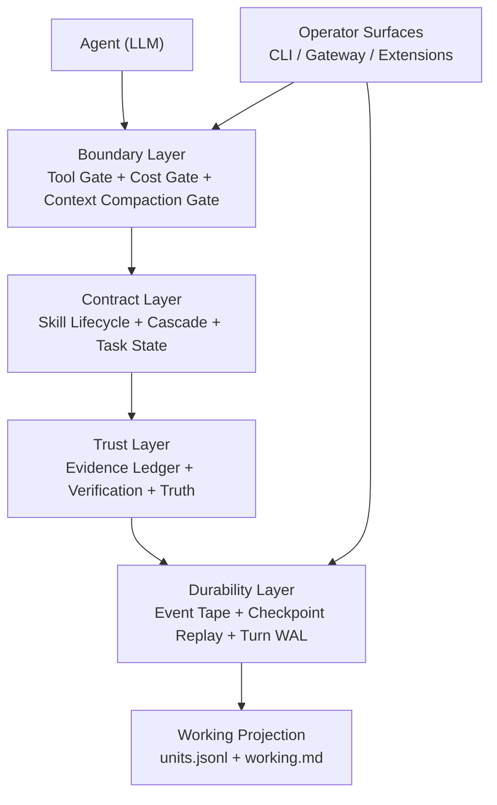

# Brewva

<p align="center">
  <a href="https://github.com/arcthur/brewva/actions/workflows/ci.yml?branch=main"></a>
  <a href="https://github.com/arcthur/brewva/releases"></a>
  <a href="LICENSE"></a>
</p>

Brewva is a commitment runtime for AI coding agents. It keeps governance explicit, evented, and recoverable, and records every accepted commitment in an append-only tape that doubles as audit trail and recovery source.

**Intelligence proposes. Kernel commits. Tape remembers.**

## Core Position

**Brewva's kernel does not try to make the agent smarter. Brewva decides what is allowed to become a system commitment.**

Optional control-plane helpers may rank, plan, summarize, or judge. Those
deliberation paths stay outside the kernel. The kernel only accepts proposals,
commits or rejects them, and records the resulting execution path.

The runtime is optimized for one question:

`Why can we trust this agent action?`

Design principles:

1. **Single-path explainability** — context injection, tool gating, compaction, and budget decisions follow deterministic runtime paths.
2. **Tape-first replayability** — event tape + checkpoint replay is the recovery source of truth; behavior is reconstructable after failure.
3. **Bounded autonomy** — context, tools, cost, and parallelism all have explicit limits and fail-closed behavior under pressure.
4. **Evidence-first contracts** — verification, ledger, task/truth updates, and skill lifecycle are explicit contract boundaries.
5. **Working projection only** — projection state is a deterministic fold from tape (`units` + `working.md`), not adaptive cognition.
6. **Proposal, not power** — cognition can happen anywhere, but only kernel commitments may mutate authoritative state.

## Architecture

Conceptual architecture view (high-level intent and control model):



Implementation-level architecture (package DAG, execution profiles, hook wiring):
`docs/architecture/system-architecture.md` · `docs/architecture/design-axioms.md` · `docs/architecture/control-and-data-flow.md` · `docs/reference/proposal-boundary.md` · `docs/journeys/working-projection.md`

Primary package surfaces:

- `@brewva/brewva-runtime`: governance runtime contracts, tape replay, verification, working projection, cost.
- `@brewva/brewva-deliberation`: proposal producers, evidence/query helpers, cognition artifact bridges, and control-plane planning helpers.
- `@brewva/brewva-tools`: runtime-aware tools (ledger/task/tape/skill/cost/governance flows).
- `@brewva/brewva-extensions`: lifecycle hook wiring, runtime integration guards, deterministic handoff, and extension-side debug loops.
- `@brewva/brewva-cli`: user entrypoint and session bootstrap (`interactive` / `--print` / `--json` / replay/undo).
- `@brewva/brewva-gateway`: local control-plane daemon and worker supervision.
- `@brewva/brewva-channels-telegram`: Telegram channel adapter and transport.
- `@brewva/brewva-ingress`: webhook worker/server ingress for Telegram edge delivery.

Skills v2 taxonomy:

- Core capability skills (`skills/core/`): `repository-analysis`, `design`, `implementation`, `debugging`, `review`
- Domain capability skills (`skills/domain/`): `agent-browser`, `frontend-design`, `github`, `telegram`, `structured-extraction`
- Continuity-gated domain skill: `goal-loop`
- Operator skills (`skills/operator/`): `runtime-forensics`, `git-ops`
- Meta skills (`skills/meta/`): `skill-authoring`, `self-improve`
- Project context (`skills/project/`):
  - shared context: `critical-rules`, `migration-priority-matrix`, `package-boundaries`, `runtime-artifacts`
  - overlays: `repository-analysis`, `design`, `implementation`, `debugging`, `review`, `runtime-forensics`

Lifecycle choreography such as verification, finishing, recovery, and compose-style planning is now runtime/control-plane behavior, not public routable skill surface.

## Quick Start

Choose one entry path:

### 1) Repository Mode (Contributor)

```bash
bun install
bun run build
bun run start -- --help
bun run start
```

### 2) Installed CLI Mode (Local Command)

```bash
bun run install:local
brewva --help
brewva "Summarize recent runtime changes"
```

For complete CLI modes and gateway/onboard operations:

- `docs/guide/cli.md`
- `docs/guide/installation.md`
- `docs/guide/gateway-control-plane-daemon.md`

## Runtime Defaults Snapshot

- Execution routing defaults to `security.execution.backend=best_available` with
  `security.execution.fallbackToHost=false`.
- Read-only verification is explicitly reported as `skipped` (not `pass`).
- Skill selection now crosses an explicit proposal boundary:
  `runtime.proposals.submit(sessionId, proposal) -> DecisionReceipt`.
  The kernel no longer exposes public selector/preselection APIs and no longer
  performs implicit cognition-side skill routing on its own.
- Broker- or planner-produced selection/chain intents are deliberation-layer
  proposals. Kernel acceptance creates pending dispatch gates, cascade intents,
  receipts, and replayable tape evidence.
- Standard routing profile defaults to `skills.routing.profile=standard` with
  `skills.routing.scopes=["core","domain"]`, so operator/meta skills are
  loaded but hidden from standard deliberation profiles.
- Cascade source defaults are now `["explicit", "dispatch"]`; compose-originated
  chain plans are no longer a public runtime source.
- Cascade missing consumes is deterministic pause (`reason=missing_consumes`);
  runtime no longer auto-replans dependency chains.
- Verification failures can now arm an extension-side debug loop that persists
  `debug-loop.json`, `failure-case.json`, and `handoff.json` under
  `.orchestrator/artifacts/` while reusing explicit cascade for retry.
  `retryCount` tracks scheduled retries after the first failed implementation
  verification, and `handoff.json` is the latest-wins session handoff snapshot.

## Development

```bash
bun run check              # Full quality gate (format + lint + typecheck + typecheck:test)
bun test                   # Run unit + integration tests
bun run test:docs          # Validate documentation quality
bun run analyze:projection  # Project working-projection quality from tape events (offline)
```

For distribution/release verification:

```bash
bun run test:dist          # Verify dist exports + CLI help banner
bun run build:binaries     # Compile platform binaries
```

## Documentation

| Section         | Path                    | Purpose                                                                 |
| --------------- | ----------------------- | ----------------------------------------------------------------------- |
| Guides          | `docs/guide/`           | Operational usage and system understanding                              |
| Architecture    | `docs/architecture/`    | System layers, control flow, invariants                                 |
| Journeys        | `docs/journeys/`        | End-to-end cross-module workflows                                       |
| Reference       | `docs/reference/`       | Contract-level definitions (config, tools, skills, events, runtime API) |
| Research        | `docs/research/`        | Incubating roadmap notes and design hypotheses with promotion targets   |
| Troubleshooting | `docs/troubleshooting/` | Failure patterns and remediation                                        |

## Inspired by

- [Amp](https://ampcode.com/)
- [bub](https://bub.build/)
- [openclaw](https://openclaw.ai/)

## License

[Apache](LICENSE)
