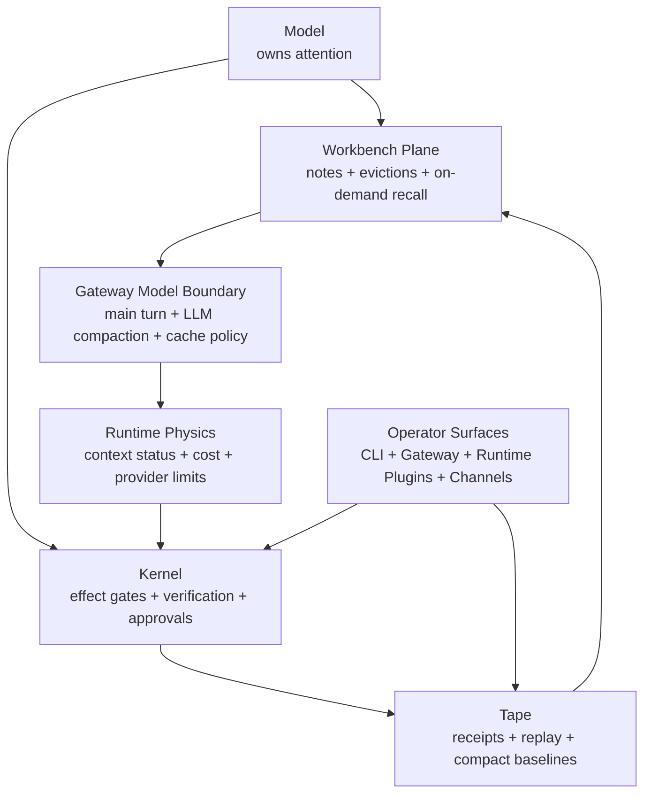

# Brewva

<p align="center">
  <a href="https://github.com/arcthur/brewva/actions/workflows/ci.yml?branch=main"></a>
  <a href="https://github.com/arcthur/brewva/releases"></a>
  <a href="LICENSE"></a>
</p>

Brewva is an AI-native coding-agent runtime built with Bun and TypeScript. It
lets the model operate its own working memory while the runtime keeps effects,
cost, cache, replay, and recovery explicit.

**Model owns attention. Kernel owns consequence. Tape owns truth. Runtime owns physics.**

## What Brewva Optimizes For

- Model-operated working memory through `workbench_note`, `workbench_evict`,
  `workbench_undo_evict`, on-demand `recall_search`, and LLM-driven
  `workbench_compact`
- Consequence governance through explicit `safe | effectful` execution and
  approval-bearing commitment boundaries
- Per-tool least privilege through repo-owned capability declarations and
  scoped runtime facades
- Tape-first durability and replay, with working state rebuilt from committed
  history and stored compact baselines
- Cache-aware request shaping, numeric context status, and provider usage
  accounting as first-class runtime physics
- Gateway-owned model calls for main turns, compaction, model routing, provider
  cache policy, and cost tracking
- Replay-first approval and rollback flows instead of hidden in-memory authority
- Extensible operator surfaces through CLI, gateway, runtime plugins, channel
  adapters, and ingress packages

The runtime is optimized around one question:

`How can the model stay autonomous without making effects or recovery untrustworthy?`

## Architecture



Current runtime shape:

- the model curates active attention through workbench tools and on-demand
  recall instead of a hidden per-turn context admission pipeline.
- LLM-driven compaction is the primary continuation path; deterministic
  compaction is an emergency degraded fallback.
- `safe` execution keeps read-only and observational work on the direct path.
- `effectful` execution records receipts, preserves rollbackability for
  reversible mutations, and routes approval-bound effects through
  `effect_commitment`.
- when no host `governancePort` authorizes an approval-bound effect, Brewva
  opens a replayable operator desk instead of silently permitting the action.
- pending and approved commitment requests are rebuilt from tape after restart,
  so approval flow is replay-first rather than process-local.

Repository-level change fitness may still integrate with Brewva through host
policy or imported evidence, but that remains adjacent to the default runtime
architecture rather than a kernel-owned merge or release gate.

Implementation detail and system boundaries:

- `docs/architecture/system-architecture.md`
- `docs/architecture/design-axioms.md`
- `docs/architecture/control-and-data-flow.md`
- `docs/reference/proposal-boundary.md`
- `docs/reference/runtime.md`
- `docs/reference/events/README.md`
- `docs/reference/token-cache.md`
- `docs/reference/exec-threat-model.md`
- `docs/reference/working-projection.md`

## Package Surfaces

- `@brewva/brewva-runtime`: runtime contracts, replay, projection,
  verification, governance, cost, workbench operation records, numeric context
  status, and WAL durability
- `@brewva/brewva-tools`: runtime-aware tools for code, tape, task, schedule,
  observability, workbench memory, recall, and explicit subagent flows
- `@brewva/brewva-gateway/runtime-plugins`: runtime plugin wiring,
  integration guards, workbench context composition, and cache-aware request
  shaping
- `@brewva/brewva-cli`: interactive CLI, print/json modes, replay/undo, daemon, and the user-facing front door into gateway-hosted channels
- `@brewva/brewva-gateway`: local control-plane daemon, worker supervision, and subagent/session orchestration
- `@brewva/brewva-channels-telegram`: Telegram adapter and transport
- `@brewva/brewva-ingress`: webhook worker/server ingress for Telegram edge delivery
- `distribution/brewva` and `distribution/brewva-*`: launcher and per-platform binary packages
- `distribution/worker`: edge deployment templates for webhook ingress

## Skill And Memory Surface

Skills are model-readable repository guidance, not hosted runtime gates.
Delegated workers define execution envelopes. The runtime owns effect
governance, verification, task truth, and patch adoption; the model owns which
guidance to read and what to preserve in the workbench.

The stable taxonomy is role-based:

- `core` and `domain` carry most authored work territory
- `operator` and `meta` are loaded and inspectable, but usually hidden from
  default routing scopes
- project overlays and shared guidance tighten repository behavior without
  creating a second public catalog

For taxonomy and exact generated inventories, see `docs/guide/features.md` and
`docs/reference/skills.md`.

One common advisory chain is:

`repository-analysis -> discovery -> strategy -> learning-research -> plan -> prep -> implementation -> review -> qa -> ship -> retro -> knowledge-capture`

New idea work starts further upstream:

`office-hours -> discovery -> strategy -> plan`

Architecture improvement work often inserts an explicit deepening pass:

`repository-analysis -> architecture -> plan -> implementation -> review`

This remains advisory and model-native. Runtime still owns verification,
derived workflow inspection surfaces, replay, and effect governance rather
than a kernel-managed stage planner.

`planning_posture` is an upstream handoff output for non-trivial work, not a
standalone skill or a hidden runtime planner.

For active continuity, the model writes workbench notes, evicts stale spans,
calls recall on demand, and compacts when context status says the physical
window is approaching a hard limit.

## Quick Start

### Repository Mode

```bash
bun install
bun run build
bun run start -- --help
bun run start
```

### Local `brewva` Command

```bash
bun run install:local
brewva --help
brewva "Summarize recent runtime changes"
```

The local installer targets macOS and Linux and can build missing binaries automatically.

For complete installation, CLI, daemon, and channel setup guidance:

- `docs/guide/installation.md`
- `docs/guide/cli.md`
- `docs/guide/gateway-control-plane-daemon.md`
- `docs/guide/telegram-webhook-edge-ingress.md`

## Development

```bash
bun run check
bun test
bun run test:docs
bun run test:dist
bun run build:binaries
```

Useful additional commands:

```bash
bun run analyze:projection
bun run test:system
bun run test:live
```

## Documentation Map

| Section         | Path                    | Purpose                                                                      |
| --------------- | ----------------------- | ---------------------------------------------------------------------------- |
| Guides          | `docs/guide/`           | Installation, operation, feature walkthroughs, and usage flows               |
| Architecture    | `docs/architecture/`    | Implemented design, invariants, and control/data boundaries                  |
| Journeys        | `docs/journeys/`        | Operator entrypoints and cross-package review flows                          |
| Reference       | `docs/reference/`       | Stable contracts for config, runtime API, tools, events, and runtime plugins |
| Solutions       | `docs/solutions/`       | Canonical repository-native engineering precedents and compound knowledge    |
| Troubleshooting | `docs/troubleshooting/` | Failure patterns and remediation                                             |
| Research        | `docs/research/`        | Incubating design notes and roadmap material                                 |

Start from `docs/index.md` for the full documentation map.

## Related Guides

- `docs/guide/overview.md`
- `docs/guide/features.md`
- `docs/guide/orchestration.md`
- `docs/guide/understanding-runtime-system.md`
- `docs/reference/commands.md`
- `docs/reference/token-cache.md`

## Inspired By

- [Amp](https://ampcode.com/)
- [bub](https://bub.build/)
- [openclaw](https://openclaw.ai/)

## License

[Apache](LICENSE)
