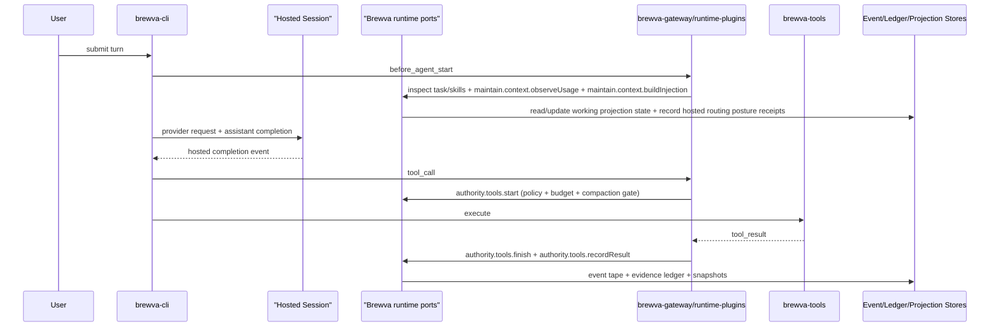
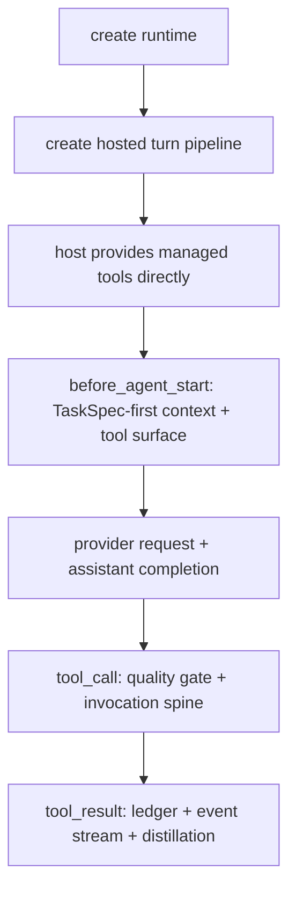
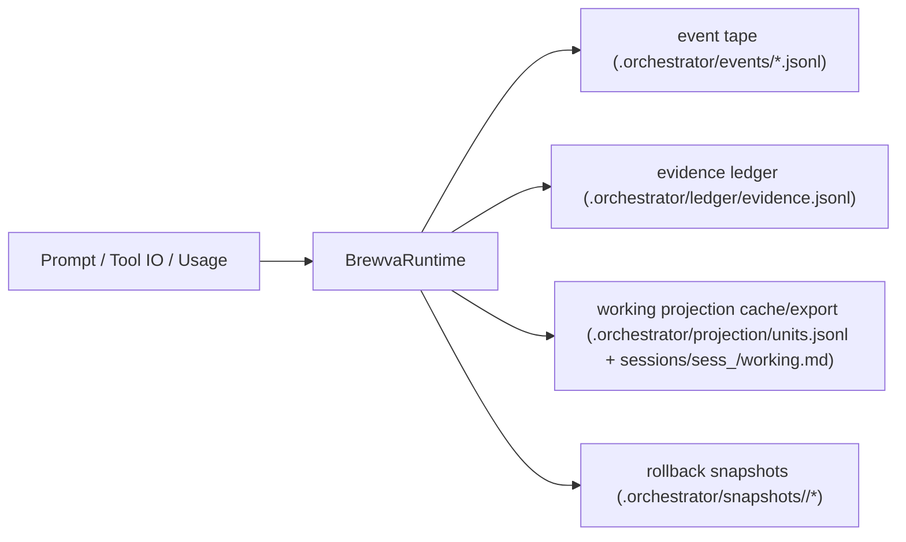
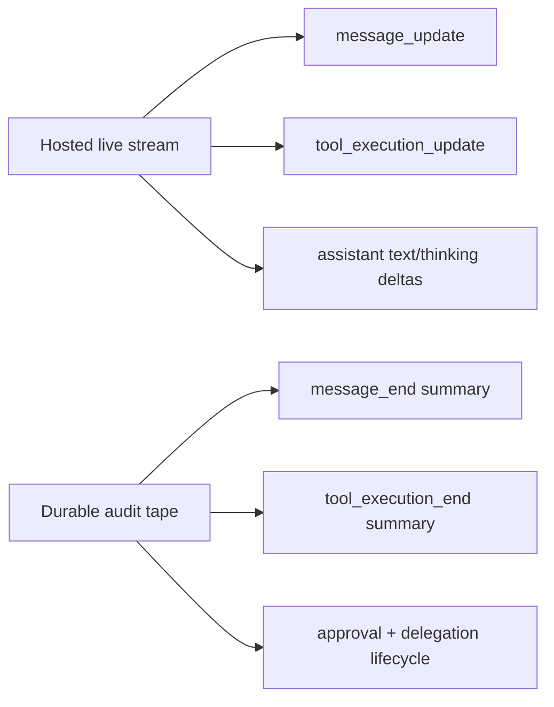
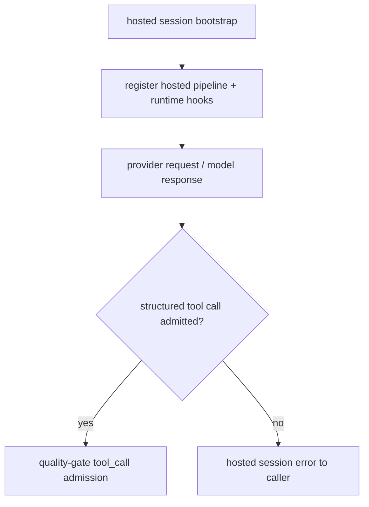
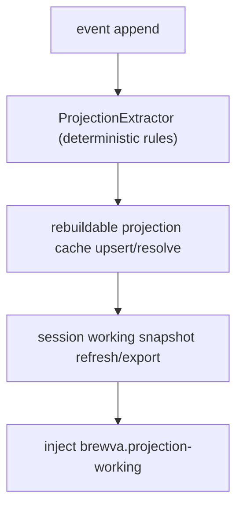
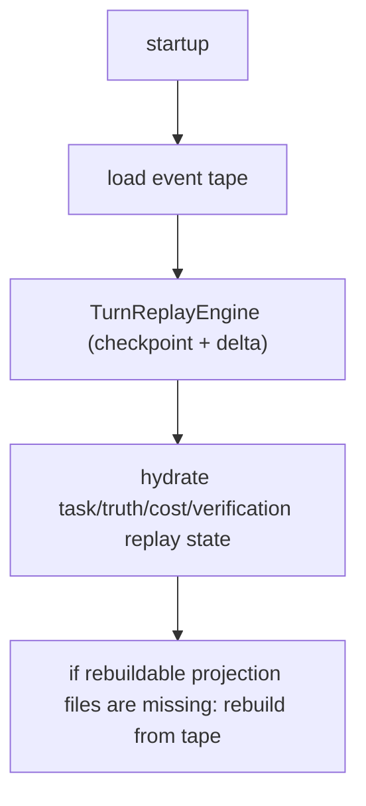
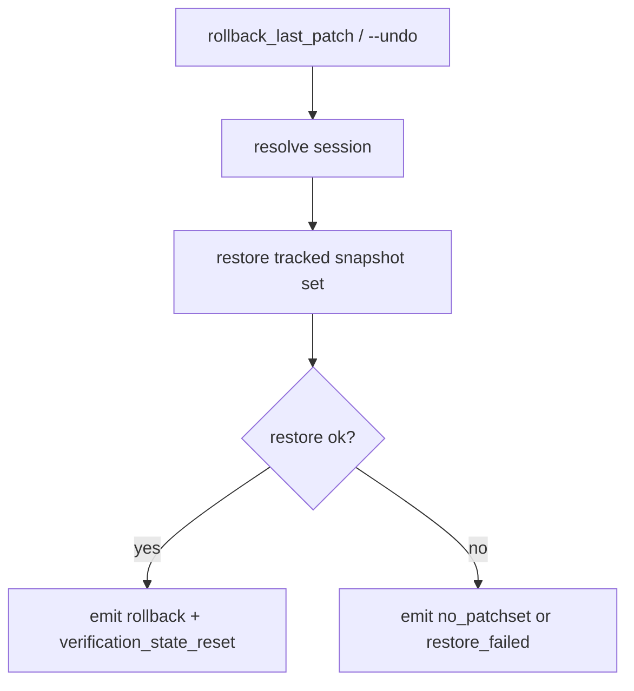
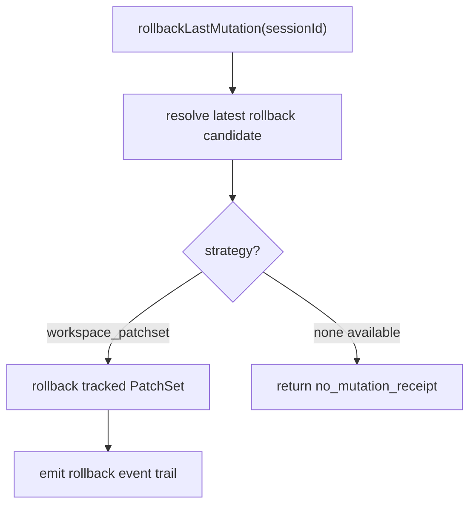

# Control And Data Flow

This document models governance-first runtime flow and persistence boundaries.

Interpretation rule:

- these diagrams are descriptive snapshots of the current runtime shape
- they do not override architectural invariants or public contracts
- if the implementation changes, this file should be updated rather than used
  to infer new authority
- host-specific branches, deleted paths, or optional integrations may be omitted
  here without changing the authority model

Use this file to understand current wiring. Use `docs/architecture/*.md`,
`docs/reference/*.md`, and runtime code to decide what authority or persistence
semantics are actually allowed.

## Default Session Flow (Runtime Plugins Enabled)

Hosted wiring narrows a root runtime into hosted, tool, and operator ports plus
repo-owned internal hooks where required. It does not hand a raw implementation
bag to every lifecycle adapter.

Before the provider request, the hosted control plane resolves the current
TaskSpec-first posture. If no skill is active and no TaskSpec exists, the turn
stays on the bootstrap tool surface so the next semantic decision is
`task_set_spec`. If TaskSpec is present and the routed match is strong, the
visible surface may narrow again so the next semantic decision is explicit
`skill_load`. These posture changes are experience-ring shaping plus durable
control-plane receipts; they do not create automatic skill activation.

## Direct Managed Tools Flow (`--managed-tools direct`)

Hosted context ownership is intentionally split:

- lifecycle shell: `packages/brewva-gateway/src/runtime-plugins/context-transform.ts`
- compaction policy: `packages/brewva-gateway/src/runtime-plugins/hosted-compaction-controller.ts`
- before-start injection assembly:
  `packages/brewva-gateway/src/runtime-plugins/hosted-context-injection-pipeline.ts`
- telemetry emission: `packages/brewva-gateway/src/runtime-plugins/hosted-context-telemetry.ts`

## Persistence Flow

## Hosted Event Surfaces

Live activity stays channel-oriented and ephemeral. Durable tape keeps replay,
evidence, and recovery semantics.

## Hosted Admission Flow

The hosted path does not use a separate provider-compatibility seam. Runtime
authority begins at admitted hosted events such as `tool_call`; permission and
governance remain kernel-owned.

## Working Projection Flow

## Recovery Flow

## Rollback Flow

### Patchset-based rollback (`rollback_last_patch` / `--undo`)

### Receipt-based mutation rollback (`runtime.authority.tools.rollbackLastMutation(...)`)

