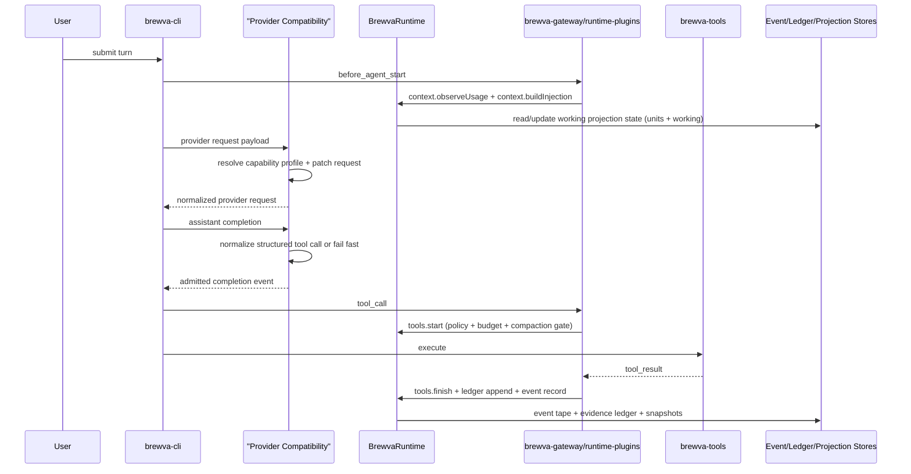
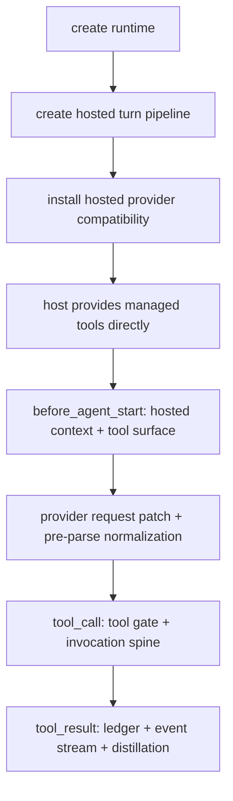
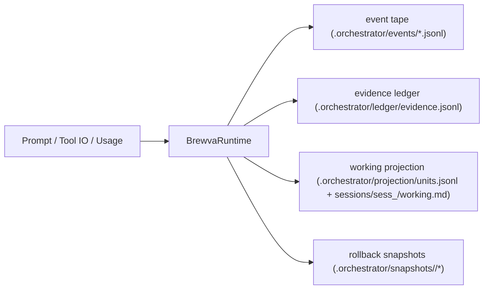
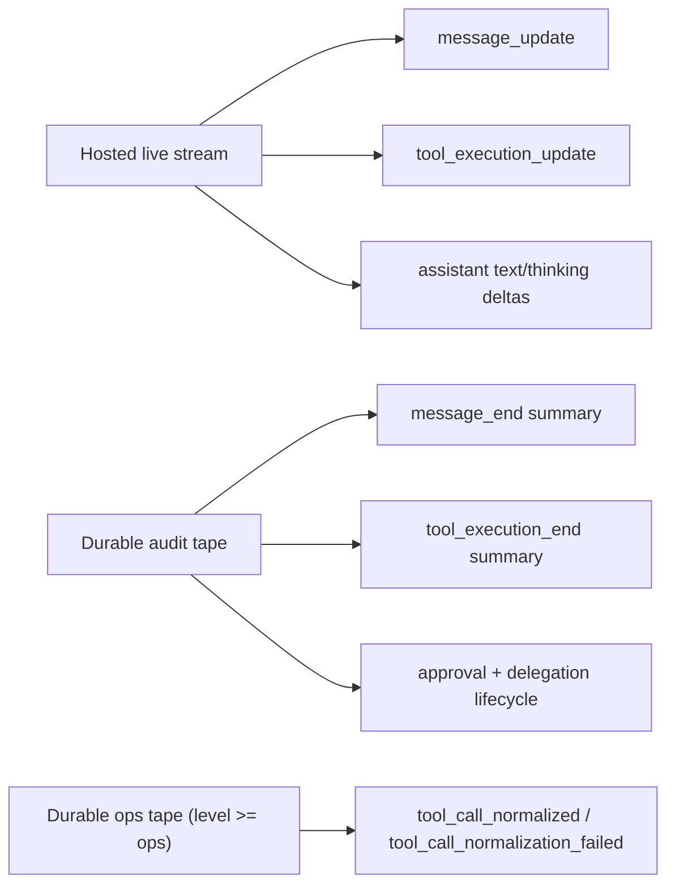
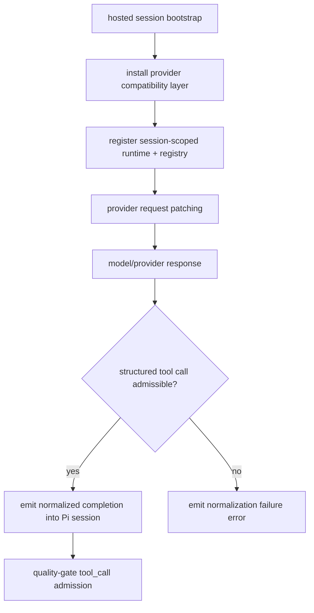
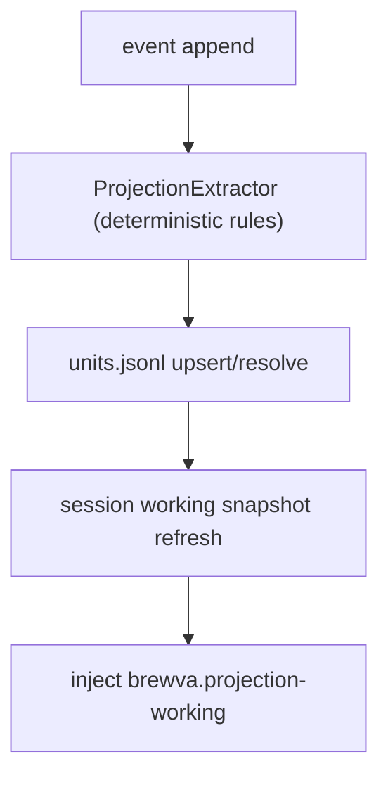
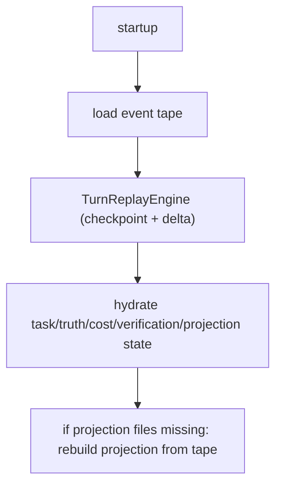
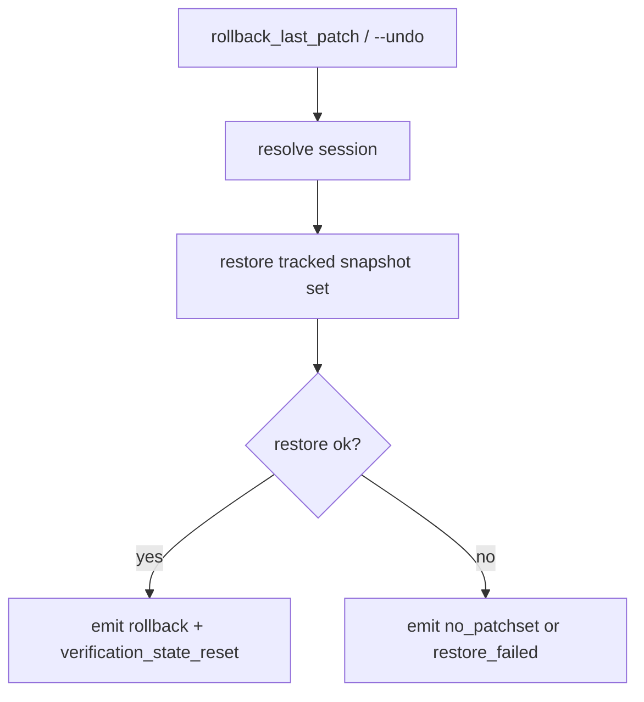
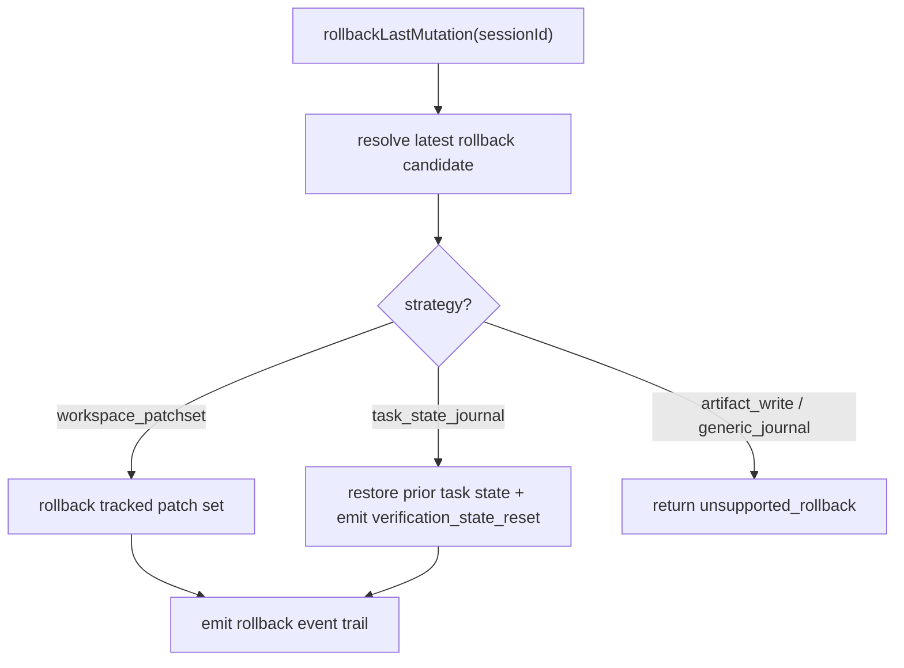

# Control And Data Flow

This document models governance-first runtime flow and persistence boundaries.

## Default Session Flow (Extensions Enabled)

## Direct Managed Tools Flow (`--managed-tools direct`)

## Persistence Flow

## Hosted Event Surfaces

Live activity stays channel-oriented and ephemeral. Durable tape keeps replay,
evidence, and recovery semantics.

## Hosted Provider Compatibility Flow

The compatibility seam sits before runtime authority. It can repair structural
shape, but it cannot grant permission, invent semantic intent, or bypass the
tool gate.

## Working Projection Flow

## Recovery Flow

## Rollback Flow

### Patchset-based rollback (`rollback_last_patch` / `--undo`)

### Receipt-based mutation rollback (`runtime.tools.rollbackLastMutation(...)`)

