# Control And Data Flow

This is a diagram-only companion for current wiring. It does not define public
methods, event schemas, authority, or persistence semantics. If a diagram
conflicts with `design-axioms`, `invariants-and-reliability`, `system-architecture`,
or reference docs, the narrower contract wins.

## Hosted Tool Turn

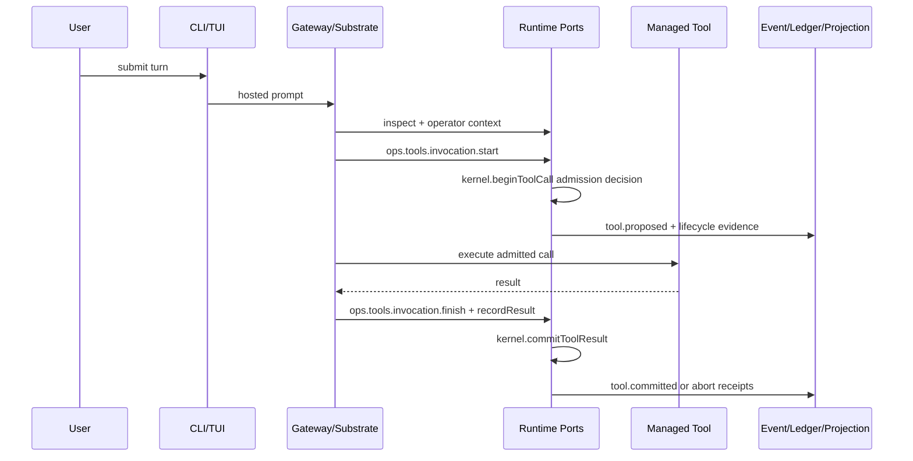

## Default Product Loop

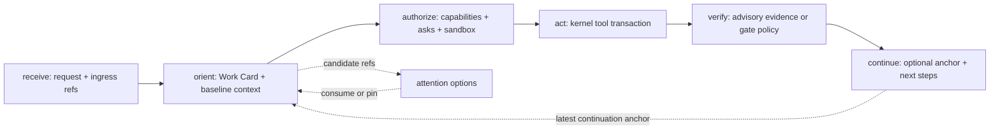

## Shared Inspect Projection

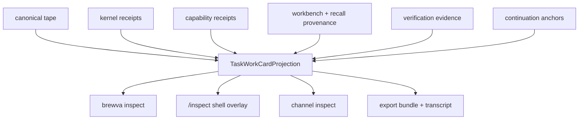

## Context Compaction Gate

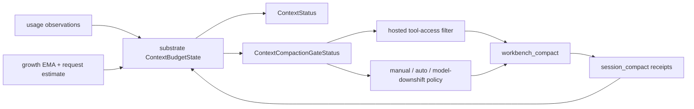

## Verification Gate Bridge

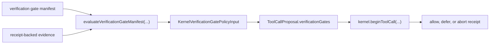

## Runtime Port Selection

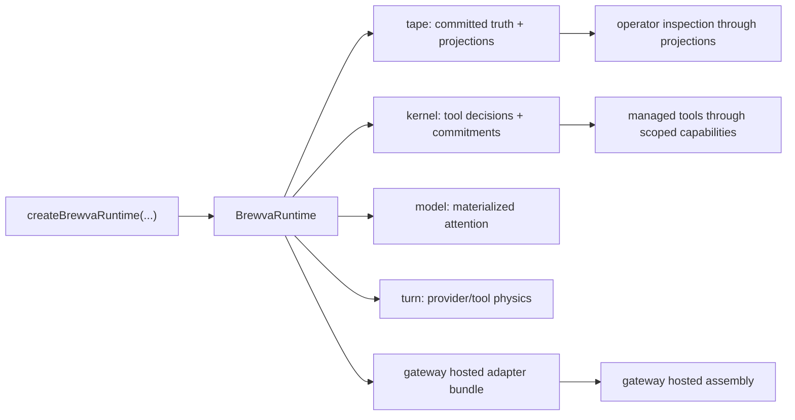

## Provider Drift Evidence

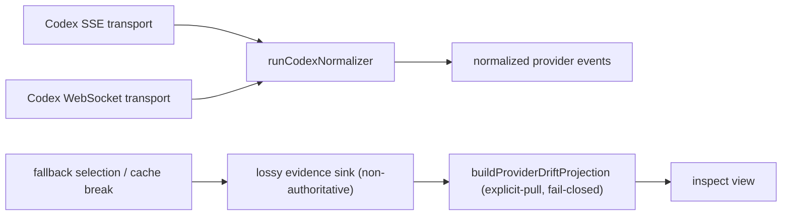

Transport is orthogonal to normalization: both Codex transports feed one
`runCodexNormalizer`. Drift and cache-break samples are lossy evidence —
non-authoritative, may vanish on restart by design, never replay truth (the tape
remains the replay authority). The `transport_fallback` drift source is typed but
deferred.

## Persistence Roles

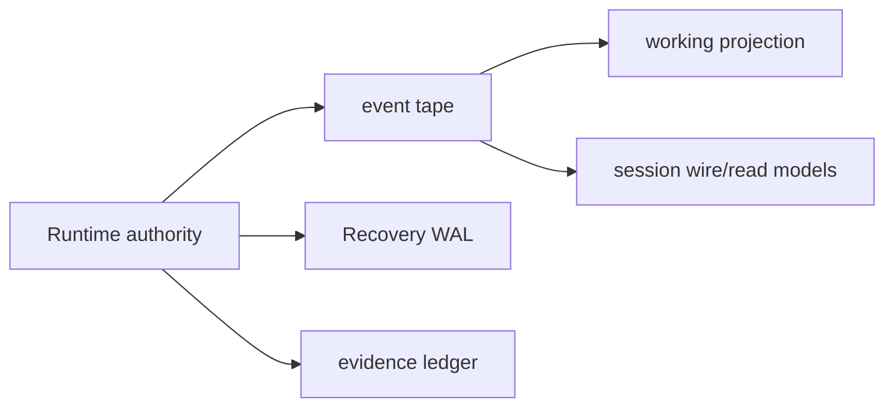

## Session Lineage And Context

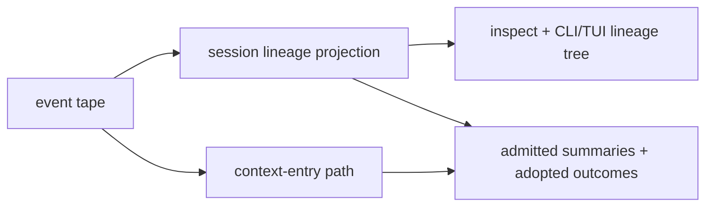

## Hosted Turn Gates

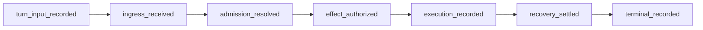

## Recovery

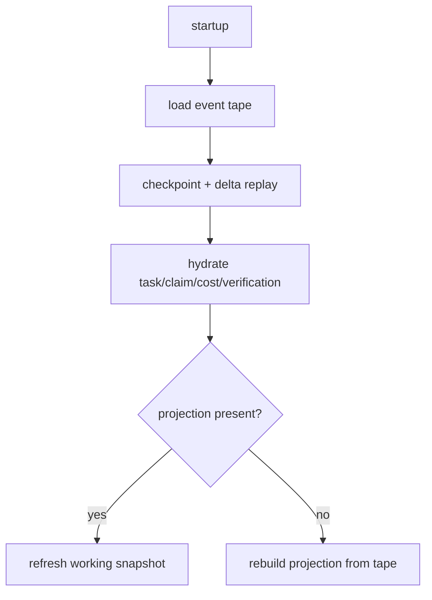

## Rewind And Rollback

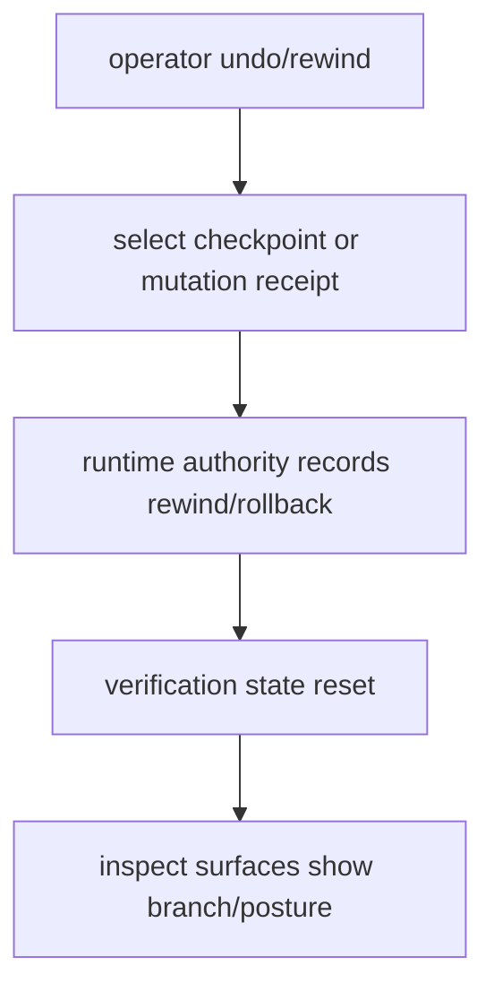

## Related Docs

- `docs/architecture/system-architecture.md`
- `docs/architecture/invariants-and-reliability.md`
- `docs/reference/events/README.md`
