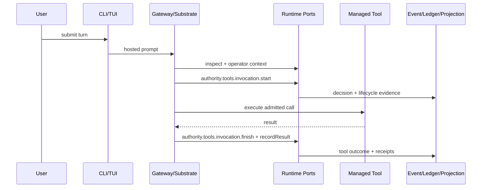
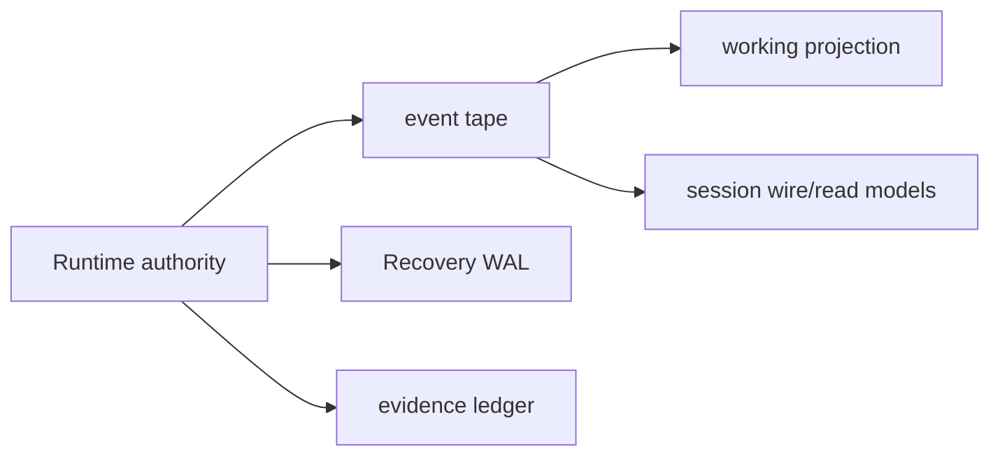
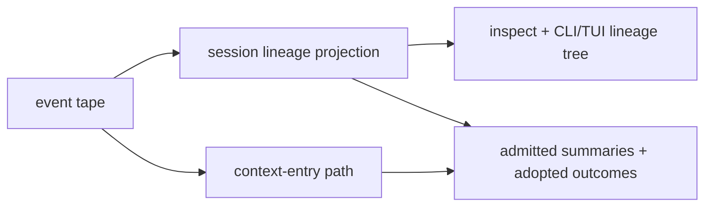
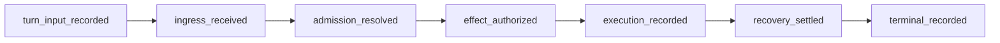
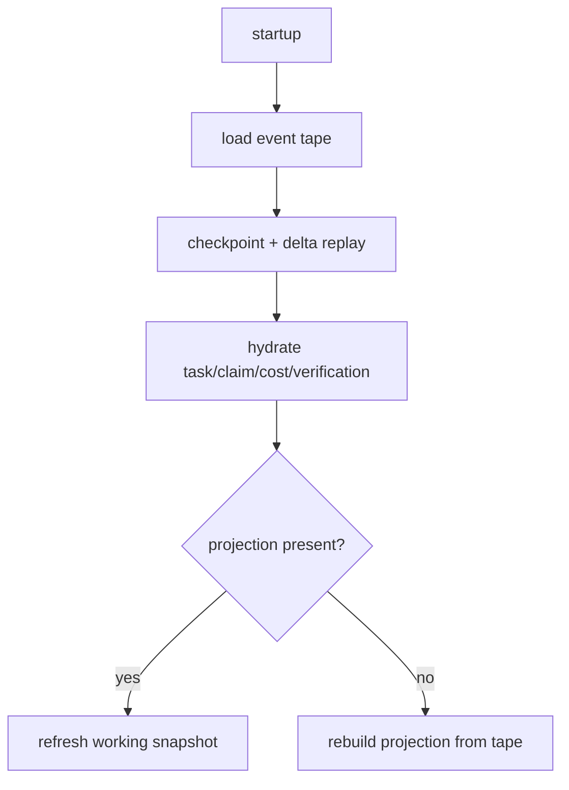
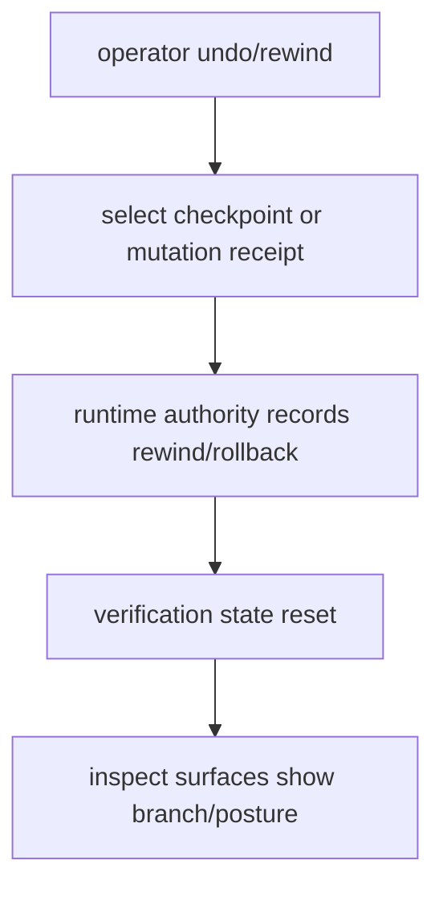

# Control And Data Flow

This is a diagram-only companion for current wiring. It does not define public
methods, event schemas, authority, or persistence semantics. If a diagram
conflicts with `design-axioms`, `invariants-and-reliability`, `system-architecture`,
or reference docs, the narrower contract wins.

## Hosted Tool Turn

## Persistence Roles

## Session Lineage And Context

## Hosted Turn Gates

## Recovery

## Rewind And Rollback

## Related Docs

- `docs/architecture/system-architecture.md`
- `docs/architecture/invariants-and-reliability.md`
- `docs/reference/events/README.md`
