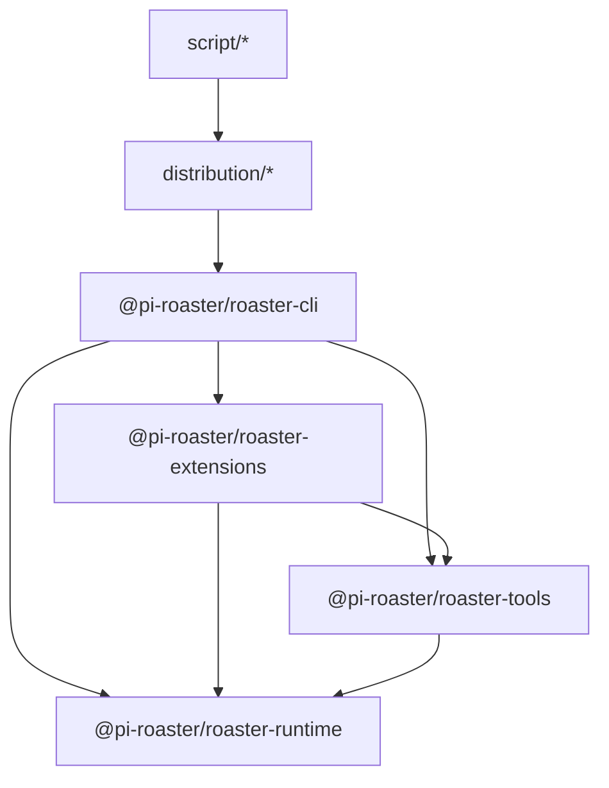

# System Architecture

This document describes the implemented architecture of `pi-roaster` based on
current package dependencies and runtime wiring.

## Package Dependency Graph

## Responsibility Slices

- **Session entry and mode control (`@pi-roaster/roaster-cli`)**
  - CLI flags, interactive/print/json modes, replay/undo, signal handling.
  - Session bootstrap and extension-enabled/disabled selection.
- **Lifecycle orchestration (`@pi-roaster/roaster-extensions`)**
  - Event stream persistence hooks.
  - Context transform and compaction gate behavior.
  - Tool-call quality gate and input sanitization.
  - Ledger writer and completion guard hooks.
- **Tool surface (`@pi-roaster/roaster-tools`)**
  - Runtime-aware tool definitions (LSP/AST, tape, ledger, task, skill, rollback).
  - Tool-side scan telemetry (`tool_parallel_read`) and runtime APIs.
- **Runtime core (`@pi-roaster/roaster-runtime`)**
  - Skill contracts/selection, tool policy enforcement, verification gate.
  - Evidence ledger + truth/task event-sourced state.
  - Tape replay (`checkpoint + delta`), context budget, parallel budget, cost tracking.
  - Rollback tracking via file snapshots.
- **Distribution/build packaging (`distribution/*`, `script/*`)**
  - Platform launcher packages and binary build/verification scripts.

## Execution Profiles

- **Default profile (`extensions enabled`)**
  - `createRoasterExtension()` registers tools and all lifecycle handlers.
  - Runtime behavior is mediated through extension hooks (`before_agent_start`,
    `tool_call`, `tool_result`, `agent_end`, etc.).
- **Direct-tool profile (`--no-extensions`)**
  - Tools are registered directly from `buildRoasterTools()`.
  - CLI installs `registerRuntimeCoreEventBridge()` for minimal lifecycle and
    assistant usage telemetry.
  - Extension-layer guards/hooks (context contract injection, quality gate,
    completion guard) are intentionally not active.

## Dependency Direction Rules

- Runtime package should stay independent from other workspace packages.
- Tools and extensions can depend on runtime, but runtime must not depend on them.
- CLI may orchestrate runtime/tools/extensions, but policy decisions should live
  in runtime and extension hooks.
- `reference` docs are normative for contracts; `guide/journeys` are operational views.

## Architectural Objectives

- Deterministic recoverability after interruption
- Observable execution timeline and evidence chain
- Contract-driven execution safety
- Bounded context and bounded cost under long-running sessions
