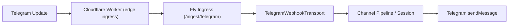

# Guide: Telegram Webhook Edge Ingress (Cloudflare Worker + Fly Ingress)

This guide documents a minimal, production-oriented layered deployment:

- Cloudflare Worker as the edge ingress adapter (signature validation, ACL, rate limiting, edge dedupe)
- Fly-hosted `brewva --channel telegram` as the control plane (session lifecycle, agent orchestration, tool execution)

Implementation references:

- Worker handler: `packages/brewva-ingress/src/telegram-webhook-worker.ts`
- Worker entrypoint template: `distribution/worker/telegram-webhook-worker.ts`
- Fly ingress server: `packages/brewva-ingress/src/telegram-ingress.ts`
- Channel startup and webhook config resolution: `packages/brewva-cli/src/channel-mode.ts`

## Topology



## 1) Start the Fly Control Plane (Webhook Mode)

Channel mode enables webhook ingress when any of the following is true:

- `channelConfig.telegram.webhook.enabled = true`
- `BREWVA_TELEGRAM_WEBHOOK_ENABLED=1` is set
- `BREWVA_TELEGRAM_INGRESS_PORT` is set

Recommended baseline is HMAC mode:

```bash
export BREWVA_TELEGRAM_WEBHOOK_ENABLED=1
export BREWVA_TELEGRAM_INGRESS_HOST=0.0.0.0
export BREWVA_TELEGRAM_INGRESS_PORT=8787
export BREWVA_TELEGRAM_INGRESS_PATH=/ingest/telegram

export BREWVA_TELEGRAM_INGRESS_AUTH_MODE=hmac
export BREWVA_TELEGRAM_INGRESS_HMAC_SECRET=<shared-hmac-secret>
export BREWVA_TELEGRAM_INGRESS_HMAC_MAX_SKEW_MS=300000
export BREWVA_TELEGRAM_INGRESS_NONCE_TTL_MS=300000

bun run start -- --channel telegram --telegram-token <bot-token>
```

If you need dual authentication, configure ingress with bearer + HMAC (`authMode=both`).

## 2) Deploy the Cloudflare Worker

Start from these templates:

- `distribution/worker/telegram-webhook-worker.ts`
- `distribution/worker/wrangler.toml.example`
- `distribution/worker/README.md`

Required variables:

- `BREWVA_INGRESS_URL`
- `BREWVA_INGRESS_HMAC_SECRET`

Optional variables:

- `BREWVA_INGRESS_BEARER_TOKEN`
- `BREWVA_TELEGRAM_SECRET_TOKEN`
- `BREWVA_TELEGRAM_EXPECTED_PATH`
- `BREWVA_TELEGRAM_ALLOWED_CHAT_IDS`
- `BREWVA_TELEGRAM_ALLOWED_USER_IDS`
- `BREWVA_TELEGRAM_DEDUPE_TTL_SECONDS`
- `BREWVA_TELEGRAM_MAX_BODY_BYTES`
- `BREWVA_TELEGRAM_RATE_LIMIT_MAX`
- `BREWVA_TELEGRAM_RATE_LIMIT_WINDOW_SECONDS`
- `BREWVA_TELEGRAM_RATE_LIMIT_SCOPE` (`chat|user|global`)

Dedupe storage:

- In-memory dedupe by default (single instance)
- Best-effort cross-instance dedupe if `BREWVA_TELEGRAM_DEDUPE_KV` is bound

## 3) Register Telegram Webhook

Point Telegram webhook to the Worker URL and configure `secret_token`:

```bash
curl -sS -X POST "https://api.telegram.org/bot<bot-token>/setWebhook" \
  -d "url=https://<worker-domain>/telegram/webhook" \
  -d "secret_token=<telegram-secret-token>"
```

If `BREWVA_TELEGRAM_EXPECTED_PATH` is set in Worker config, the webhook path must match exactly.

## 4) Response and Retry Semantics

- Worker returns `200 accepted`: forwarded successfully, Telegram does not retry
- Worker returns `200 duplicate`: edge dedupe hit, Telegram does not retry
- Worker returns `429 rate_limited`: throttled, Telegram retries per provider behavior
- Worker returns `502 forward_failed/forward_rejected`: ingress unavailable/rejected, Telegram retries

When forwarding to Fly ingress, `2xx` and `409` are both treated as success (`409` = control-plane idempotency hit).

## 5) Production Recommendations

- Keep dual-layer dedupe: Worker (`update_id`) + Fly ingress (`buildTelegramInboundDedupeKey`)
- Use secret separation: do not reuse `BREWVA_TELEGRAM_SECRET_TOKEN` as HMAC secret
- Roll out gradually: start with a single bot/chat and expand ACL scope
- Track key edge metrics: `forward_rejected`, `rate_limited`, `duplicate`

## 6) Local End-to-End Validation

The repository includes a local E2E smoke script (no external Telegram callback required):

```bash
bun run test:webhook-smoke
```

The script starts a local ingress server, sends the same update through Worker twice, and validates:

- first request is accepted
- second request is deduped
- ingress dispatch count is exactly one

## 7) Live Path Validation (Staging/Production)

Run a live smoke probe against the deployed Worker endpoint:

```bash
export BREWVA_WEBHOOK_LIVE_URL="https://<worker-domain>/telegram/webhook"
export BREWVA_WEBHOOK_LIVE_TELEGRAM_SECRET="<telegram-secret-token>"
export BREWVA_WEBHOOK_LIVE_CHAT_ID="12345"
export BREWVA_WEBHOOK_LIVE_USER_ID="42"

bun run test:webhook-smoke:live
```

For strict idempotency verification, enable the second-request dedupe check:

```bash
export BREWVA_WEBHOOK_LIVE_ASSERT_DEDUPE=1
bun run test:webhook-smoke:live
```

The strict check passes when the second request is handled as:

- edge duplicate (`code=duplicate`), or
- control-plane idempotency (`code=accepted`, `ingressStatus=409`).
