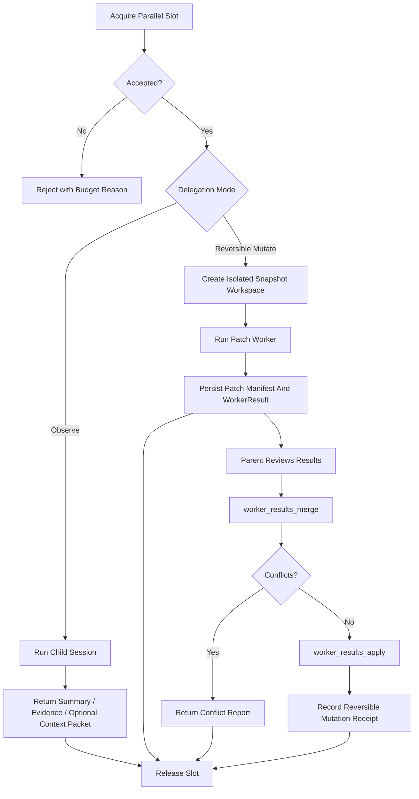

# Journey: Background And Parallelism

## Objective

Execute parallel and delegated work safely under concurrency, isolation, and
parent-controlled merge constraints.

## Key Steps

1. Acquire per-session concurrency budget through the runtime slot gate.
2. Run explicit child work through `subagent_run` or `subagent_fanout`; there is
   no hidden authority escalation or auto-spawn path.
3. For read-only delegation, return structured outcome data (`summary`,
   `evidenceRefs`, optional `artifactRefs`) and optionally hand the result back
   through `appendSupplementalInjection(...)` or a `context_packet` proposal.
4. For patch-producing delegation, execute in an isolated snapshot workspace and
   persist a `WorkerResult` plus patch artifacts instead of mutating the parent
   workspace directly.
5. Let the parent session inspect and adopt child patch results explicitly via
   `worker_results_merge` and `worker_results_apply`.
6. Feed pending or applied worker outcomes back into derived workflow status so
   ship state remains blocked until parent-controlled merge/apply completes.
7. Release slots, persist lifecycle state, and keep pending child runs visible
   to compaction through a dedicated `PendingDelegations` section.

## Background Runs And Recovery

Background child runs are durable control-plane work, not process-local best
effort helpers.

- detached child runs persist control files under
  `.orchestrator/subagent-runs/<runId>/`
- `subagent_status` and `subagent_cancel` survive parent runtime restarts
- hydration rebuilds delegation state from lifecycle events and durable run
  metadata
- late outcomes may return through `context_packet` when inline same-turn
  injection is no longer valid
- derived workflow status treats pending worker results as ship blockers until
  the parent explicitly merges or applies them
- these signals remain explicit inspection state; they do not auto-apply child
  work or force the parent into a stage machine

Note: use `runtime.tools.acquireParallelSlot(...)` to apply per-skill
`maxParallel` policy (warn/enforce), not internal parallel managers directly.

## Code Pointers

- Delegation orchestration:
  `packages/brewva-gateway/src/subagents/orchestrator.ts`
- Detached background controller:
  `packages/brewva-gateway/src/subagents/background-controller.ts`
- Isolated workspace capture:
  `packages/brewva-gateway/src/subagents/workspace.ts`
- Runtime parallel and merge state:
  `packages/brewva-runtime/src/services/parallel.ts`
- Workflow status derivation:
  `packages/brewva-runtime/src/workflow/derivation.ts`
- Session hydration fold:
  `packages/brewva-runtime/src/services/session-hydration-fold-delegation.ts`
- Parent-side tool surface:
  `packages/brewva-tools/src/subagent-run.ts`,
  `packages/brewva-tools/src/subagent-control.ts`,
  `packages/brewva-tools/src/worker-results.ts`
