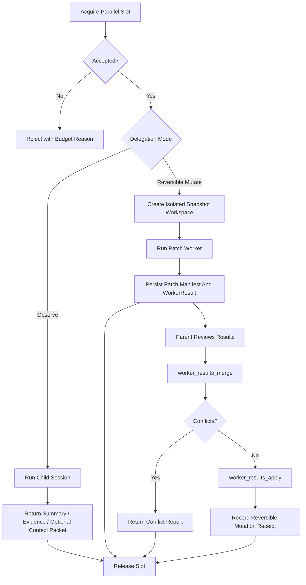

# Journey: Background And Parallelism

## Objective

Execute parallel and delegated work safely under concurrency, isolation, and
parent-controlled merge constraints.

## Key Steps

1. Acquire per-session concurrency budget through the runtime slot gate.
2. Run explicit child work through `subagent_run` or `subagent_fanout`; there is
   no hidden authority escalation or auto-spawn path. Named delegated workers
   now resolve through `agentSpec` and `ExecutionEnvelope`.
3. When `skillName` is present, the child prompt is assembled from:
   executor preamble, delegated skill body, task packet, context refs, and
   output contracts. The child runner validates returned `skillOutputs` before
   handing the result back to the parent.
4. For read-only delegation, return structured outcome data (`summary`,
   `evidenceRefs`, optional typed `data`, optional `artifactRefs`,
   optional `skillOutputs`) and hand the result back either through same-turn
   `appendSupplementalInjection(...)` or a replay-visible pending delegation
   outcome handoff.
5. For patch-producing delegation, execute in an isolated snapshot workspace and
   persist a `WorkerResult` plus patch artifacts instead of mutating the parent
   workspace directly.
6. Let the parent session inspect and adopt child patch results explicitly via
   `worker_results_merge` and `worker_results_apply`.
7. Feed pending or applied worker outcomes back into derived workflow status so
   ship state remains blocked until parent-controlled merge/apply completes.
8. Release slots, persist lifecycle state, and keep pending child runs visible
   to compaction through a dedicated `PendingDelegations` section.

## Background Runs And Recovery

Background child runs are durable control-plane work, not process-local best
effort helpers.

- detached child runs persist control files under
  `.orchestrator/subagent-runs/<runId>/`
- workspace-defined `agentSpec` / `envelope` files still live under
  `.brewva/subagents/*.json` during migration; custom files support
  narrowing-only `extends` chains
- detached runs also persist `delegation-context-manifest.json` so isolated
  children receive explicit parent-selected evidence context rather than
  ambient session access
- `subagent_status` and `subagent_cancel` survive parent runtime restarts
- the control-plane delegation read model rebuilds run state from lifecycle
  events and durable run metadata
- `HostedDelegationStore.listPendingOutcomes(...)` is the stable derived handoff
  view for late detached outcomes
- hosted turns surface pending late results through a
  `[CompletedDelegationOutcomes]` context block and mark them with
  `subagent_delivery_surfaced`
- derived workflow status treats pending worker results as ship blockers until
  the parent explicitly merges or applies them, and also reports pending
  delegation outcomes awaiting parent attention
- these signals remain explicit inspection state; they do not auto-apply child
  work or force the parent into a stage machine

Note: use `runtime.tools.acquireParallelSlot(...)` to apply per-skill
`maxParallel` policy (warn/enforce), not internal parallel managers directly.

## Code Pointers

- Delegation orchestration:
  `packages/brewva-gateway/src/subagents/orchestrator.ts`
- Delegation catalog and workspace config loading:
  `packages/brewva-gateway/src/subagents/catalog.ts`,
  `packages/brewva-gateway/src/subagents/config-files.ts`
- Detached background controller:
  `packages/brewva-gateway/src/subagents/background-controller.ts`
- Detached run protocol and context manifest:
  `packages/brewva-gateway/src/subagents/background-protocol.ts`
- Isolated workspace capture:
  `packages/brewva-gateway/src/subagents/workspace.ts`
- Runtime parallel and merge state:
  `packages/brewva-runtime/src/services/parallel.ts`
- Parent-turn handoff surfacing:
  `packages/brewva-gateway/src/runtime-plugins/context-composer.ts`,
  `packages/brewva-gateway/src/runtime-plugins/context-transform.ts`
- Workflow status inspection:
  `packages/brewva-tools/src/workflow-status.ts`
- Delegation read model:
  `packages/brewva-gateway/src/subagents/delegation-store.ts`
- Parent-side tool surface:
  `packages/brewva-tools/src/subagent-run.ts`,
  `packages/brewva-tools/src/subagent-control.ts`,
  `packages/brewva-tools/src/worker-results.ts`
