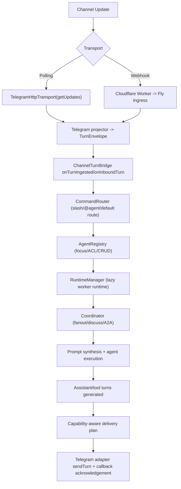

# Journey: Channel Gateway And Turn Flow

> Note: this document describes channel ingress/egress (`--channel`), not the local control-plane daemon (`brewva gateway ...`).

## Objective

Describe the end-to-end `--channel` execution path: inbound channel updates are normalized into `TurnEnvelope`, orchestrated against runtime-backed agent sessions, and delivered back to the originating channel.

## Key Steps

1. Adapter ingress:
   - polling path: transport calls `getUpdates`;
   - webhook path: Worker validates and forwards update to Fly ingress;
   - both paths end at projector + adapter dedupe and produce normalized turn.
2. Bridge ingest: `channel_turn_ingested` is recorded, then the turn is handed to the CLI channel loop.
3. Router/ACL phase: channel text is matched against orchestration commands and owner ACL policy (when enabled).
4. Registry/scope phase: focus and agent lifecycle state are loaded from registry; routing scope is computed (`chat` or `thread`).
5. Session binding: the CLI binds/reuses an agent session using `agent + scope` as the session key.
6. Turn canonicalization: inbound `turn.sessionId` is rewritten to the agent session id, while the original channel session id is preserved in `meta.channelSessionId`.
7. Runtime dispatch: the inbound turn is transformed into a prompt, one agent execution cycle is run, and assistant/tool outputs are collected.
8. Delivery and negotiation: outbound turns are capability-adjusted, then rendered by the adapter into channel-specific outbound requests.
9. Approval loop: callback queries are signature-validated, projected into approval turns, and acknowledged via `answerCallbackQuery`.

## Observability

- Ingress / egress bridge:
  - `channel_turn_ingested`
  - `channel_turn_emitted`
  - `channel_turn_bridge_error`
- Dispatch lifecycle:
  - `channel_session_bound`
  - `channel_turn_dispatch_start`
  - `channel_turn_dispatch_end`
  - `channel_turn_outbound_complete`
  - `channel_turn_outbound_error`
- Orchestration lifecycle:
  - `channel_command_received`
  - `channel_command_rejected`
  - `channel_agent_created`
  - `channel_agent_deleted`
  - `channel_focus_changed`
  - `channel_fanout_started`
  - `channel_fanout_finished`
  - `channel_discussion_round`
  - `channel_a2a_invoked`
  - `channel_a2a_blocked`

## Code Pointers

- CLI channel orchestration: `packages/brewva-cli/src/channel-mode.ts`
- Runtime channel bridge contracts: `packages/brewva-runtime/src/channels/turn-bridge.ts`
- Public import path for channel contracts: `@brewva/brewva-runtime/channels`
- Extension bridge telemetry wrapper: `packages/brewva-extensions/src/channel-turn-bridge.ts`
- Telegram adapter/projector/transport:
  - `packages/brewva-channels-telegram/src/adapter.ts`
  - `packages/brewva-channels-telegram/src/projector.ts`
  - `packages/brewva-channels-telegram/src/http-transport.ts`
  - `packages/brewva-channels-telegram/src/webhook-transport.ts`
- Webhook ingress / edge adapter:
  - `packages/brewva-ingress/src/telegram-ingress.ts`
  - `packages/brewva-ingress/src/telegram-webhook-worker.ts`
  - `distribution/worker/telegram-webhook-worker.ts`

## Related Docs

- CLI guide: `docs/guide/cli.md`
- Webhook edge ingress guide: `docs/guide/telegram-webhook-edge-ingress.md`
- Command surface: `docs/reference/commands.md`
- Event reference: `docs/reference/events.md`
