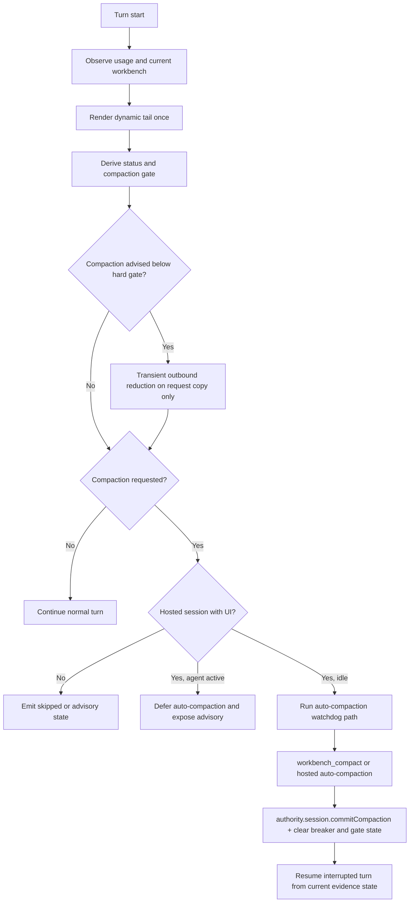

# Journey: Context And Compaction

## Audience

- developers reviewing runtime context, the hosted compaction controller, and
  turn recovery
- advanced operators who need to understand compaction-gate and post-compaction
  recovery semantics

## Entry Points

- hosted lifecycle `beforeAgentStart`
- `runtime.inspect.workbench.list(...)`
- model-facing `workbench_compact`
- durable `session_compact` receipts
- post-compaction turn resume

## Objective

Describe how Brewva executes model-authored workbench rendering, explicit
diagnostic context additions, context-status derivation, the compaction gate,
hosted auto-compaction, and post-compaction turn recovery through one
reviewable flow.

## In Scope

- model-operated workbench path
- numeric context status and the compaction gate
- hosted auto-compaction policy
- compaction completion and interrupted-turn resume
- reasoning-branch reset interaction with hosted context rebuild

## Out Of Scope

- working-projection persistence rules
- scheduler and delegation business semantics
- general approval / rollback governance

## Flow

## Key Steps

1. At turn start, the runtime initializes turn-local budget state.
2. The hosted workbench pipeline reads the model-authored workbench notebook and
   renders the dynamic tail once for the turn.
3. Hosted logic may append fixed dynamic-tail blocks without back-modeling them
   as registered context sources.
4. Runtime context functions derive gate status from usage ratio, hard limit,
   and the recent-compaction window.
5. Under forced-compaction status without recent compaction, every tool except
   `workbench_compact` and the minimal context-critical allowlist is blocked by
   the gate.
6. The hosted path then decides whether to:
   - emit advisory state only
   - defer auto-compaction because the agent is active
   - trigger auto-compaction while the session is idle
7. If compaction is advised but still below hard-gate posture, the hosted path
   may clear older large tool-result bodies on the outbound provider request
   copy before the provider call is sent.
8. After `workbench_compact` or hosted auto-compaction completes, the runtime
   records the durable `session_compact` receipt, clears the gate, and resumes
   the interrupted turn when required.
9. If a durable `reasoning_revert` arrives, hosted recovery rebuilds the active
   branch from the target checkpoint and resumes from that surviving context
   instead of keeping superseded branch history visible to the model.

## Execution Semantics

- there is no provider registry or automatic prompt-injection admission path;
  hosted extensions may not reintroduce pseudo-sources through side channels
- guarded diagnostic families are explicit dynamic-tail blocks:
  - they stay headroom-governed
  - they do not participate in hidden provider selection or arena budget floors
- composer policy blocks are provenance-tagged render artifacts rather than
  source-typed admission objects
- the effective compaction threshold is derived from context window, threshold
  floor / ceiling, and headroom policy
- those live ratios drive turn-scoped gate and advisory guidance; the hosted
  system-prompt contract stays static and does not cache window-derived
  percentages
- recent-compaction cooldown is governed by both `minTurnsBetween` and
  `minSecondsBetween`; forced-compaction status may cross the fixed bypass line
- while the compaction gate is armed, `workbench_compact` remains the required
  repair action and only the minimal context-critical allowlist remains usable;
  this is narrower than the broader control-plane tool set
- hosted auto-compaction uses an idle-versus-active policy:
  - when the agent is active, the host records advisory state rather than
    triggering implicit compaction
  - when the session is idle, the host may trigger the auto-compaction path
- transient outbound reduction runs only on the outbound provider-request copy:
  - it may clear older large text-only tool-result bodies
  - it keeps recent tool results intact
  - it gates on the stronger of:
    - live runtime context usage
    - a request-local payload estimate anchored by the session context window
      or, if needed, Pi model metadata
  - it does not mutate runtime history, WAL state, compaction receipts, or
    replay inputs
  - it is skipped for recovery/output-budget request paths where full fidelity
    is part of the retry contract
- automatic reasoning checkpoints are narrow by default: turn start,
  verification outcomes, and compaction boundaries are recorded automatically,
  while `tool_boundary` remains an explicit boundary rather than a universal
  checkpoint on every tool completion
- verification-boundary checkpoints reuse the latest hosted leaf observed for
  the session when one is available; otherwise they record `leaf=null` rather
  than inventing a branch target
- compaction summaries are checked and sanitized so prompt-injection residue or
  system-prompt material does not survive into compaction artifacts

## Failure And Recovery

- non-interactive mode does not run hosted auto-compaction; it leaves explicit
  skipped or advisory state instead
- an active session defers auto-compaction with
  `agent_active_manual_compaction_unsafe`
- the host does not issue a second auto-compaction request while one is already
  in flight
- watchdog timeout records `auto_compaction_watchdog_timeout` and clears the
  in-flight state
- after compaction, the interrupted turn resumes from current task and evidence
  state instead of restarting as a blank session
- compaction retry projects the runtime-internal turn spine to
  `recovery_settled`; it does not create a separate context-owned lifecycle
  state machine
- after a reasoning revert, hosted recovery uses `branchWithSummary(...)` plus
  rebuilt session messages so compaction products from superseded branch tails
  do not stay model-visible
- crash recovery does not need a second reasoning-specific WAL: the gateway WAL
  replays the interrupted turn envelope, while tape decides whether pending
  branch reset must be re-applied before the next prompt runs
- recovery posture remains inspectable as a derived read model; it is not
  rendered as a hidden working-set block in the model prompt
- projection remains a rebuildable helper; compaction and recovery correctness
  do not depend on projection-cache files being present

## Observability

- context / compaction events:
  - `context_compaction_requested`
  - `context_compaction_gate_blocked_tool`
  - `context_compaction_gate_armed`
  - `context_compaction_gate_cleared`
  - `context_compaction_auto_requested`
  - `context_compaction_auto_completed`
  - `context_compaction_auto_failed`
  - `context_compaction_skipped`
- hosted transition events:
  - `session_turn_transition`
    - `reason=compaction_gate_blocked`
    - `reason=compaction_retry`
    - `reason=output_budget_escalation`
    - `reason=provider_fallback_retry`
    - `reason=max_output_recovery`
    - `reason=reasoning_revert_resume`
    - `reason=wal_recovery_resume`
- hosted auto-compaction trigger ladder:
  - `no_request -> non_interactive_mode -> agent_active_manual_compaction_unsafe -> auto_compaction_breaker_open -> auto_compaction_in_flight -> execute_auto_compaction`
- ladder note:
  - this trigger ladder decides whether hosted auto-compaction runs at all
  - summary quality is owned by the hosted compaction summary path; deterministic
    summary projection is an emergency fallback, not the primary order
- prompt failure recovery:
  - `HostedThreadLoop` owns recovery decision ordering from a turn-local state
    projection instead of letting policy helpers recursively dispatch prompts
  - deterministic context reduction maps to
    `wait_for_compaction_settlement` and does not dispatch an extra resume
    prompt
  - active compaction that interrupts a turn and returns no assistant answer
    maps to `compact_resume_stream`
  - capability-gated output budget escalation may continue on the same prompt
  - bounded provider-fallback retry and bounded max-output recovery abort
    remaining policies when their breaker or failure path opens
- outbound reduction:
  - no new durable `context_*` event family is emitted for transient outbound
    reduction
  - request-copy edits remain invisible to replay and tape truth
  - live reduction state is exposed through
    `runtime.inspect.context.getTransientReduction(sessionId)`
- promotion evidence:
  - hosted prompt-stability and transient-reduction samples are written to the
    sidecar directory `.orchestrator/context-evidence`
  - `bun run report:context-evidence` aggregates those samples with durable
    `session_compact` receipts and cost-summary cache counters
  - this report is the promotion-evidence surface; it is not a replay input
    and it is not a new durable runtime event family
- post-recovery context:
  - recovery posture remains available through runtime inspection and event
    tape; no `[RecoveryWorkingSet]` hidden prompt block is rendered
- governance events:
  - `governance_compaction_integrity_checked`
  - `governance_compaction_integrity_failed`
  - `governance_compaction_integrity_error`

## Code Pointers

- Runtime context service: `packages/brewva-runtime/src/domain/context/context.ts`
- Status / gate logic: `packages/brewva-runtime/src/domain/context/context-pressure.ts`
- Context-critical allowlist: `packages/brewva-runtime/src/security/control-plane-tools.ts`
- Context budget policy: `packages/brewva-runtime/src/domain/context/budget.ts`
- Compaction integrity: `packages/brewva-runtime/src/domain/context/context-compaction.ts`
- Hosted compaction controller: `packages/brewva-gateway/src/hosted/internal/context/hosted-compaction-controller.ts`
- Hosted context shell: `packages/brewva-gateway/src/hosted/internal/context/context-transform.ts`
- Context evidence sidecar/report: `packages/brewva-gateway/src/hosted/internal/context/evidence/context-evidence.ts`
- Provider request reduction: `packages/brewva-gateway/src/hosted/internal/provider/request/provider-request-reduction.ts`
- Provider request recovery: `packages/brewva-gateway/src/hosted/internal/provider/request/provider-request-recovery.ts`
- Compaction telemetry: `packages/brewva-gateway/src/hosted/internal/context/hosted-context-telemetry.ts`
- Turn resume path: `packages/brewva-gateway/src/hosted/internal/compaction/recovery.ts`

## Related Docs

- Runtime plugins: `docs/reference/extensions.md`
- Configuration: `docs/reference/configuration.md`
- Hosted dynamic context: `docs/reference/hosted-dynamic-context.md`
- Working projection: `docs/reference/working-projection.md`
