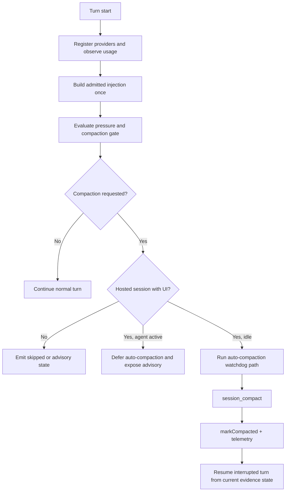

# Journey: Context And Compaction

## Audience

- developers reviewing runtime context, the hosted compaction controller, and
  turn recovery
- advanced operators who need to understand compaction-gate and post-compaction
  recovery semantics

## Entry Points

- hosted lifecycle `beforeAgentStart`
- `runtime.maintain.context.buildInjection(...)`
- `session_compact`
- post-compaction turn resume

## Objective

Describe how Brewva executes context admission, pressure evaluation, the
compaction gate, hosted auto-compaction, and post-compaction turn recovery
through one explicit path.

## In Scope

- deterministic injection path
- context pressure and the compaction gate
- hosted auto-compaction policy
- compaction completion and interrupted-turn resume
- reasoning-branch reset interaction with hosted context rebuild

## Out Of Scope

- working-projection persistence rules
- scheduler and delegation business semantics
- general approval / rollback governance

## Flow

## Key Steps

1. At turn start, the runtime initializes turn-local budget state and clears
   leftover reservations from the previous turn.
2. Context providers enter the same admission path; the runtime builds one
   admitted injection plan for the turn.
3. `ContextPressureService` computes gate status from usage ratio, hard limit,
   and the recent-compaction window.
4. Under critical pressure without recent compaction, ordinary non-control-plane
   tools are blocked by the gate.
5. The hosted path then decides whether to:
   - emit advisory state only
   - defer auto-compaction because the agent is active
   - trigger auto-compaction while the session is idle
6. After `session_compact` completes, the runtime records the compaction
   summary, clears the gate, and resumes the interrupted turn when required.
7. If a durable `reasoning_revert` arrives, hosted recovery rebuilds the active
   branch from the target checkpoint and resumes from that surviving context
   instead of keeping superseded branch history visible to the model.

## Execution Semantics

- context admission is deterministic and single-path; runtime plugins may
  compose admitted entries but may not bypass admission
- the effective compaction threshold is derived from context window, threshold
  floor / ceiling, and headroom policy
- recent-compaction cooldown is governed by both `minTurnsBetween` and
  `minSecondsBetween`; severe pressure may cross the fixed bypass line
- `session_compact` and a small set of control-plane tools remain allowed while
  the compaction gate is armed
- hosted auto-compaction uses an idle-versus-active policy:
  - when the agent is active, the host records advisory state rather than
    triggering implicit compaction
  - when the session is idle, the host may trigger the auto-compaction path
- automatic reasoning checkpoints are narrow by default: turn start,
  verification outcomes, and compaction boundaries are recorded automatically,
  while `tool_boundary` remains an explicit boundary rather than a universal
  checkpoint on every tool completion
- verification-boundary checkpoints reuse the latest hosted leaf observed for
  the session when one is available; otherwise they record `leaf=null` rather
  than inventing a branch target
- compaction summaries are checked and sanitized so prompt-injection residue or
  system-prompt material does not survive into compaction artifacts

## Failure And Recovery

- non-interactive mode does not run hosted auto-compaction; it leaves explicit
  skipped or advisory state instead
- an active session defers auto-compaction with
  `agent_active_manual_compaction_unsafe`
- the host does not issue a second auto-compaction request while one is already
  in flight
- watchdog timeout records `auto_compaction_watchdog_timeout` and clears the
  in-flight state
- after compaction, the interrupted turn resumes from current task and evidence
  state instead of restarting as a blank session
- after a reasoning revert, hosted recovery uses `branchWithSummary(...)` plus
  rebuilt session messages so compaction products from superseded branch tails
  do not stay model-visible
- crash recovery does not need a second reasoning-specific WAL: the gateway WAL
  replays the interrupted turn envelope, while tape decides whether pending
  branch reset must be re-applied before the next prompt runs
- the resumed turn also gets a recovery-aware typed working set block so the
  model can re-anchor on hosted recovery posture, task state, and pending
  delegation handoff without relying on freeform memory carry-over
- projection remains a rebuildable helper; compaction and recovery correctness
  do not depend on projection-cache files being present

## Observability

- context / compaction events:
  - `context_compaction_requested`
  - `context_compaction_gate_blocked_tool`
  - `context_compaction_gate_armed`
  - `context_compaction_gate_cleared`
  - `context_compaction_auto_requested`
  - `context_compaction_auto_completed`
  - `context_compaction_auto_failed`
  - `context_compaction_skipped`
- hosted transition events:
  - `session_turn_transition`
    - `reason=compaction_gate_blocked`
    - `reason=compaction_retry`
    - `reason=output_budget_escalation`
    - `reason=provider_fallback_retry`
    - `reason=max_output_recovery`
    - `reason=reasoning_revert_resume`
    - `reason=wal_recovery_resume`
- hosted auto-compaction trigger ladder:
  - `no_request -> non_interactive_mode -> agent_active_manual_compaction_unsafe -> auto_compaction_breaker_open -> auto_compaction_in_flight -> execute_auto_compaction`
- ladder note:
  - this trigger ladder decides whether hosted auto-compaction runs at all
  - deterministic-first ordering lives in the recovery/context strategy path,
    not in the trigger ladder itself
- prompt failure recovery:
  - ordered hosted policy chain: deterministic context reduction, then
    capability-gated output budget escalation on the same prompt, then bounded
    provider-fallback retry, then bounded max-output recovery
- post-recovery context:
  - hidden injection may include `[RecoveryWorkingSet]` when hosted transition
    posture indicates compaction retry, provider fallback retry, max-output
    recovery, output-budget escalation, or WAL resume
- governance events:
  - `governance_compaction_integrity_checked`
  - `governance_compaction_integrity_failed`
  - `governance_compaction_integrity_error`

## Code Pointers

- Runtime context service: `packages/brewva-runtime/src/services/context.ts`
- Pressure / gate logic: `packages/brewva-runtime/src/services/context-pressure.ts`
- Context budget policy: `packages/brewva-runtime/src/context/budget.ts`
- Compaction integrity: `packages/brewva-runtime/src/services/context-compaction.ts`
- Hosted compaction controller: `packages/brewva-gateway/src/runtime-plugins/hosted-compaction-controller.ts`
- Hosted context shell: `packages/brewva-gateway/src/runtime-plugins/context-transform.ts`
- Compaction telemetry: `packages/brewva-gateway/src/runtime-plugins/hosted-context-telemetry.ts`
- Turn resume path: `packages/brewva-gateway/src/session/compaction-recovery.ts`

## Related Docs

- Runtime plugins: `docs/reference/runtime-plugins.md`
- Configuration: `docs/reference/configuration.md`
- Context composer: `docs/reference/context-composer.md`
- Working projection: `docs/reference/working-projection.md`
