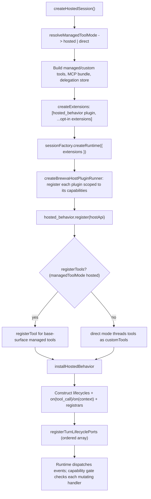

# Journey: Hosted Behavior Installation

## Audience

- developers reviewing how the hosted runtime composes its behaviors onto the
  four-port runtime
- reviewers verifying the authority boundary: which capabilities hosted behavior
  declares, and why extensions cannot widen kernel authority
- developers tracing the `managedToolMode` hosted/direct distinction at session
  assembly

## Entry Points

- `createHostedSession(...)`
- `createExtensions(...)` — constructs the plugin list
- `createHostedBehaviorHostAdapter(...)` — the single internal plugin
- `installHostedBehavior(...)` — the actual wiring function
- `createBrewvaHostPluginRunner(...)` — runtime-side dispatch and per-handler
  capability enforcement

## Objective

Describe how hosted session assembly installs a single internal host plugin
(`hosted_behavior`) that registers the gateway's context, tool, evidence,
recovery, and goal behaviors against the substrate host-plugin API; in what order
those behaviors are wired; and how the runtime's per-handler capability gate
keeps this composition inside a fixed authority boundary that extensions cannot
widen.

Honest naming (so the doc matches reality): this is internal hosted-behavior
installation, not a user-authored public plugin API. The host installs one
private internal plugin (`hosted_behavior`) that wires the gateway's own
behaviors. A separate, narrow opt-in extension facade exists for advisory-ring
callers, but the hosted lane itself is closed — hosted behavior installation is
private to hosted session assembly.

## In Scope

- the `hosted_behavior` internal plugin: its declared capabilities, tool
  registration, and lifecycle-port composition
- the ordered registration of context transform, quality gate, event stream,
  ledger writer, tool-result distiller, and provider-request recovery/reduction,
  plus the turn-lifecycle-port array
- the `managedToolMode` hosted-versus-direct effect on tool registration only
- the substrate capability gate that bounds every handler

## Out Of Scope

- compaction-gate physics, dynamic-tail rendering, and transient outbound
  reduction semantics → `context-and-compaction`
- the advisory extension ring and verification-gate manifests (the opt-in caller
  facade) → `docs/reference/extensions.md`
- dynamic-tail block contents and `ContextBundle` admission →
  `docs/reference/hosted-dynamic-context.md`
- CLI mode resolution and product surfaces → `interactive-session`

## Flow



## Key Steps

1. `createHostedSession` resolves the managed tool mode: `direct` only when
   exactly `"direct"`, otherwise `hosted`.
2. `createExtensions` builds exactly one default plugin via
   `createHostedBehaviorHostAdapter` with `registerTools` set to whether the
   mode is `hosted`, then appends any opt-in extensions.
3. The session factory passes the plugin list to the host plugin runner, which
   calls each plugin's `register` with an API scoped to that plugin's declared
   capabilities.
4. When `registerTools` is true, the plugin registers only base-surface managed
   tools; non-base surfaces are skipped. In `direct` mode the same tool set is
   threaded through `customTools` instead, so the runtime authority boundary is
   unchanged either way.
5. `installHostedBehavior` wires behaviors in a fixed order: it builds the
   managed tool catalog, constructs the lifecycles (context transform, quality
   gate, skill selection, tool surface, read-path recovery, goal continuation),
   registers `tool_call` and `context` handlers directly, and calls the
   registrars for the event stream, ledger writer, tool-result distiller, and
   provider-request recovery/reduction.
6. It then calls `registerTurnLifecyclePorts` with an ordered array of ports:
   local hooks, skill-selection `beforeAgentStart`, context-transform
   turn/compact/shutdown, tool-surface `beforeAgentStart`, the quality-gate and
   context-transform input/before-start/tool-result handlers, read-path-recovery
   tool-result, tool-surface tool-result/shutdown, goal continuation, and
   finally any user-supplied ports.

## Execution Semantics

- per-event composition is order-preserving: handlers for a given event run in
  the port-array order above
- slot semantics differ by event: `turn_start` / `session_compact` /
  `session_shutdown` / `session_start` / `turn_end` / `agent_end` run all
  handlers sequentially; `input` short-circuits on the first defined result;
  `before_agent_start` merges results (messages concatenated, system prompt
  threaded forward); `tool_result` runs a merge pipeline threading
  content/details/isError forward
- `managedToolMode` only changes tool registration, not the lifecycle spine:
  the rest of the `installHostedBehavior` wiring is identical, and `direct` mode
  builds the same tool set through `customTools`, leaving the four-port runtime
  authority boundary unchanged
- the authority boundary is the four-port runtime plus the substrate capability
  gate. Hosted behavior reaches the runtime only through a narrowed adapter
  port, never the runtime root. The `hosted_behavior` plugin declares a fixed
  capability set, enumerated by exact name below; nothing widens it
- the substrate runner enforces capability per mutating operation and per
  mutating handler result; a plugin lacking the capability throws and a
  violation is recorded
- the key invariant from `context-and-compaction` holds here structurally: there
  is no provider registry and no prompt-injection admission path, and extensions
  may not reintroduce pseudo-sources. The capability enum has no
  register-context-source capability — the only context-write path is a message
  list edit gated by context-messages write, not a source registry
- local hooks are advisory only: results are observe or recommend, invalid
  shapes normalize to an advisory note, and they record governance decisions but
  never block

The `hosted_behavior` plugin declares exactly these capabilities by name; a
drift-guard fitness keeps this list and the `HOSTED_BEHAVIOR_CAPABILITIES`
constant in lockstep:

<!-- hosted-behavior-capabilities -->

```text
tool_registration.write
tool_surface.write
system_prompt.write
context_messages.write
provider_payload.write
input_parts.write
tool_call.block
tool_result.write
assistant_message.enqueue
```

It does not declare `turn_input.handle`, `message_visibility.write`, or
`user_message.enqueue`: those exist in the capability enum but stay outside the
hosted authority surface.

## Failure And Recovery

- a capability violation fails closed: a mutating handler or operation without
  the declared capability throws and records a violation; it cannot silently
  succeed
- handler errors are bounded: each handler runs under an observability span and
  non-cancel errors are wrapped in a tagged host-plugin handler error carrying
  the plugin name and event; cancellation propagates as-is
- local-hook advisory failures are swallowed into governance notes with error
  severity rather than propagated
- the provider-request recovery and reduction hooks are installed here,
  consistent with `context-and-compaction`; their reduction/recovery semantics
  themselves live in that journey

## Observability

- capability and plugin enforcement: a capability-violation hook
  (`recordPluginCapabilityViolation`), a tagged `BrewvaHostPluginHandlerError`,
  and an observability span named `brewva.host.plugin.<event>`
- durable evidence and receipts written by the installed behaviors:
  - event stream subscribes `turn_input_recorded`, `turn_render_committed`,
    `session_shutdown`, and `verification_outcome_recorded`
  - the ledger writer records tool outputs and finishes tool invocations
  - provider-request recovery appends `output_budget_escalation` evidence;
    reduction appends `transient_reduction` evidence (semantics in
    `context-and-compaction`)
  - read-path recovery records read-path gate-armed events
  - goal continuation records goal-continuation-queued events
  - local hooks record a turn-governance-decision with a `local_hook` source
- runtime-ops events live under the `runtime.ops` namespace

## Code Pointers

- Internal plugin and wiring:
  `packages/brewva-gateway/src/hosted/internal/session/host-api-installation.ts`
  (`createHostedBehaviorHostAdapter`, `installHostedBehavior`)
- Session assembly:
  `packages/brewva-gateway/src/hosted/internal/session/init/session-assembly.ts`
- Plugin list construction and direct/hosted split:
  `packages/brewva-gateway/src/hosted/internal/session/init/orchestration.ts`
- Mode resolution:
  `packages/brewva-gateway/src/hosted/internal/session/init/environment.ts`
- Runtime adapter boundary:
  `packages/brewva-gateway/src/hosted/internal/session/runtime-ports.ts`
- Lifecycle-port composition and advisory hooks:
  `packages/brewva-gateway/src/hosted/internal/hooks/turn-lifecycle-port.ts`,
  `packages/brewva-gateway/src/hosted/internal/hooks/local-hook-port.ts`
- Capability gate and host-plugin contract:
  `packages/brewva-substrate/src/host-api/plugin-runner.ts`,
  `packages/brewva-substrate/src/host-api/plugin.ts`
- Behavior modules wired by `installHostedBehavior`:
  `packages/brewva-gateway/src/hosted/internal/context/context-transform.ts`,
  `packages/brewva-gateway/src/hosted/internal/session/tools/quality-gate.ts`,
  `packages/brewva-gateway/src/hosted/internal/session/tools/tool-surface.ts`,
  `packages/brewva-gateway/src/hosted/internal/context/read-path-recovery.ts`,
  `packages/brewva-gateway/src/hosted/internal/session/goal-continuation.ts`,
  `packages/brewva-gateway/src/hosted/internal/context/evidence/event-stream.ts`,
  `packages/brewva-gateway/src/hosted/internal/context/evidence/ledger-writer.ts`,
  `packages/brewva-gateway/src/hosted/internal/session/tools/tool-result-distiller.ts`,
  `packages/brewva-gateway/src/hosted/internal/provider/request/provider-request-recovery.ts`,
  `packages/brewva-gateway/src/hosted/internal/provider/request/provider-request-reduction.ts`
- Opt-in extension facade (distinct from hosted behavior):
  `packages/brewva-gateway/src/extensions/api.ts`

## Related Docs

- Extensions reference: `docs/reference/extensions.md`
- Hosted dynamic context: `docs/reference/hosted-dynamic-context.md`
- Context and compaction: `docs/journeys/internal/context-and-compaction.md`
- Interactive session: `docs/journeys/operator/interactive-session.md`
