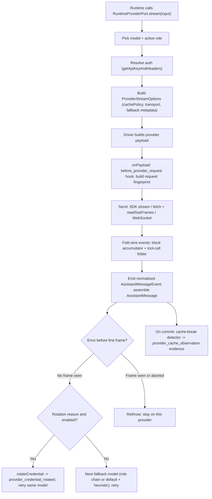

# Journey: Provider Turn, Streaming, And Fallback

## Audience

- developers reviewing the provider transport seam: request construction,
  SSE / WebSocket streaming parse, normalized event folding, model fallback,
  and the prompt/token cache efficiency plane
- advanced operators who need to know how a turn picks a different
  model/credential and how that drift is made inspectable, without leaking
  secrets

## Entry Points

- stable provider-core surface: `stream` / `streamSimple` / `complete`
- hosted provider stream function: `createHostedProviderStreamFunction(...)`
- hosted runtime provider port (the fallback loop):
  `createHostedRuntimeProviderPort(...).stream(input)`
- per-provider drivers registered in the provider-core builtins registry
- payload mutation hook: the `before_provider_request` plugin event

## Objective

Describe how Brewva turns one model turn into a provider HTTP or WebSocket
request, streams the response, folds provider-local wire events into one
normalized `AssistantMessageEvent` shape and a final `AssistantMessage`,
optionally falls back to another model or credential before the first frame, and
runs the prompt/token cache as a non-authoritative efficiency plane whose drift
is made inspectable through a request fingerprint and a lossy evidence sink.

## In Scope

- the provider request lifecycle: build, mutate, send, stream, assemble
- the normalized streaming contract and the two folding seams (block
  accumulator, tool-call folder)
- SSE frame reading versus SDK-iterable streaming; the Codex WebSocket-first
  transport with SSE fallback
- provider terminal-integrity enforcement and abort propagation
- hosted model fallback (pre-first-frame) and credential-slot rotation, plus how
  each is made replay- or cache-visible
- the prompt/token cache: policy, capability resolution, render, request
  fingerprint, break detection, sticky latches, tool-schema snapshot, Codex
  continuation
- auth resolution (env discovery, vault, OAuth)

## Out Of Scope

- transient outbound request reduction, capability-gated output-budget
  escalation, and the single-shot `provider_retry` recovery cause →
  `context-and-compaction`
- the event tape as replay authority and WAL recovery → `wal-and-crash-recovery`
  (reuse its framing: the tape is the `durable source of truth`; cache state is
  rebuildable and disposable)
- read-unchanged reduction details → `docs/reference/token-cache.md`

## Flow

## Key Steps

1. The hosted provider port resolves auth via the runtime model catalog; an auth
   failure becomes a pre-frame attempt error eligible for fallback.
2. It assembles `ProviderStreamOptions` with the cache policy, transport,
   session id, an `onPayload` hook, an `onCacheRender` hook, and any
   `providerFallback` metadata carried from a prior attempt.
3. The driver builds a provider-shaped request and resolves its own cache render.
4. `onPayload` runs the hosted payload pipeline: it emits
   `before_provider_request` (plugins may mutate), normalizes the cache render,
   resolves the tool-schema snapshot and sticky latches, and builds the request
   fingerprint after final payload assembly and before streaming.
5. The stream is sent over the SDK iterable, an SSE reader (Codex), or a
   WebSocket (Codex `auto` transport), and the driver feeds wire events into the
   composer.
6. The composer folds events through a sequential block accumulator (text and
   thinking) and a keyed tool-call folder, emitting normalized
   `AssistantMessageEvent`s and assembling the final `AssistantMessage`.
7. The hosted port maps frames and flips a saw-frame flag on the first
   text/thinking delta or tool-call end. On an error before any frame, it
   classifies the failure and either rotates a credential (retrying the same
   model) or selects the next fallback model.
8. On a committed assistant message, a cache-break detector compares against the
   last fingerprint and appends a `provider_cache_observation` evidence sample.

## Execution Semantics

- normalized event families: `start`; `text_start|delta|end`;
  `thinking_start|delta|end`; `toolcall_start|delta|end`; `done` (reason
  `stop|length|toolUse`); `error` (reason `aborted|error`). Tool-call events
  carry an advisory parse status that does not replace terminal validation
- the stream lifecycle (start mode, done/error emission, abort propagation,
  queue backpressure) is owned by the provider-core stream runner; a full or
  closed buffer fails the stream explicitly
- terminal integrity is enforced per driver: a started Anthropic stream that
  never reaches message-stop fails, and tool calls are finalized only after the
  terminal frame
- provider retry and hosted fallback are different layers: a driver may run its
  own bounded retryable-request loop below the normalized stream, while model
  fallback is a separate hosted loop above provider-core. The single-shot
  `provider_retry` recovery cause is runtime/context-owned (boundary doc)
- only the Codex SSE path consumes the shared SSE frame reader; other providers
  stream via SDK async-iterables. Codex `auto` transport tries WebSocket first
  and falls back to SSE, recording a session-scoped fallback latch
- fallback is pre-first-frame only: once any frame has flowed, or the turn is
  aborted, the error is rethrown and the attempt keeps the stream
- the fallback chain is `fallbackChains[activeRole]` or `fallbackChains.default`
  (one chain, not concatenated), then one appended heuristic same-provider
  candidate; failure classification yields `quota | rate_limit | auth | context
| provider | unknown`
- the fallback metadata object carries `attemptedRoute`, `selectedRoute`,
  `reason`, a revert policy, and a `cache_invalidated` flag (the one snake_case
  wire field), defaulting to invalidated when provider or model id differs
- credential-slot rotation is gated on a rotation reason (`quota`, `rate_limit`,
  `auth`) and an enabled rotation setting; it cools down the active slot, picks
  the next slot, records the rotation, and retries the same model
- prompt/token cache is an efficiency plane, not replay authority:
  - policy is `retention` (none/short/long), `writeMode`, `scope`, with a
    bucket key over provider/api/model/scope/retention/writeMode/session
  - capability is resolved from api + provider + model + base URL + transport
    (for example Kimi Code is unsupported, Anthropic long retention requires the
    direct base URL, Codex gains a continuation capability off SSE)
  - the request fingerprint hashes are opaque SHA-256 over redacted payloads
    (secret-named keys are stripped before hashing)
  - break detection is bucket-keyed; expected breaks rebase state silently;
    sticky latches are monotonic and cleared on session clear; the tool-schema
    snapshot bumps an epoch on tool-set change
  - Codex continuation reuses `previous_response_id` plus a reduced input slice
    and is invalidated when the model changes

## Failure And Recovery

- abort is checked at every layer; an aborted producer maps to a terminal error
  event, and the hosted attempt links the turn signal to a per-attempt abort
  controller
- an auth failure surfaces as a pre-frame attempt error and is eligible for
  fallback
- a provider error before the first frame is classified and routed to credential
  rotation (same model) or a model swap; if neither yields a candidate, the
  original error is rethrown
- a provider error after the first frame is rethrown as-is — the partial stream
  is what was already seen
- a lazy provider load failure returns a single terminal error event rather than
  throwing at registration
- a Codex WebSocket failure that never started falls back to SSE plus a session
  latch; a started WebSocket or an explicit websocket transport surfaces the
  error
- session cache disposal clears continuation and cache state; only Codex
  implements continuation clearing, and the next provider turn must not outrun a
  pending clear. Continuation and cache are explicitly not replay authority

## Observability

- durable runtime event: `provider_credential_rotated`, payload
  `{ providerId, credentialSlot, reason, cooldownMs }`. Secrets never enter it —
  `credentialSlot` is a slot id, separate from the secret credential
- a pure model-swap fallback (no credential rotation) emits no durable event of
  its own; replay sees it through the payload fingerprint field
  `providerFallbackHash` and the per-attempt harness manifest
  (`providerFallbackActive`). Credential rotation is visible through both the
  tape event and the fingerprint
- `provider_cache_observation` is an evidence-sink kind appended via the runtime
  context evidence sink, not a durable event family; it is lossy by contract and
  may be absent after restart
- cache-break diagnostics can be dumped to a directory configured by
  `BREWVA_CACHE_BREAK_DUMP_DIR` (or the related debug env vars); dumps are
  non-authoritative and never enter the tape

## Code Pointers

- Provider-core stream seam: `packages/brewva-provider-core/src/stream/`
  (`index.ts`, `run-provider-stream.ts`, `sse-frame-reader.ts`, `composer.ts`,
  `block-accumulator.ts`, `tool-call-folder.ts`, `assistant-message.ts`)
- Contracts and catalog: `packages/brewva-provider-core/src/contracts/`
  (`stream.ts`, `event.ts`, `cache.ts`), `catalog/index.ts`,
  `registry/builtins.ts`, `auth/index.ts`
- Cache policy and capability:
  `packages/brewva-provider-core/src/cache/policy.ts`,
  `packages/brewva-provider-core/src/cache/capability.ts`
- Drivers (examples):
  `packages/brewva-provider-core/src/providers/anthropic/request.ts`,
  `packages/brewva-provider-core/src/providers/openai-codex-responses/adapter.ts`
- Hosted fallback loop (the owner; the execution-ports file is a barrel):
  `packages/brewva-gateway/src/hosted/internal/turn-adapter/runtime-turn-provider.ts`
  (`createHostedRuntimeProviderPort`, `classifyProviderFailure`,
  `providerFallbackMetadata`)
- Hosted provider stream + payload pipeline:
  `packages/brewva-gateway/src/hosted/internal/provider/stream.ts`,
  `packages/brewva-gateway/src/hosted/internal/session/managed-agent/provider-payload-pipeline.ts`
- Cache-break observation:
  `packages/brewva-gateway/src/hosted/internal/session/managed-agent/provider-assistant-observer.ts`,
  `packages/brewva-gateway/src/hosted/internal/session/managed-agent/provider-cache-state.ts`,
  `packages/brewva-gateway/src/hosted/internal/context/materialization.ts`
- Credential-rotation event constant:
  `packages/brewva-vocabulary/src/internal/iteration.ts`

## Related Docs

- Provider streaming reference: `docs/reference/provider-streaming.md`
- Token cache reference: `docs/reference/token-cache.md`
- Model fallback (replay-visible): `docs/solutions/gateway/model-fallback-replay-visible.md`
- Context and compaction: `docs/journeys/internal/context-and-compaction.md`
- WAL and crash recovery: `docs/journeys/internal/wal-and-crash-recovery.md`
