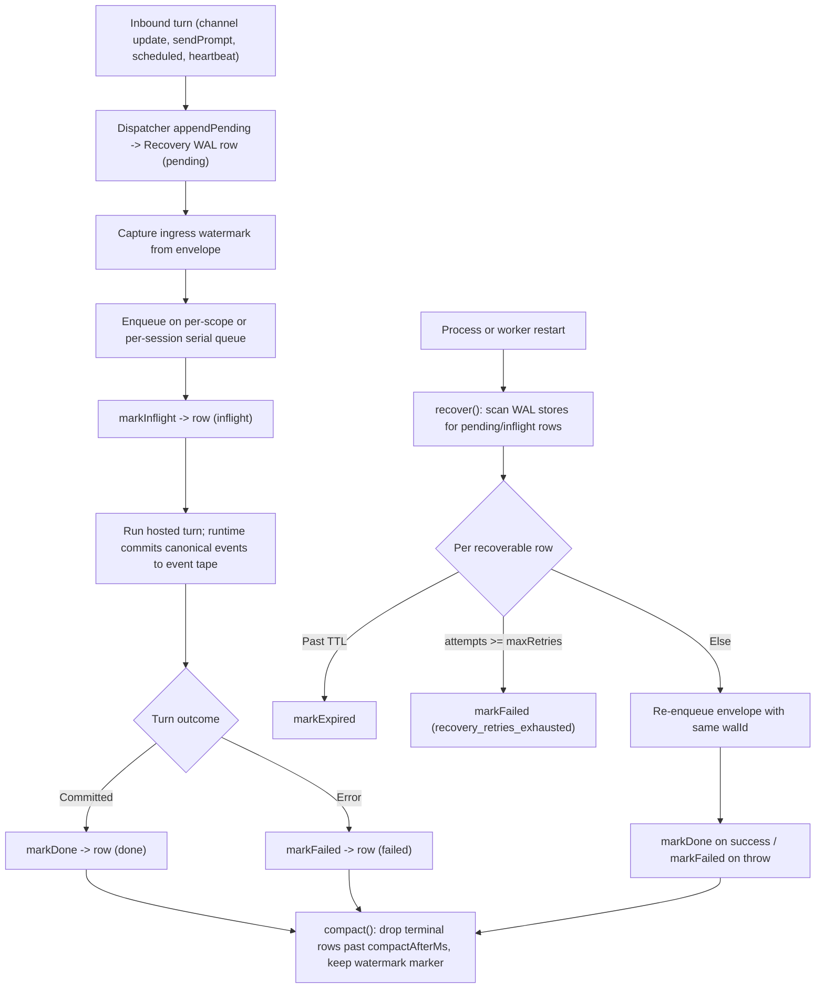

# Journey: WAL And Crash Recovery

## Audience

- developers reviewing gateway and channel restart-replay, the Recovery WAL, and
  the event tape's role in crash recovery
- advanced operators diagnosing what was replayed after a daemon or worker
  restart, and WAL integrity failures

## Entry Points

- ingress acceptance through `createRecoveryWalStore(...)` `appendPending`
- restart replay through `createRecoveryWalRecovery(...)` `recover`
- channel host `recovery.recover()` on lifecycle start
- session-supervisor `recoverRecoveryWalState()` on daemon or worker start
- event-tape rebuild through `createRuntimeTape(...)` `loadFromDisk`
- `brewva inspect` recovery-WAL section

## Objective

Describe how Brewva makes inbound work durable at ingress through the Recovery
WAL and makes per-session history durable as truth through the event tape, and
how, after a process or worker restart, unfinished turns are replayed from the
Recovery WAL while session history is rebuilt from the event tape — without
depending on upstream redelivery.

This journey owns the distinction between the two durable logs. Conflating them
is the most common review error, so it is stated up front:

- `event tape` is the `durable source of truth`: the append-only canonical
  per-session event stream that replay and audit read. It is rebuilt from disk,
  not recovered as transient state.
- the Recovery WAL is `durable transient`: a bounded ingress-acceptance and
  in-flight-turn log whose only job is to let a restarted process re-drive work
  that had been accepted but not yet finished.

## In Scope

- the two-log distinction (`event tape` versus Recovery WAL)
- Recovery WAL record lifecycle: `pending` -> `inflight` -> `done` / `failed` /
  `expired`
- ingress acceptance, dedupe, and ingress high-watermark capture
- restart replay on both the channel-host path and the session-supervisor /
  worker path
- in-flight reconstruction and worker-crash disposition
- WAL compaction with watermark preservation
- WAL and event-tape integrity failure handling

## Out Of Scope

- inspect report composition, `--replay` / `--undo` / `--redo` / `/rewind`,
  hydration, and `PatchSet` rollback → `inspect-replay-and-recovery`. This
  journey may reference the tape, but replay-engine and rollback mechanics live
  there.
- Telegram ingress projection, command / ACL routing, outbound delivery, and
  approval callback routing → `channel-gateway-and-turn-flow`. The
  polling-offset-from-watermark fact bridges both: the WAL side is here, the
  transport side is there.
- compaction gate, soft-cut, `compaction_required` resume, and reasoning-revert
  rebuild → `context-and-compaction`. That journey already records that crash
  recovery needs no second reasoning-specific WAL because the gateway WAL
  replays the interrupted turn envelope.
- scheduler intent convergence semantics → `intent-driven-scheduling`. The WAL
  only carries `source: "schedule"` replay; convergence is scheduler-owned.

## Flow

## Key Steps

1. **Ingress acceptance.** `appendPending(envelope, source, opts)` writes a
   frozen `brewva.recovery-wal.v1` row (`walId`, `status: "pending"`, `source`,
   `sessionId`, `createdAt`, `ttlMs`, `attempts: 0`, optional `dedupeKey`, and
   the `envelope`) and appends it to `<scope>.jsonl`. If a non-terminal row with
   the same `dedupeKey` already exists and is not expired, the existing row is
   returned instead of writing a duplicate.
2. **Watermark capture.** `observeIngressWatermark` reads the envelope's
   `ingressSequence` and tracks the maximum. For Telegram this sequence is
   projected from the upstream `update_id` before the envelope reaches the WAL.
3. **Mark inflight on dispatch.** `markInflight(id)` sets `status: "inflight"`
   and increments `attempts`. Channel turns run on a per-scope serial queue;
   worker turns run on a per-session turn queue whose active WAL ids are tracked
   on the worker handle.
4. **Run the turn against truth.** While the turn runs, the runtime commits
   canonical events to the `event tape`. The WAL row tracks delivery progress;
   the tape records what actually happened.
5. **Terminal marking.** On a committed turn the caller marks the row `done`; on
   error it marks the row `failed`. `update()` is monotonic: any change is
   refused once the current row is terminal, and every change appends a fresh
   append-only line.
6. **Restart replay.** On process start, `recover()` iterates one store per
   `<scope>.jsonl` file and over each store's recoverable rows (`pending` or
   `inflight`). For each row it expires the row when it is past TTL, fails the
   row when `attempts` has reached `maxRetries`
   (`recovery_retries_exhausted`), and otherwise dispatches the source-keyed
   replay handler, then marks the row `done` or `failed`.
7. **Replay handlers differ per path.** The channel host registers a single
   `channel` handler that re-enqueues the envelope with the **same** `walId`, so
   dedupe and ordering hold across restart. The session supervisor registers
   `gateway`, `heartbeat`, and `schedule` handlers that all route through
   `replayRecoveredTurn`, which reopens the session and re-sends the prompt with
   the original `walReplayId`; a missing prompt or session fails the row as
   `recovery_missing_prompt_or_session` rather than guessing.
8. **In-flight worker reconstruction.** WAL ids are bound to live turns through
   track / untrack / rekey operations on the worker handle's active-WAL-id map.
   Rekey supports turn-id remapping (for example on resume) without losing the
   WAL binding.
9. **Compaction with watermark preservation.** `compact()` drops only terminal
   rows older than `compactAfterMs`, then rewrites the file with a leading
   `brewva.recovery-wal.watermark.v1` marker row ahead of the survivors, so the
   ingress watermark survives even when every turn row is gone.

## Execution Semantics

- two logs, two roles: the `event tape` is the `durable source of truth` for
  replay and audit; the Recovery WAL and snapshots are `durable transient`
  material used only for bounded restart recovery
- the `event tape` is append-only and dedupes by event id; `loadFromDisk`
  re-parses only files whose byte size grew since the last parse. This is
  rebuild-from-truth, not WAL recovery
- "durably accepted" is not "executed": an ingress WAL row only proves the turn
  was admitted locally. The Telegram polling watermark can advance from a row in
  any status because retry is local to WAL recovery, not upstream redelivery
- the polling restart offset is `ingressWatermark + 1` for the Telegram
  channel; an absent watermark — no marker and no surviving row carrying a
  sequence — yields no offset, which is a cold start
- the recoverable status set is `pending` and `inflight`; the terminal status
  set is `done`, `failed`, and `expired`
- canonical recovery causes are runtime-owned, not WAL-owned: `approval_pending`,
  `compaction_required`, `provider_retry`, `interrupt`, and `terminal_commit`
  live on the `event tape` and drive its recovery-history and turn-state
  projections. They are independent of WAL row status
- per-scope and per-session serialization preserves ingress admission order;
  replay re-enters the same queue with the original `walId`, so dedupe holds
  across the restart boundary
- TTL is chosen by source; the default Recovery WAL configuration uses a 5-minute
  base TTL, a 10-minute schedule-turn TTL, a 24-hour tool-turn TTL,
  `maxRetries` of 2, and a 1-hour compaction horizon
- durability is named at two levels (`DURABILITY_LEVELS`): between flush
  boundaries the logs are `process_crash` durable (the OS page cache outlives a
  process or worker kill, the case recovery is built for); at a flush boundary —
  a committed `turn.ended` or `checkpoint.committed` event, or a terminal WAL
  mark — they are `power_loss` durable (fsync'd to disk). Full-file rewrites (WAL
  compaction) are atomic (tmp write, fsync, rename, parent-directory fsync), and a
  torn trailing line left by a crash is truncated on load, so a crash never
  truncates a log or merges a new record onto a half-written one. Recovery
  delivery is `at_least_once` (`EFFECT_DELIVERY`): replay re-drives the accepted
  envelope, and external effects are deduped best-effort, not exactly-once

## Failure And Recovery

- the Recovery WAL quarantines and continues (it is durable-transient, not
  truth): a malformed row (non-object line, invalid JSON, or schema-invalid row,
  each tagged `<file>:<line>:<reason>`) is isolated from the live set, preserved
  on disk through compaction for forensic repair, and surfaced through the
  `brewva inspect` `recoveryWal` block — while append, update, list, watermark,
  and recovery keep serving the healthy rows, so one unrecoverable row never
  wedges the daemon. A corrupt ingress-watermark snapshot line is quarantined the
  same way; its value is never trusted, so the polling offset falls back to the
  watermark rebuilt from the surviving rows' ingressSequence (row-derived), and
  cold-starts only when no surviving row carries one
- a WAL file removed at runtime is detected and resets in-memory state, the id
  counter, and the watermark, so a manually-cleared WAL starts clean instead of
  erroring
- replay marks rows `failed` after `maxRetries` attempts or `expired` past TTL
  rather than looping forever
- a worker crash marks every queued and active in-flight row terminal-`failed`
  (`worker_crash:<msg>`) and clears the handle maps. Because those rows are now
  terminal, they are **not** re-driven within the same process; only rows still
  `pending` or `inflight` when the OS killed the process are re-scanned by
  `recover()` on the next start. State this precisely: not every worker crash
  auto-replays — only work that never reached a terminal WAL row does
- event-tape corruption is a separate failure: the strict tape reader
  (`classifyTapeRecord`) throws `unsupported_tape_schema` with a remediation hint,
  while the read-only forensic scan surfaces damaged tape rows as explicit
  `event_tape` issues instead of collapsing into an empty-but-healthy session
- compaction preserves the ingress watermark and rewrites the file atomically
  (tmp + rename), so polling restart does not fall back to full upstream
  redelivery and a crash mid-compaction cannot truncate the log or lose the
  watermark marker

## Observability

- Recovery WAL durable event types:
  - `recovery.wal.appended`
  - `recovery.wal.status.changed`
  - `recovery.wal.compacted`
  - `recovery.wal.recovery.completed`
- channel-scoped WAL telemetry inputs:
  - `channel_recovery_wal_appended`
  - `channel_recovery_wal_status_changed`
  - `channel_recovery_wal_compacted`
  - `channel_recovery_wal_recovery_completed`
- primary operator surface: the `brewva inspect` `recoveryWal` block, which
  reports `enabled`, `filePath`, `pendingCount`, `pendingSessionCount`, and
  `pendingRows` (each with `walId`, `source`, `status`, `turnId`, `channel`,
  `toolCallId`, `toolName`, `updatedAt`)
- artifact paths:
  - Recovery WAL: `.orchestrator/recovery-wal/<scope>.jsonl` (gateway scope
    `gateway`; channel scopes per store)
  - event tape: `.brewva/tape/<encoded-session-id>.jsonl`
- integrity-surface caveat: the unified
  `HostedRuntimeAdapterPort.ops.session.lifecycle.getIntegrity(...)` aggregation
  — intended to fold `event_tape`, `recovery_wal`, and `artifact` durability
  issues into one status — is not yet implemented. The hosted adapter returns a
  healthy stub, so the `brewva inspect` `integrity` block stays empty. The live
  integrity signals today are the Recovery WAL store's fail-closed integrity
  guard (surfaced through the inspect `recoveryWal` block), hydration (which
  surfaces `event_tape` damage), and ledger chain verification

## Code Pointers

- Recovery WAL store and recovery factory:
  `packages/brewva-gateway/src/daemon/recovery.ts`
  (`createRecoveryWalStore`, `createRecoveryWalRecovery`)
- Gateway daemon WAL store construction:
  `packages/brewva-gateway/src/daemon/gateway-daemon.ts`
- Channel host restart replay:
  `packages/brewva-gateway/src/channels/channel-host-lifecycle.ts`
- Channel WAL wiring and polling offset:
  `packages/brewva-gateway/src/channels/wiring.ts`
- Channel turn dispatcher WAL lifecycle:
  `packages/brewva-gateway/src/channels/channel-turn-dispatcher.ts`
- Session-supervisor restart replay:
  `packages/brewva-gateway/src/daemon/session-supervisor/index.ts`
  (`recoverRecoveryWalState`, `replayRecoveredTurn`)
- Worker WAL-id binding and crash disposition:
  `packages/brewva-gateway/src/daemon/session-supervisor/worker-rpc.ts`
- Turn-queue WAL handoff:
  `packages/brewva-gateway/src/daemon/session-supervisor/turn-queue.ts`
- Event tape (append-only truth):
  `packages/brewva-runtime/src/runtime/tape/impl.ts`
  (`createRuntimeTape`, `loadFromDisk`, `classifyTapeRecord`)
- Tape port interfaces: `packages/brewva-runtime/src/runtime/tape/port.ts`
- Recovery WAL event-type constants:
  `packages/brewva-vocabulary/src/internal/session.ts` (re-exported via
  `packages/brewva-vocabulary/src/session.ts`)
- Canonical recovery causes:
  `packages/brewva-runtime/src/runtime/runtime-api.ts`
- Recovery WAL and tape config defaults:
  `packages/brewva-runtime/src/config/defaults.ts`
- Channel WAL event recorder:
  `packages/brewva-gateway/src/channels/recovery-events.ts`
- Channel WAL telemetry inputs:
  `packages/brewva-gateway/src/hosted/internal/session/runtime-ops-builders/channel.ts`
- Inspect recovery-WAL and integrity surface:
  `packages/brewva-cli/src/operator/inspect/report.ts`
- Stubbed lifecycle integrity (drift):
  `packages/brewva-gateway/src/hosted/internal/session/runtime-ops-builders/session.ts`,
  delegated by `packages/brewva-cli/src/runtime/cli-runtime-ports.ts`

## Related Docs

- Inspect, replay, and recovery: `docs/journeys/operator/inspect-replay-and-recovery.md`
- Channel gateway and turn flow: `docs/journeys/operator/channel-gateway-and-turn-flow.md`
- Context and compaction: `docs/journeys/internal/context-and-compaction.md`
- Session lifecycle: `docs/reference/session-lifecycle.md`
- Control and data flow: `docs/architecture/control-and-data-flow.md`
- Artifacts and paths: `docs/reference/artifacts-and-paths.md`
