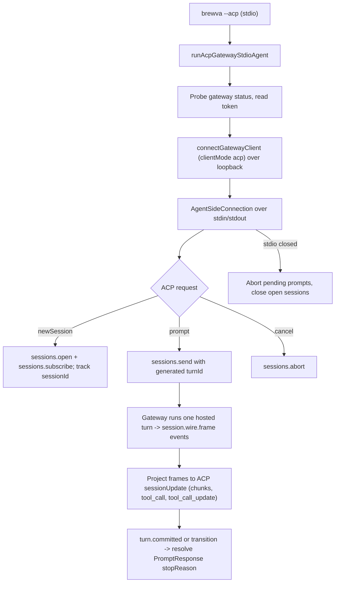

# Journey: ACP Client Ingress

## Audience

- operators connecting an external ACP (Agent Client Protocol) editor or client
  to Brewva through `brewva --acp`
- developers reviewing how ACP stdio ingress maps onto the existing gateway
  `sessions.*` protocol and the shared hosted turn

## Entry Points

- `brewva --acp` — runs an ACP agent over stdio through the Brewva gateway
- `runAcpGatewayStdioAgent(...)` — process entry that builds the ACP connection
- forwarded CLI options: `--cwd`, `--config`, `--model`, `--agent`,
  `--managed-tools` (become session defaults)
- hard prerequisite: a running, reachable gateway daemon (`brewva gateway start`)

## Objective

Describe how `brewva --acp` launches an ACP agent on stdin/stdout, connects to
the gateway as a WebSocket client tagged `clientMode: "acp"`, and translates ACP
`newSession` / `prompt` / `cancel` requests into gateway `sessions.open` /
`sessions.subscribe` / `sessions.send` / `sessions.abort` / `sessions.close`
calls, streaming `session.wire.frame` events back out as ACP `sessionUpdate`
notifications.

The load-bearing fact: ACP is a protocol-translation adapter in front of the
gateway, not a new ingress runtime. It reuses the identical hosted session and
turn machinery as the gateway print path; the daemon treats an ACP connection
like any other gateway client. There is no ACP-specific session, turn,
governance, or recovery path.

Maturity note (stated so the doc matches reality): the ACP adapter is a
working-but-early surface — a single-file adapter at package version `0.1.0`
with no dedicated tests, sitting in front of the mature gateway spine. The
gateway stores `clientMode: "acp"` only as a connection-provenance label and
never branches behavior on it. Treat ACP as a thin client front end, not a
co-equal ingress subsystem like channels.

## In Scope

- the `--acp` flag and the stdio ACP server (`AgentSideConnection` over
  newline-delimited JSON on `process.stdin` / `process.stdout`)
- gateway client bootstrap from env (status probe, token read, connect)
- ACP request to gateway method mapping
- `session.wire.frame` to ACP `sessionUpdate` projection
- per-prompt turn completion and timeout
- disconnect and shutdown handling

## Out Of Scope

- the shared hosted turn, worker, tool spine, and kernel governance →
  `interactive-session` and `channel-gateway-and-turn-flow` (ACP only feeds the
  same spine; it does not re-document it)
- gateway daemon lifecycle, token, and status → `gateway-control-plane-lifecycle`
- the `sessions.*` idempotent admission and Recovery WAL internals →
  `wal-and-crash-recovery` and gateway internals (ACP merely calls
  `sessions.send` with a `turnId`)
- channel ingress (`--channel`), a separate peer ingress →
  `channel-gateway-and-turn-flow`

## Flow

## Key Steps

1. The `--acp` flag is mutually exclusive with prompt text, `--channel`,
   `--daemon`, the inspect/undo/redo/replay flags, task flags, `--session`,
   explicit output modes, and any non-`auto` backend; a violation exits with an
   error.
2. `createAcpGatewayClientSessionPortFromEnv` resolves gateway paths/host/port
   from env, probes `queryGatewayStatus`, reads the gateway token, and calls
   `connectGatewayClient` with `clientId: "brewva-acp"` and `clientMode: "acp"`.
3. `runAcpGatewayStdioAgent` wraps stdout/stdin as a newline-delimited JSON
   stream and constructs an `AgentSideConnection`.
4. `initialize` returns the ACP protocol version, agent name `"Brewva"`, and
   `agentCapabilities` with `loadSession: false` — session resume is not
   advertised.
5. `newSession` rejects any request carrying ACP MCP servers, calls
   `sessions.open`, subscribes to the resulting session, tracks it, and returns
   the session id.
6. `prompt` generates a `turnId`, subscribes a `session.wire.frame` listener
   filtered by session and turn, calls `sessions.send`, asserts acceptance, and
   awaits completion raced against a prompt timeout. Only `type: "text"` prompt
   blocks are supported; other block types are rejected.
7. Frames are projected to ACP updates: assistant deltas become
   `agent_message_chunk` or `agent_thought_chunk`; tool lifecycle frames become
   `tool_call` and `tool_call_update`; `turn.committed` or a cancelled/failed
   `turn.transition` resolves the prompt with a mapped stop reason.
8. `cancel` calls `sessions.abort`. Replay control frames and approval frames
   are deliberately ignored — approvals are not surfaced to the ACP client.

## Execution Semantics

- one ACP `prompt` maps to one gateway turn; the adapter generates a fresh
  `turnId` per call and inherits the gateway's idempotent admission contract
- stop-reason mapping: cancelled to `cancelled`, failed to `refusal`, otherwise
  `end_turn`
- `sessionUpdate` notifications are delivered through a serialized queue so
  ordering is preserved even though frame handlers are async
- frames for other sessions or other turns are dropped; the gateway's
  replay-on-subscribe window (`replay.begin` ... `replay.complete`) is ignored,
  so replayed history is not misattributed to the new prompt
- `clientMode: "acp"` is connection provenance only; the daemon never alters
  behavior based on it
- confirmed adapter limits to state plainly: text-only prompt blocks, ACP MCP
  servers rejected at `newSession`, approvals not surfaced, `loadSession: false`

## Failure And Recovery

- if the gateway daemon is not running or reachable, or the token is missing,
  the adapter throws before the ACP server starts; the CLI prints the error and
  exits non-zero
- a prompt that exceeds the prompt timeout rejects as an ACP method error
- a turn the gateway does not accept rejects with an explicit error
- when stdio or the connection closes, the adapter rejects all pending prompts,
  aborts their sessions, and closes every tracked open session on a best-effort
  basis; new requests after shutdown are rejected
- there is no ACP-side reconnect or backoff supervisor: a dropped gateway socket
  fails pending requests and the editor is expected to relaunch `brewva --acp`

## Observability

- there are no ACP-specific durable events; the adapter emits no `acp_*` events
  and adds no durable receipts
- the outbound ACP surface is `sessionUpdate` notifications
  (`agent_message_chunk`, `agent_thought_chunk`, `tool_call`,
  `tool_call_update`) — ACP wire output, not Brewva durable records
- the authoritative replay and audit surface is the underlying hosted session,
  identical to any gateway session: the canonical `session.wire.frame` stream
  and the event tape for the bound session. Inspect or replay an ACP-driven
  session exactly like a gateway session (`brewva inspect`, `brewva --replay`)
- the gateway records `client = { id: "brewva-acp", version, mode: "acp" }` on
  the connection as debugging provenance, not as an event

## Code Pointers

- ACP adapter (entire surface):
  `packages/brewva-cli/src/entry/acp-gateway-agent.ts`
  (`runAcpGatewayStdioAgent`, `createAcpGatewayAgent`,
  `createAcpGatewayClientSessionPortFromEnv`, `extractAcpPromptText`)
- CLI flag and dispatch:
  `packages/brewva-cli/src/entry/args.ts`,
  `packages/brewva-cli/src/entry/main.ts`,
  `packages/brewva-cli/src/entry/help.ts`
- Gateway client used by the adapter:
  `packages/brewva-gateway/src/ingress/internal/client.ts`
  (`connectGatewayClient`), barrel `packages/brewva-gateway/src/ingress/api.ts`
- Gateway status / token:
  `packages/brewva-gateway/src/admin/internal/cli.ts` (`queryGatewayStatus`),
  `packages/brewva-gateway/src/ingress/internal/auth.ts` (`readGatewayToken`)
- Protocol contract:
  `packages/brewva-gateway/src/protocol/schema.ts`
  (`sessions.*` methods, `session.wire.frame`, `client.mode`)
- Daemon handlers (shared hosted turn):
  `packages/brewva-gateway/src/daemon/gateway-daemon.ts`
- Wire frame source and vocabulary:
  `packages/brewva-gateway/src/hosted/internal/turn-adapter/worker/main.ts`
  (`sendSessionWireFrame`), `packages/brewva-vocabulary/src/internal/wire.ts`
  (`SessionWireFrame`)

## Related Docs

- Channel gateway and turn flow: `docs/journeys/operator/channel-gateway-and-turn-flow.md`
- MCP tool integration: `docs/journeys/operator/mcp-tool-integration.md`
- Gateway control-plane lifecycle: `docs/journeys/operator/gateway-control-plane-lifecycle.md`
- Interactive session: `docs/journeys/operator/interactive-session.md`
- Command reference: `docs/reference/commands.md`
- Session lifecycle: `docs/reference/session-lifecycle.md`
