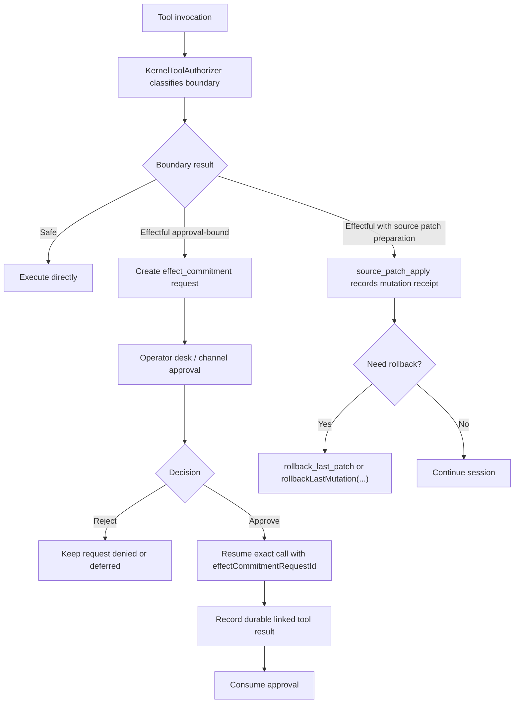

# Journey: Approval And Rollback

## Audience

- operators blocked by `tool_call` decisions who need to understand approval
  and rollback behavior
- developers reviewing governance, the proposal boundary, and the tool gate

## Entry Points

- blocked or deferred tool calls
- approval turns in channel mode
- `HostedRuntimeAdapterPort.ops.tools.access.explain(...)`
- `HostedRuntimeAdapterPort.ops.proposals.requests.list(...)`
- `HostedRuntimeAdapterPort.ops.proposals.requests.listPending(...)`
- `rollback_last_patch`

## Objective

Describe how an effectful tool invocation is classified by boundary,
commitment posture, and recovery preparation, and how an operator moves through
effect commitment, explicit approval, exact resume, and rollback surfaces.

## In Scope

- tool access and effect-boundary classification
- effect-commitment admission
- operator approval and exact resume
- anchored `SourcePatchPlan` apply and `PatchSet` rollback

## Out Of Scope

- normal interactive-session happy paths
- detached subagent merge
- scheduler daemon
- full inspect report composition

## Flow

## Key Steps

1. A tool invocation enters the shared invocation spine and resolves an exact
   governance descriptor.
2. The runtime classifies the call as:
   - `safe`
   - `effectful` with local recovery preparation
   - `effectful` and approval-bound
3. Approval-bound calls do not execute immediately; they create a replayable
   `effect_commitment` request.
4. The operator decides the request through the operator desk or a channel
   approval surface.
5. After approval, the caller must resume the exact request using the same
   `effectCommitmentRequestId`, original `toolCallId`, and canonical argument
   identity.
6. Approval is consumed only after a durable linked tool result is recorded.
7. Source mutations prepare a `SourcePatchPlan` before execution and only
   mutate through `source_patch_apply`. The result is reversible only after the
   recorded mutation receipt links a `PatchSet` and rollback artifact.

## Execution Semantics

- `effectful` does not mean "always requires approval"
- recovery preparation and approval-bound commitment are different effectful
  realities; a tool can need approval without having an automatic undo path
- approval never auto-applies to a later similar-looking call; only the exact
  request may be resumed, including the original `toolCallId` and `argsDigest`
- `resource_lease` expands budget only; it does not widen effect authority
- with `infrastructure.events.enabled=false`, effectful execution fails closed;
  the runtime does not permit a no-audit read-model write path

## Failure And Recovery

- proposal admission rejects requests without an exact governance descriptor,
  with mismatched declared effects, or for tools that are not actually
  approval-bound
- pending approval is replay-hydrated from tape after restart; there is no
  process-local fallback
- if an external effect completes before durable observation is recorded, the
  path still carries at-least-once semantics; backends should treat the request
  id as an idempotency key whenever possible
- `rollback_last_patch` only covers tracked `PatchSet` artifacts, including
  source patches that recorded rollback artifacts during apply
- `rollbackLastMutation(...)` is the receipt-aware rollback surface and returns
  an explicit no-candidate result when no rollback receipt exists

## Observability

- primary inspection and operator surfaces:
  - `HostedRuntimeAdapterPort.ops.tools.access.explain(...)`
  - `HostedRuntimeAdapterPort.ops.proposals.requests.list(...)`
  - `HostedRuntimeAdapterPort.ops.proposals.requests.listPending(...)`
  - `HostedRuntimeAdapterPort.ops.proposals.proposals.list(...)`
  - `brewva inspect`
- core durable events:
  - `proposal_received`
  - `proposal_decided`
  - `decision_receipt_recorded`
  - `effect_commitment_approval_requested`
  - `effect_commitment_approval_decided`
  - `effect_commitment_approval_consumed`
  - `rollback`

## Code Pointers

- Proposal boundary: `docs/reference/proposal-boundary.md`
- Tool authorizer: `packages/brewva-runtime/src/runtime/kernel/kernel.ts`
- Tool transaction log: `packages/brewva-runtime/src/runtime/kernel/kernel.ts`
- Effect-commitment desk: `packages/brewva-runtime/src/runtime/kernel/kernel.ts`
- `PatchSet` rollback: `packages/brewva-runtime/src/protocol/types/patch.ts`
- Source patch protocol:
  `packages/brewva-runtime/src/protocol/types/source-patch.ts`
- Source patch gate:
  `packages/brewva-tools/src/families/navigation/source-patch.ts`
- Receipt-aware rollback: `packages/brewva-runtime/src/runtime/kernel/kernel.ts`
- Rollback tool: `packages/brewva-tools/src/families/workflow/rollback-last-patch.ts`

## Related Docs

- Exploration and effect governance: `docs/architecture/exploration-and-effect-governance.md`
- Proposal boundary: `docs/reference/proposal-boundary.md`
- Tools reference: `docs/reference/tools.md`
- Inspect / replay / undo: `docs/journeys/operator/inspect-replay-and-recovery.md`
