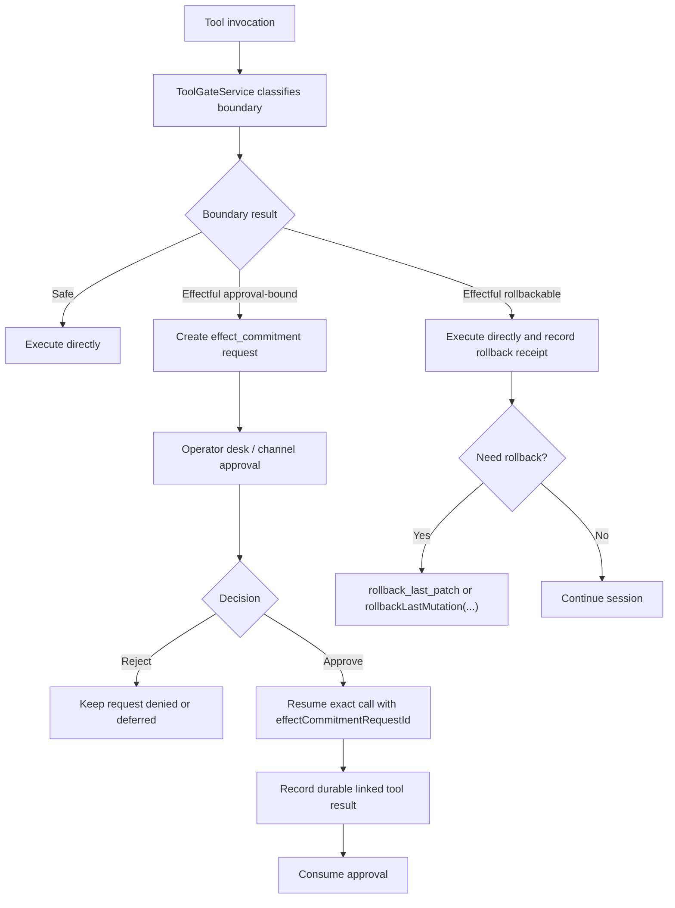

# Journey: Approval And Rollback

## Audience

- operators blocked by `tool_call` decisions who need to understand approval
  and rollback behavior
- developers reviewing governance, the proposal boundary, and the tool gate

## Entry Points

- blocked or deferred tool calls
- approval turns in channel mode
- `runtime.tools.explainAccess(...)`
- `runtime.proposals.listEffectCommitmentRequests(...)`
- `runtime.proposals.listPendingEffectCommitments(...)`
- `rollback_last_patch`

## Objective

Describe how an effectful tool invocation is classified as `safe`,
`rollbackable`, or `approval-bound`, and how an operator moves through effect
commitment, explicit approval, exact resume, and rollback surfaces.

## In Scope

- tool access and effect-boundary classification
- effect-commitment admission
- operator approval and exact resume
- rollbackable mutation and `PatchSet` rollback

## Out Of Scope

- normal interactive-session happy paths
- detached subagent merge
- scheduler daemon
- full inspect report composition

## Flow

## Key Steps

1. A tool invocation enters the shared invocation spine and resolves an exact
   governance descriptor.
2. The runtime classifies the call as:
   - `safe`
   - `effectful` and rollbackable
   - `effectful` and approval-bound
3. Approval-bound calls do not execute immediately; they create a replayable
   `effect_commitment` request.
4. The operator decides the request through the operator desk or a channel
   approval surface.
5. After approval, the caller must resume the exact request using the same
   `effectCommitmentRequestId`, original `toolCallId`, and canonical argument
   identity.
6. Approval is consumed only after a durable linked tool result is recorded.
7. For rollbackable mutations, the runtime preserves a rollback anchor and the
   operator can later use `PatchSet` rollback or receipt-aware mutation
   rollback.

## Execution Semantics

- `effectful` does not mean "always requires approval"
- rollbackable and approval-bound are different effectful realities; governance
  does not permit a tool to be both
- approval never auto-applies to a later similar-looking call; only the exact
  request may be resumed, including the original `toolCallId` and `argsDigest`
- `resource_lease` expands budget only; it does not widen effect authority
- with `infrastructure.events.enabled=false`, effectful execution fails closed;
  the runtime does not permit a no-audit write path

## Failure And Recovery

- proposal admission rejects requests without an exact governance descriptor,
  with mismatched declared effects, or for tools that are not actually
  approval-bound
- pending approval is replay-hydrated from tape after restart; there is no
  process-local fallback
- if an external effect completes before durable observation is recorded, the
  path still carries at-least-once semantics; backends should treat the request
  id as an idempotency key whenever possible
- `rollback_last_patch` only covers tracked `PatchSet` artifacts
- `rollbackLastMutation(...)` is the receipt-aware rollback surface and returns
  an explicit no-candidate result when no rollback receipt exists

## Observability

- primary inspection and operator surfaces:
  - `runtime.tools.explainAccess(...)`
  - `runtime.proposals.listEffectCommitmentRequests(...)`
  - `runtime.proposals.listPendingEffectCommitments(...)`
  - `runtime.proposals.list(...)`
  - `brewva inspect`
- core durable events:
  - `proposal_received`
  - `proposal_decided`
  - `decision_receipt_recorded`
  - `effect_commitment_approval_requested`
  - `effect_commitment_approval_decided`
  - `effect_commitment_approval_consumed`
  - `rollback`

## Code Pointers

- Proposal boundary: `docs/reference/proposal-boundary.md`
- Tool gate: `packages/brewva-runtime/src/services/tool-gate.ts`
- Invocation spine: `packages/brewva-runtime/src/services/tool-invocation-spine.ts`
- Effect-commitment desk: `packages/brewva-runtime/src/services/effect-commitment-desk.ts`
- `PatchSet` rollback: `packages/brewva-runtime/src/services/file-change.ts`
- Receipt-aware rollback: `packages/brewva-runtime/src/services/mutation-rollback.ts`
- Rollback tool: `packages/brewva-tools/src/rollback-last-patch.ts`

## Related Docs

- Exploration and effect governance: `docs/architecture/exploration-and-effect-governance.md`
- Proposal boundary: `docs/reference/proposal-boundary.md`
- Tools reference: `docs/reference/tools.md`
- Inspect / replay / undo: `docs/journeys/operator/inspect-replay-and-recovery.md`
