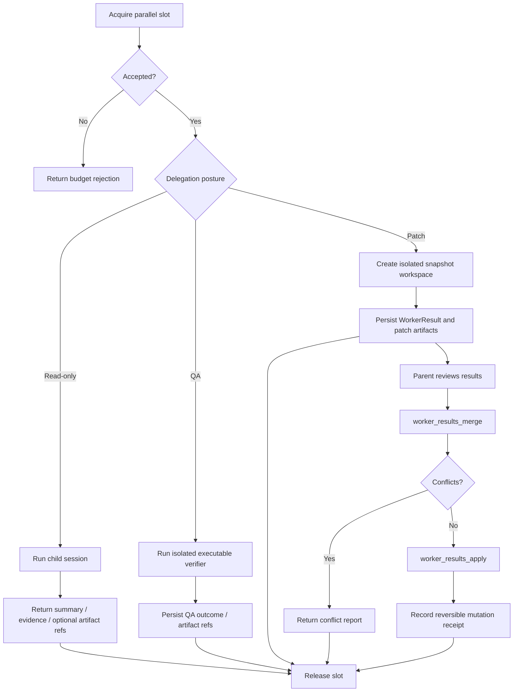

# Journey: Background And Parallelism

## Audience

- operators using `subagent_run`, `subagent_fanout`, and `worker_results_*`
- developers reviewing delegated workers, parallel-budget policy, and
  merge/apply flows

## Entry Points

- `subagent_run`
- `subagent_fanout`
- `subagent_status`
- `worker_results_merge`
- `worker_results_apply`

## Objective

Describe how a parent session runs delegated child work safely under
parallel-budget limits, isolated workspaces, and parent-controlled adoption.

## In Scope

- parallel slot gate
- detached child runs
- read-only delegation, executable QA delegation, and `PatchSet`-producing delegation
- worker-result merge / apply

## Out Of Scope

- scheduler-daemon time-driven execution
- channel ingress / egress
- approval-bound tool governance

## Flow

## Key Steps

1. The parent session acquires parallel budget through the runtime slot gate.
2. Child work can only start through explicit `subagent_*` tools; there is no
   hidden auto-spawn path.
3. Read-only delegation returns structured results that can be used through
   same-turn supplemental injection or preserved as replay-visible handoff
   state.
4. Executable `qa` runs may use isolated execution and artifact capture, but
   they do not produce `WorkerResult` and never enter merge/apply posture.
5. `PatchSet`-producing delegation runs inside an isolated snapshot workspace
   and emits `WorkerResult` plus `PatchSet` artifacts instead of mutating the
   parent
   workspace directly.
6. The parent session must explicitly call `worker_results_merge` and
   `worker_results_apply` before any child patch is adopted.
7. Pending patch worker outcomes flow into `workflow_status` until the parent
   resolves the adoption step; QA outcomes surface as delegation outcomes and
   `workflow.qa`, not as pending patch adoption work.

## Execution Semantics

- delegated workers resolve through `agentSpec` and `ExecutionEnvelope`, not
  through arbitrary prompt text
- when `skillName` is present, the child prompt is assembled from authored
  specialist instructions, delegated skill body, task packet, context
  references, and output contracts
- read-only specialists default to minimal-context execution with dedicated
  repository observation tools such as `git_status`, `git_diff`, and `git_log`
- detached runs are durable control-plane work, not best-effort background
  helpers
- late detached outcomes remain explicit parent-attention blockers; the runtime
  does not auto-apply child work
- isolated patch workers prefer reflink / COW workspace capture when available

## Failure And Recovery

- insufficient parallel budget causes immediate rejection; the system does not
  silently overrun the session limit
- after parent restart, durable detached live runs are restored into the
  in-memory slot ledger so concurrency is not over-issued
- `subagent_status` and `subagent_cancel` survive runtime restart
- completion predicates are checked before spawn, during recovery, and again on
  later parent events to avoid meaningless spawn-then-cancel behavior
- merge conflicts return a conflict report only; they do not mutate the parent
  workspace

## Observability

- primary inspection surfaces:
  - `subagent_status`
  - `workflow_status`
  - `HostedDelegationStore.listPendingOutcomes(...)`
- durable artifacts:
  - `.orchestrator/subagent-runs/<runId>/`
  - `WorkerResult`
  - patch manifests
  - QA artifact refs and canonical QA outcome data
  - `delegation-context-manifest.json`

## Code Pointers

- Orchestrator: `packages/brewva-gateway/src/subagents/orchestrator.ts`
- Catalog / config: `packages/brewva-gateway/src/subagents/catalog.ts`
- Background controller: `packages/brewva-gateway/src/subagents/background-controller.ts`
- Background protocol: `packages/brewva-gateway/src/subagents/background-protocol.ts`
- Workspace isolation: `packages/brewva-gateway/src/subagents/workspace.ts`
- Runtime parallel state: `packages/brewva-runtime/src/services/parallel.ts`
- Delegation store: `packages/brewva-gateway/src/subagents/delegation-store.ts`
- Tool surface: `packages/brewva-tools/src/subagent-run.ts`
- Worker adoption: `packages/brewva-tools/src/worker-results.ts`

## Related Docs

- Orchestration guide: `docs/guide/orchestration.md`
- Runtime API: `docs/reference/runtime.md`
- Scheduling: `docs/journeys/operator/intent-driven-scheduling.md`
