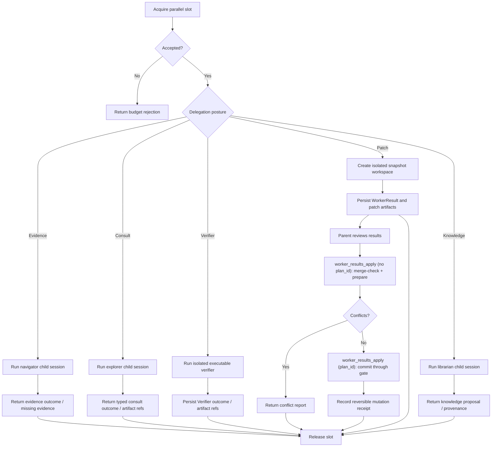

# Journey: Background And Parallelism

## Audience

- operators using `subagent_run`, `subagent_fanout`, `subagent_fork`,
  `subagent_status`, `subagent_cancel`, and `worker_results_*`
- developers reviewing delegated workers, parallel-budget policy, and
  merge/apply flows

## Entry Points

- `subagent_run`
- `subagent_fanout`
- `subagent_fork`
- `subagent_status`
- `inbox_query`
- `subagent_cancel`
- `worker_results_merge`
- `worker_results_apply`
- `worker_results_reject`
- `review_request` (dispatches a bounded fresh-context reviewer; its receipt and
  fitness semantics live in `verification-and-independent-review`)

## Objective

Describe how a parent session runs delegated child work safely under
parallel-budget limits, isolated workspaces, and parent-controlled adoption.

## In Scope

- parallel slot gate
- detached child runs
- `navigator` evidence runs, `explorer` consultation, executable `verifier`
  delegation, `worker` patch delegation, and `librarian` knowledge proposals
- worker-result merge / apply

## Out Of Scope

- scheduler-daemon time-driven execution → `intent-driven-scheduling`
- channel ingress / egress → `channel-gateway-and-turn-flow`
- approval-bound tool governance → `approval-and-rollback`
- `review_request` receipt semantics, the authored-vs-independent perspective, and
  requirement fitness → `verification-and-independent-review`

## Flow

## Key Steps

1. The parent session acquires parallel budget through the runtime slot gate.
2. Child work can only start through explicit `subagent_*` tools; there is no
   hidden auto-spawn path.
3. Public `subagent_run` and `subagent_fanout` require `agent` and accept
   `skillName` only as an optional compatible semantic contract. The resolver
   validates the role, result mode, gate reason, envelope, managed-tool set, and
   model category; it never auto-spawns hidden teams.
4. Executable `verifier` runs may use isolated execution and artifact capture, but
   they do not produce `WorkerResult` and never enter merge/apply posture.
5. `PatchSet`-producing delegation runs inside an isolated snapshot workspace
   and emits `WorkerResult` plus `PatchSet` artifacts instead of mutating the
   parent
   workspace directly.
6. The parent adopts a worker patch with an explicit `worker_results_apply`:
   called without `plan_id` it runs the merge check and prepares the plan in one
   step (returning the prepared plan or a conflict report); called with `plan_id`
   it commits through the gate. `worker_results_merge` remains available for
   standalone conflict inspection but is no longer a required pre-apply step. If
   the parent rejects the patch, it calls `worker_results_reject` to record the
   rejection receipt.
7. Pending worker outcomes flow into `workflow_status` until the parent
   resolves the adoption step; Verifier outcomes surface as delegation outcomes and
   `workflow.verifier`, not as pending patch adoption work.
8. Librarian knowledge proposals require an explicit knowledge adoption receipt
   before they become authoritative docs, skills, or final artifacts.
9. `subagent_fork` records a fork primitive with parent lineage and
   `forkTurns`. It is not a catalog specialist and cannot expand authority
   beyond the parent ceiling.

## Execution Semantics

- public delegated workers resolve through explicit `agent` plus optional
  compatible `skillName`, not through public `agentSpec` or envelope fields
- the stable public delegated surface is `navigator`, `explorer`, `worker`,
  `verifier`, and `librarian`
- run lifecycle uses only `pending`, `running`, `blocked`, `completed`,
  `failed`, and `cancelled`; timeout is a lifecycle reason, not a public
  status, and worker apply is role disposition, not `merged` lifecycle
- `navigator`, `explorer`, and `librarian` are separate read-only roles with
  distinct result contracts and managed-tool sets
- `inbox_query` is an explicit-pull read model; reading inbox does not inject
  content into the parent prompt or mark evidence as consumed
- consult kind is derived by the resolver for public explorer skills;
  diagnostic tools may still select it explicitly for maintainer probes
- when `skillName` is present, the child prompt is assembled from authored
  specialist instructions, delegated skill body, task packet, context
  references, and output contracts
- independent review runs through the `review_request` path: it dispatches a
  bounded fresh-context reviewer as a `consult/review` delegate under the
  explorer envelope family and commits an `independent`-perspective verification
  receipt; its grading lives in `verification-and-independent-review`
- same-turn `returnMode=supplemental` and durable detached delivery state are
  separate:
  - same-turn supplemental append affects the current parent-turn hidden tail
  - detached delivery still remains durable control-plane state with
    `handoffState` progression such as `pending_parent_turn -> surfaced`
  - `subagent_delivery_surfaced` is emitted only when a later parent turn
    actually surfaces that pending durable outcome
- detached runs are durable control-plane work, not best-effort background
  helpers
- late detached outcomes remain explicit parent-attention blockers; the runtime
  does not auto-apply child work
- isolated patch workers prefer reflink / COW workspace capture when available

## Failure And Recovery

- insufficient parallel budget causes immediate rejection; the system does not
  silently overrun the session limit
- after parent restart, active concurrency is reconstructed from the durable
  tape (delegation spawn/terminal events) so slots are not over-issued; there
  is no separate in-memory ledger that must survive restart
- `subagent_status` and `subagent_cancel` survive runtime restart
- completion predicates are checked before spawn, during recovery, and again on
  later parent events to avoid meaningless spawn-then-cancel behavior
- merge conflicts return a conflict report only; they do not mutate the parent
  workspace

## Enforced Claims

The authority-bearing claims in this journey are pinned to live enforcement by
`test/fitness/delegation-claims-enforcement.fitness.test.ts`. Each claim has a
stable id and an enforcement test that fails if the behavior regresses to a
stub or no-op, keeping documented authority and wired authority in lockstep
(design axiom 14). A drift guard in the same file asserts this list and the
test registry stay identical.

- `parallel-budget-rejection`: insufficient parallel budget causes immediate
  rejection; the session concurrency limit is never silently overrun.
- `parallel-lifetime-cap`: the per-session lifetime delegation cap is enforced
  from durable tape and cannot be silently overrun.
- `slot-ledger-restart-recovery`: after restart, active concurrency is
  reconstructed from durable tape so slots are not over-issued.
- `no-auto-apply`: the runtime does not auto-apply child work; a completed
  worker patch stays pending an explicit parent adoption decision.

## Interactive Task Review

In the interactive shell, delegated runs surface through the task browser
rather than through a hidden local queue. The task browser owns selection and
summary preview; detailed worker output opens in the subagent footer above the
composer.

Operator expectations:

- list entries show running, completed, and failed runs with recent summaries
- selecting a run opens the subagent footer inspector with worker-session
  assistant text, tool output summaries, status, delivery metadata, worker
  session id, summary/error, and artifact refs
- when a worker session id exists, the footer can open that worker session from
  the same runtime-owned session wire used by replay and inspection
- stop or cancel still routes through the existing operator ports and
  `subagent_cancel`; the task browser does not own independent task truth

## Observability

- primary inspection surfaces:
  - `subagent_status`
  - `workflow_status`
  - `HostedDelegationStore.listPendingOutcomes(...)`
  - session-index delegation and parallel views
- model-facing advisory:
  - the delegation advisory renders in the hosted `[RuntimeBrief]` dynamic tail
    (salience low, silent unless actionable), surfacing delegation as a
    pressure-relief or review-debt-closure instrument — inform-only, no gate
  - its adoption is graded off the tape by `report:delegation-evidence` (see the
    orchestration guide's measurement loop)
- durable artifacts:
  - `.orchestrator/subagent-runs/<runId>/`
  - `WorkerResult`
  - patch manifests
  - Verifier artifact refs and canonical Verifier outcome data
  - serialized `ContextBundle` manifests with stable bundle hashes at
    `.orchestrator/subagent-runs/<runId>/context-bundle.json`
- detached filesystem IPC:
  - isolated behind `DetachedRunAdapter`
  - spec, live state, cancel request, and outcome files are not read or written
    directly by the background controller
  - durable run specs are latest-only; Brewva does not migrate stale detached
    run directories across binary upgrades, so operators should stop old
    detached workers and clear `.orchestrator/subagent-runs/` before retrying
    work after an upgrade
  - context-bundle manifests are delegation run artifacts shared by in-process
    and detached execution, not a second detached protocol shape
  - in-process delegation intentionally remains inline

## Code Pointers

- Orchestrator: `packages/brewva-gateway/src/delegation/orchestrator.ts`
- Catalog / config: `packages/brewva-gateway/src/delegation/catalog/registry.ts`
- Background controller: `packages/brewva-gateway/src/delegation/background/controller.ts`
- Detached adapter: `packages/brewva-gateway/src/delegation/background/detached-run-adapter.ts`
- Background runner: `packages/brewva-gateway/src/delegation/background/runner-main.ts`
- Background protocol: `packages/brewva-gateway/src/delegation/background/protocol.ts`
- Context bundle: `packages/brewva-gateway/src/context/context-bundle.ts`
- Workspace isolation: `packages/brewva-gateway/src/delegation/workspace.ts`
- Parallel admission gate: `packages/brewva-gateway/src/delegation/parallel-admission.ts`
  (host wiring: `packages/brewva-gateway/src/hosted/internal/session/parallel-admission-host.ts`)
- Session-index read models: `packages/brewva-session-index/src/projection/delegation.ts`
- Delegation store: `packages/brewva-gateway/src/delegation/delegation-store.ts`
- Run / fan-out tools: `packages/brewva-tools/src/families/delegation/subagent-run/api.ts`
- Status / cancel tools: `packages/brewva-tools/src/families/delegation/subagent-control.ts`
- Worker adoption: `packages/brewva-tools/src/families/workflow/worker-results.ts`
- Independent review dispatch: `packages/brewva-tools/src/families/delegation/review-request.ts`
  (receipt observer: `packages/brewva-gateway/src/delegation/review-receipt-observer.ts`,
  reviewer model routing: `packages/brewva-gateway/src/delegation/model-routing.ts`)

## Related Docs

- Orchestration guide: `docs/guide/orchestration.md`
- Tools reference: `docs/reference/tools.md`
- Runtime API: `docs/reference/runtime.md`
- Scheduling: `docs/journeys/operator/intent-driven-scheduling.md`
- Verification and independent review: `docs/journeys/operator/verification-and-independent-review.md`
