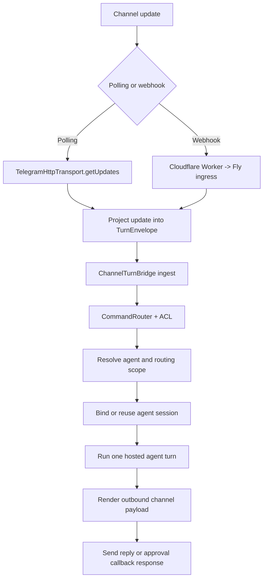

# Journey: Channel Gateway And Turn Flow

## Audience

- operators running `brewva --channel telegram`
- developers reviewing channel ingress / egress, scope binding, and approval
  callbacks

## Entry Points

- `brewva --channel telegram --telegram-token <bot-token>`
- Telegram polling
- Telegram webhook ingress

## Objective

Describe how the `--channel` path normalizes external channel updates into
`TurnEnvelope`, binds them to runtime-backed agent sessions, and returns
responses or approval turns to the originating channel.

## In Scope

- Telegram polling / webhook ingress
- channel-scope routing and agent-session binding
- channel dispatch, delivery, and approval callbacks

## Out Of Scope

- `brewva gateway ...`
- local interactive CLI sessions
- detached subagent details

## Flow

## Key Steps

1. Telegram updates enter the system through polling or webhook ingress.
2. The projector and adapter dedupe layer normalize raw updates into
   `TurnEnvelope`.
3. The bridge records ingest events and hands the turn to the channel loop.
4. The command router resolves slash commands, `@agent` routing, and ACL
   decisions.
5. Channel scope binds to the agent session while preserving the original
   channel session id in metadata.
6. The runtime executes one hosted turn and collects assistant, tool, and
   approval outputs.
7. The adapter renders outbound payloads according to channel capabilities and
   sends them.
8. Approval callbacks are signature-validated, projected into approval turns,
   and rebound to the target agent session.

## Execution Semantics

- polling restart offset comes from the durably accepted TurnWAL ingress
  watermark rather than from Telegram redelivery
- the ingress watermark is ingress-level state, not proof that local execution
  finished successfully
- outbound delivery is not replay-critical durable state; the system performs
  bounded retry and then records an outbound error
- Telegram channel policy is the built-in `telegram` skill, not a
  user-authored transport-policy injection path

## Failure And Recovery

- once an update is durably accepted into TurnWAL, local unfinished work is
  recovered from WAL instead of relying on Telegram redelivery
- TurnWAL compaction preserves the latest ingress watermark in a metadata-only
  marker so polling restart does not fall back
- outbound requests use bounded retry only for explicitly retryable provider
  rejections
- approval screen state is process-local cache; approval truth remains derived
  from runtime events

## Observability

- ingress / egress:
  - `channel_turn_ingested`
  - `channel_turn_emitted`
  - `channel_turn_bridge_error`
- dispatch:
  - `channel_session_bound`
  - `channel_turn_dispatch_start`
  - `channel_turn_dispatch_end`
  - `channel_turn_outbound_complete`
  - `channel_turn_outbound_error`
- orchestration:
  - `channel_command_received`
  - `channel_command_rejected`
  - `channel_focus_changed`
  - `channel_fanout_started`
  - `channel_fanout_finished`

## Code Pointers

- Channel host: `packages/brewva-gateway/src/channels/host.ts`
- Bootstrap: `packages/brewva-gateway/src/channels/channel-bootstrap.ts`
- Session coordinator: `packages/brewva-gateway/src/channels/channel-session-coordinator.ts`
- Command router: `packages/brewva-gateway/src/channels/channel-control-router.ts`
- Turn dispatcher: `packages/brewva-gateway/src/channels/channel-turn-dispatcher.ts`
- Agent dispatch: `packages/brewva-gateway/src/channels/channel-agent-dispatch.ts`
- Reply writer: `packages/brewva-gateway/src/channels/channel-reply-writer.ts`
- Telegram adapter / transport: `packages/brewva-channels-telegram/src`
- Ingress: `packages/brewva-ingress/src`

## Related Docs

- CLI: `docs/guide/cli.md`
- Telegram webhook ingress: `docs/guide/telegram-webhook-edge-ingress.md`
- Session lifecycle: `docs/reference/session-lifecycle.md`
