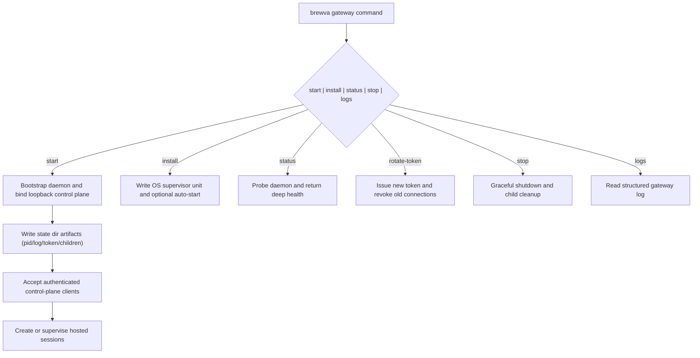

# Journey: Gateway Control-Plane Lifecycle

## Audience

- operators managing `brewva gateway ...`
- developers reviewing the gateway daemon, local control plane, and hosted
  session orchestration

## Entry Points

- `brewva gateway start`
- `brewva gateway install`
- `brewva gateway status`
- `brewva gateway stop`
- `brewva gateway rotate-token`
- `brewva onboard --install-daemon`

## Objective

Describe how the `brewva gateway` product entrypoint starts the daemon, exposes
the typed control-plane protocol, manages hosted sessions, and supports
long-running operation through status, logs, install, and token rotation.

## In Scope

- gateway daemon lifecycle
- state-directory artifacts and auth token handling
- local control-plane protocol and health probing
- operator surfaces such as install, uninstall, stop, and logs

## Out Of Scope

- `--channel telegram`
- skill and verification details inside one interactive session
- scheduler daemon

## Flow

## Key Steps

1. `brewva gateway start` launches the local daemon and binds only to loopback.
2. The daemon writes `gateway.pid.json`, `gateway.log`, `gateway.token`, and
   `children.json`.
3. Clients authenticate through challenge-response before using the typed
   WebSocket protocol.
4. The daemon owns hosted session orchestration, child-process supervision, and
   control-plane state management.
5. `install` and `uninstall` manage the OS supervisor; `onboard` remains a
   thinner wrapper.
6. `status`, `logs`, `rotate-token`, and `stop` form the day-to-day operator
   lifecycle.

## Execution Semantics

- `brewva gateway` and `--channel` are separate execution paths
- gateway is a local control plane, not a public ingress surface
- the protocol uses latest-only semantics; there is no sync-mode or
  grace-window compatibility layer
- `rotate-token` revokes the old token immediately
- the gateway state directory contains control-plane material, not runtime
  replay truth

## Failure And Recovery

- after a daemon crash, the service can be restarted from state-directory
  artifacts and the OS supervisor
- `children.json` supports orphan cleanup so child processes do not leak across
  restart boundaries
- `status --deep` is the first diagnostic entrypoint for liveness, probe
  failures, and missing auth files
- after token rotation, old connections fail immediately and clients must
  re-authenticate
- for long-running operation, prefer `install` or `onboard` over ad hoc manual
  backgrounding

## Observability

- `brewva gateway status --deep`
- `brewva gateway logs --tail <N>`
- loopback HTTP health probe
- state-directory artifacts:
  - `gateway.pid.json`
  - `gateway.log`
  - `gateway.token`
  - `children.json`

## Code Pointers

- Gateway CLI: `packages/brewva-gateway/src/cli.ts`
- Gateway daemon: `packages/brewva-gateway/src/daemon/gateway-daemon.ts`
- Protocol schema: `packages/brewva-gateway/src/protocol/schema.ts`
- Client: `packages/brewva-gateway/src/client.ts`
- Main CLI entry: `packages/brewva-cli/src/index.ts`

## Related Docs

- Gateway guide: `docs/guide/gateway-control-plane-daemon.md`
- Gateway command reference: `docs/reference/commands.md`
- Gateway control-plane protocol: `docs/reference/gateway-control-plane-protocol.md`
