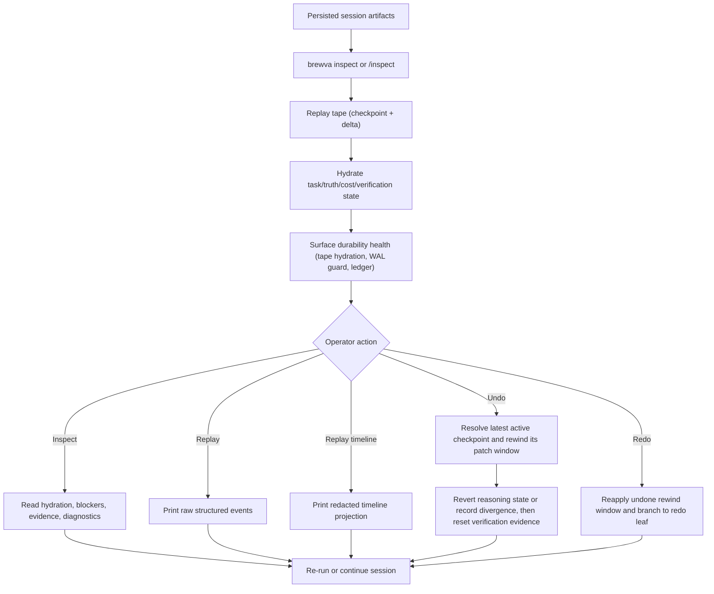

# Journey: Inspect, Replay, And Recovery

## Audience

- operators using `brewva inspect`, `--replay`, `--undo`, `--redo`, and
  interactive `/rewind`
- developers reviewing replay, hydration, WAL, session rewind, and rollback behavior

## Entry Points

- `brewva inspect`
- `brewva inspect --session <id>`
- `brewva inspect --run-report`
- `brewva --replay`
- `brewva --undo`
- `brewva --redo`
- interactive `/rewind`
- `/inspect` in channel or interactive control surfaces

## Objective

Describe how a persisted session is reconstructed by inspection surfaces and how
operators move through the `inspect -> replay -> integrity -> rewind/redo` path
to diagnose issues, recover state, and validate outcomes.

## Implementation Status

Hydration, the recovery projections, and the rewind/redo engine are implemented
under `docs/research/active/rfc-inspect-replay-and-recovery-optimization.md`:
hydration projects `cold`/`ready`/`degraded` from tape with a source cursor;
conversation and workspace rewind and redo run through one gateway-owned
transaction engine with per-turn auto-checkpoints and supersession; recovery
capabilities are evidence-derived. Integrity currently verifies the event tape
(degrading on damage) and stays `inconclusive` until WAL, artifact, and ledger
checks also run. World-changing rewind invalidates verification evidence
structurally rather than through an authority-bearing event: patch-set rollback
detaches the patch-set-keyed evidence the gate matches on (`containsAll` over
`patchSetRefs`), so stale outcomes fall to a `stale`/`missing` posture by
consequence. Requirement-fitness grading and a review-debt Work Card line now
ship as a re-derived read-time view (see
`verification-and-independent-review`); a dedicated "verification debt created by
recovery" annotation on that line remains an intended refinement. Read
present-tense descriptions of the unchecked integrity dimensions as the intended
contract, not yet a shipped guarantee.

## In Scope

- inspect report construction
- event tape replay and hydration
- integrity reporting from durable health signals
- session rewind checkpoints, fork recovery, and PatchSet restoration
- recovery boundaries when projection, WAL, or nearby artifacts are missing

## Out Of Scope

- skill selection and normal execution happy paths →
  `skill-routing-and-activation` and `interactive-session`
- effect-commitment approval semantics → `approval-and-rollback`
- Telegram channel ingress details → `channel-gateway-and-turn-flow`

## Flow

## Key Steps

1. `brewva inspect` rebuilds a compact operator view from event tape and nearby
   rebuildable artifacts. The default surface is the shared Work Card; raw
   replay and diagnostic sections are explicit drill-downs.
2. On first hydration, the runtime performs checkpoint-plus-delta replay and
   restores task, truth, cost, verification, and related fold slices.
3. The report surfaces durability health from live signals: damaged event-tape
   rows degrade hydration with explicit `event_tape` issues, the Recovery WAL
   store guards itself fail-closed, and the ledger chain is verified
   independently. The unified
   `HostedRuntimeAdapterPort.ops.session.lifecycle.getIntegrity(...)` aggregation
   is the intended single health surface, but it is not yet implemented: the
   hosted adapter returns a healthy stub, so the report's `integrity` block stays
   empty until it lands.
4. `--replay` prints raw structured event records from durable tape for scripts
   that intentionally depend on event payloads.
5. `--replay-timeline` prints a redacted replay timeline from the same durable
   tape. Timeline groups must carry canonical event or receipt refs and must
   not read the live hosted stream.
6. `--undo` resolves the target session, rewinds the latest active checkpoint,
   carries branch summary by default, resets verification state, and restores
   the original prompt.
7. `/rewind` or `HostedRuntimeAdapterPort.ops.session.rewind.rewind(...)` can target any active
   checkpoint with `conversation`, `code`, or `both` semantics. Runtime
   governance is mode-aware, and the runtime records divergence notes when only
   one side rewinds.
8. `--redo` reapplies the latest undone rewind window and re-anchors the
   reasoning leaf selected before rewind when the prior operation changed
   conversation state.
9. Delegated inspect surfaces expose workboard, run cards, explicit-pull inbox,
   timeline preview, and recovery preview. Worker patches and librarian
   knowledge enter parent truth only after explicit apply or adoption.

## Execution Semantics

- the durable source of truth is the event tape, checkpoints, receipts, approval
  events, and linked tool outcomes
- Recovery WAL and snapshots are `durable transient` artifacts used for bounded
  recovery or undo, not historical truth
- projection files are `rebuildable state`; removing them must not change replay
  correctness
- `inspect` layers deterministic directory-scoped analysis on top of replayed
  state, so it serves both as a recovery entrypoint and as a code-review
  entrypoint
- replay uses the V2 delegation vocabulary: public lifecycle no longer emits
  `timeout` or `merged`; those meanings live in lifecycle reason and role
  disposition respectively
- verifier evidence is advisory debt; it can enter inspect/workboard, but not
  worker merge/apply authority
- checkpoint domains are distinct contracts and must not share an ambiguous
  identity, though they may reference one another:
  - model materialization checkpoints (`checkpoint.committed`) anchor replay
    baseline reconstruction
  - session fold baselines anchor what survived a `session_compact`
  - operator recovery checkpoints anchor `/rewind` and `--undo`/`--redo`
- hydration and integrity are distinct views:
  - hydration reports whether replay successfully rebuilt session-local state,
    as `cold`/`ready`/`degraded` with a source cursor
  - integrity reports durability health: it degrades on `event_tape` damage and
    stays `inconclusive` until WAL, artifact, and ledger checks also run, rather
    than ever claiming health it has not verified

## Failure And Recovery

- damaged event tape rows do not collapse into an "empty but healthy" session;
  hydration degrades and surfaces explicit `event_tape` issues
- WAL integrity failures fail closed so the runtime does not continue from a
  corrupted recovery surface
- missing projection artifacts are rebuilt from durable tape instead of making
  the session unrecoverable
- `--undo` / `--redo` return explicit `no_checkpoint` semantics when no
  rewind checkpoint window exists
- channel helper state and approval-screen cache are not part of recovery
  correctness

## Observability

- primary inspection surfaces:
  - `brewva inspect`
  - `brewva --replay`
  - `brewva --undo`
  - the Recovery WAL store's fail-closed integrity guard (read via the inspect
    `recoveryWal` block)
  - `HostedRuntimeAdapterPort.ops.session.lifecycle.getIntegrity(...)` — the
    intended unified health surface, currently a healthy stub (see Key Steps)
- key report sections:
  - Work Card goal/context/options/authority/work/evidence/continuation anchor
  - hydration status
  - integrity issues (empty until the unified `getIntegrity` aggregation lands)
  - latest verification outcome
  - ledger chain status
  - projection, WAL, and snapshot artifact paths

## Code Pointers

- Inspect / replay / undo CLI dispatch: `packages/brewva-cli/src/index.ts`
- Inspect report implementation: `packages/brewva-cli/src/operator/inspect/report.ts`
- Run-story projection (`--run-report`): `packages/brewva-cli/src/operator/inspect/run-report.ts`
- Read-time requirement fitness and review debt: `packages/brewva-cli/src/operator/inspect/{requirement-fitness,review-debt}.ts`
  (grammar journey: `docs/journeys/operator/verification-and-independent-review.md`)
- Session lifecycle: `packages/brewva-runtime/src/runtime/tape/impl.ts`
- Replay engine: `packages/brewva-runtime/src/runtime/tape/impl.ts`
- Patch-set rollback: `packages/brewva-vocabulary/src/workbench.ts`
- Receipt-aware rollback: `packages/brewva-runtime/src/runtime/kernel/impl.ts`
- Rollback tool: `packages/brewva-tools/src/families/workflow/rollback-last-patch.ts`

## Related Docs

- CLI: `docs/guide/cli.md`
- Session lifecycle reference: `docs/reference/session-lifecycle.md`
- Artifact and path reference: `docs/reference/artifacts-and-paths.md`
- Control and data flow: `docs/architecture/control-and-data-flow.md`
- Common failures: `docs/troubleshooting/common-failures.md`
- Approval path: `docs/journeys/operator/approval-and-rollback.md`
- Verification grammar: `docs/journeys/operator/verification-and-independent-review.md`
