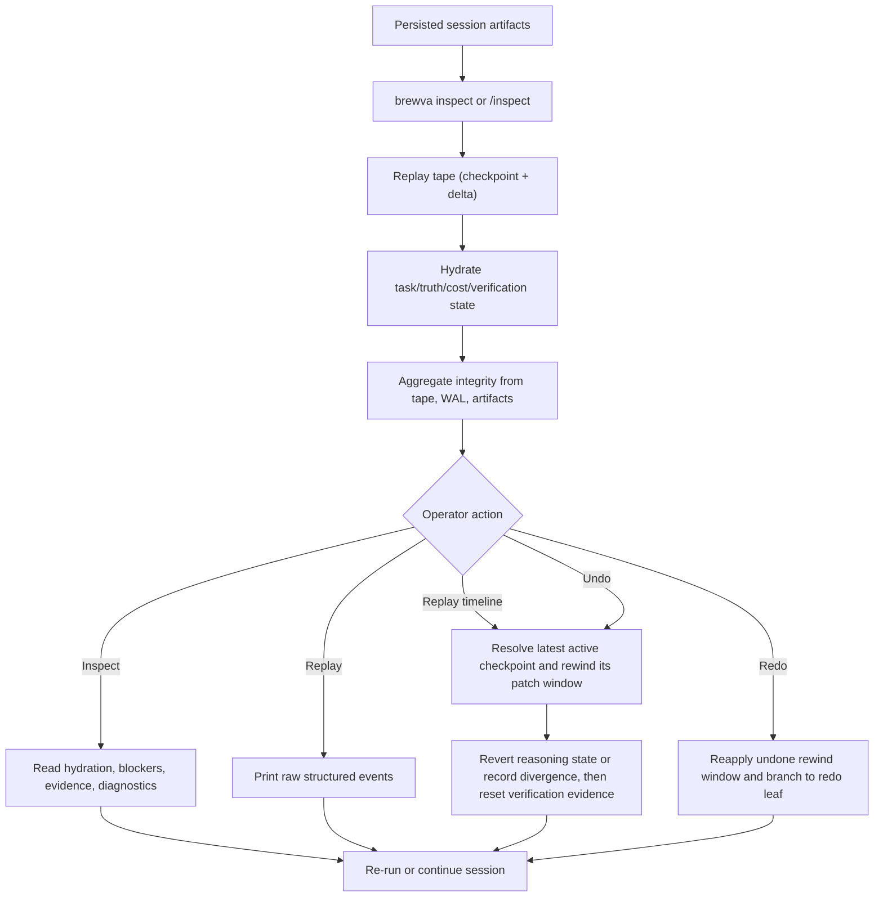

# Journey: Inspect, Replay, And Recovery

## Audience

- operators using `brewva inspect`, `--replay`, `--undo`, `--redo`, and
  interactive `/rewind`
- developers reviewing replay, hydration, WAL, session rewind, and rollback behavior

## Entry Points

- `brewva inspect`
- `brewva inspect --session <id>`
- `brewva --replay`
- `brewva --undo`
- `brewva --redo`
- interactive `/rewind`
- `/inspect` in channel or interactive control surfaces

## Objective

Describe how a persisted session is reconstructed by inspection surfaces and how
operators move through the `inspect -> replay -> integrity -> rewind/redo` path to
diagnose issues, recover state, and validate outcomes.

## In Scope

- inspect report construction
- event tape replay and hydration
- integrity aggregation
- session rewind checkpoints, fork recovery, and PatchSet restoration
- recovery boundaries when projection, WAL, or nearby artifacts are missing

## Out Of Scope

- skill selection and normal execution happy paths
- effect-commitment approval semantics
- Telegram channel ingress details

## Flow

## Key Steps

1. `brewva inspect` rebuilds a compact operator view from event tape and nearby
   rebuildable artifacts.
2. On first hydration, the runtime performs checkpoint-plus-delta replay and
   restores task, truth, cost, verification, and related fold slices.
3. `HostedRuntimeAdapterPort.ops.session.lifecycle.getIntegrity(...)` aggregates tape, Recovery WAL, and artifact
   persistence issues into one health surface.
4. `--replay` 从 durable tape 打印 raw structured event dump；依赖原始
   payload 的脚本继续使用这条兼容路径。
5. `--replay-timeline` 从同一 durable tape 打印 redacted replay timeline；
   timeline group 必须带 canonical event/receipt refs，且不读取 live hosted
   stream。
6. `--undo` resolves the target session, rewinds the latest active checkpoint,
   carries branch summary by default, resets verification state, and restores
   the original prompt.
7. `/rewind` or `HostedRuntimeAdapterPort.ops.session.rewind.rewind(...)` can target any active
   checkpoint with `conversation`, `code`, or `both` semantics. Runtime
   governance is mode-aware, and the runtime records divergence notes when only
   one side rewinds.
8. `--redo` reapplies the latest undone rewind window and re-anchors the
   reasoning leaf selected before rewind when the prior operation changed
   conversation state.
9. Delegated inspect surfaces expose workboard、run cards、explicit-pull
   inbox、timeline preview 和 recovery preview；worker patch 与 librarian
   knowledge 只有在显式 apply/adopt 后才进入父 truth。

## Execution Semantics

- the durable source of truth is the event tape, checkpoints, receipts, approval
  events, and linked tool outcomes
- Recovery WAL and snapshots are `durable transient` artifacts used for bounded
  recovery or undo, not historical truth
- projection files are `rebuildable state`; removing them must not change replay
  correctness
- `inspect` layers deterministic directory-scoped analysis on top of replayed
  state, so it serves both as a recovery entrypoint and as a code-review
  entrypoint
- replay 使用 V2 delegation vocabulary：public lifecycle 不再产生
  `timeout` 或 `merged`，这些语义分别进入 lifecycle reason 与 role
  disposition
- verifier evidence 是 advisory debt；它可以进入 inspect/workboard，但不能进入
  worker merge/apply authority
- hydration and integrity are distinct views:
  - hydration reports whether replay successfully rebuilt session-local state
  - integrity reports unified durability health across tape, WAL, and artifacts

## Failure And Recovery

- damaged event tape rows do not collapse into an "empty but healthy" session;
  hydration degrades and surfaces explicit `event_tape` issues
- WAL integrity failures fail closed so the runtime does not continue from a
  corrupted recovery surface
- missing projection artifacts are rebuilt from durable tape instead of making
  the session unrecoverable
- `--undo` / `--redo` return explicit `no_checkpoint` semantics when no
  rewind checkpoint window exists
- channel helper state and approval-screen cache are not part of recovery
  correctness

## Observability

- primary inspection surfaces:
  - `brewva inspect`
  - `brewva --replay`
  - `brewva --undo`
  - `HostedRuntimeAdapterPort.ops.session.lifecycle.getIntegrity(...)`
- key report sections:
  - hydration status
  - integrity issues
  - latest verification outcome
  - ledger chain status
  - projection, WAL, and snapshot artifact paths

## Code Pointers

- Inspect / replay / undo CLI dispatch: `packages/brewva-cli/src/index.ts`
- Inspect report implementation: `packages/brewva-cli/src/operator/inspect/report.ts`
- Session lifecycle: `packages/brewva-runtime/src/runtime/tape/impl.ts`
- Replay engine: `packages/brewva-runtime/src/runtime/tape/impl.ts`
- Patch-set rollback: `packages/brewva-vocabulary/src/workbench.ts`
- Receipt-aware rollback: `packages/brewva-runtime/src/runtime/kernel/impl.ts`
- Rollback tool: `packages/brewva-tools/src/families/workflow/rollback-last-patch.ts`

## Related Docs

- CLI: `docs/guide/cli.md`
- Session lifecycle reference: `docs/reference/session-lifecycle.md`
- Artifact and path reference: `docs/reference/artifacts-and-paths.md`
- Control and data flow: `docs/architecture/control-and-data-flow.md`
- Common failures: `docs/troubleshooting/common-failures.md`
- Approval path: `docs/journeys/operator/approval-and-rollback.md`
