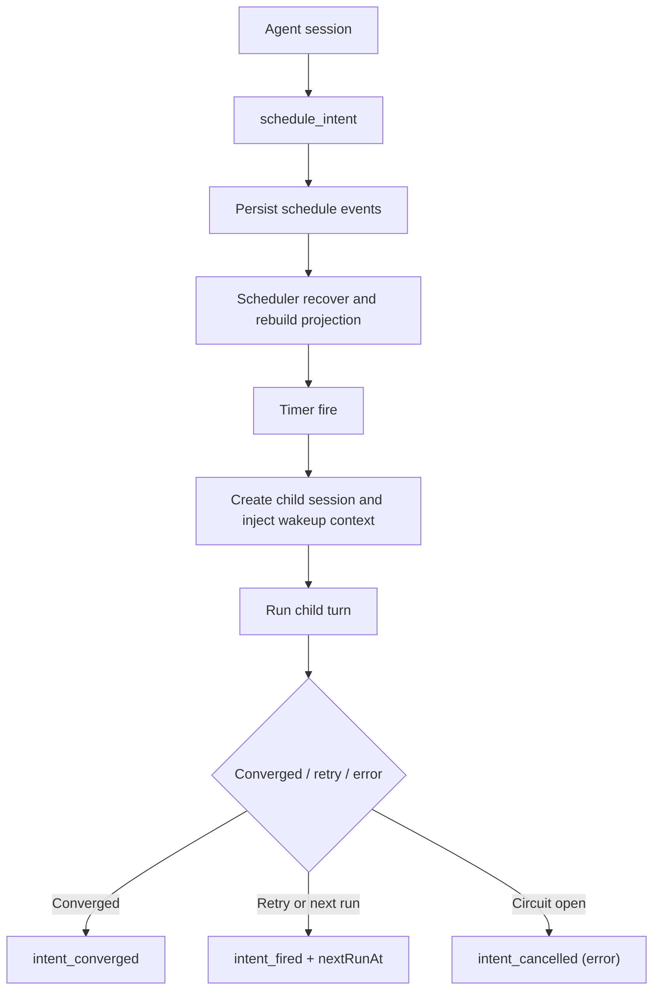

# Journey: Intent-Driven Scheduling

## Audience

- operators using `schedule_intent` and `--daemon`
- operators using `follow_up`, `schedule_intent`, and scheduler control-plane pause/resume
- developers reviewing scheduler behavior, child session continuity, and
  convergence semantics

## Entry Points

- `schedule_intent`
- `follow_up`
- `brewva --daemon`
- `optimization_continuity`

## Objective

Describe how an agent declares future execution intent and how the daemon
continues running child sessions until an explicit convergence condition is
met.

## In Scope

- follow-up wrapper create / cancel / list
- schedule intent create / update / cancel / list
- daemon recovery and catch-up
- child session continuity
- convergence predicates, retry policy, and circuit-break behavior

## Out Of Scope

- detached subagent worker merge
- channel ingress / egress
- gateway control-plane daemon

## Flow

## Key Steps

1. The agent declares one-shot or recurring intent through `follow_up` or `schedule_intent`.
2. The runtime records schedule-intent events and updates the rebuildable
   schedule projection.
3. On startup, the daemon runs recovery to rebuild projection state, clear
   stale leases, and catch up missed intents.
4. When a timer fires, the daemon creates a child session, injects wakeup
   context, and runs one turn.
5. After the child run completes, the daemon advances intent state according to
   convergence predicates, retry policy, and circuit-break rules.

## Execution Semantics

- the target can be expressed as `runAt` / `delayMs` or as `cron` plus
  `timeZone`
- recurring cron-backed intents persist a deterministic forward-jittered
  `nextRunAt`; replay treats the event-carried `nextRunAt` as authoritative
- `follow_up` is the bounded ergonomic layer; `schedule_intent` remains the
  precise control surface
- `continuityMode=inherit` carries the parent `TaskSpec`, truth facts, and
  anchor context
- `continuityMode=fresh` intentionally does not inherit parent state
- convergence conditions are explicit user-authored predicates, not a runtime
  planner:
  - `truth_resolved`
  - `task_phase`
  - `max_runs`
  - `all_of`
  - `any_of`
- `optimization_continuity` remains an inspection surface; it does not turn the
  scheduler into a hidden optimizer

## Failure And Recovery

- startup catch-up is bounded by `maxRecoveryCatchUps`; overflow intents are
  deferred
- stale one-shot `runAt` intents older than
  `staleOneShotRecoveryThresholdMs` are deferred instead of firing immediately
- `leaseDurationMs` prevents duplicate concurrent firing of the same intent
- `maxConsecutiveErrors` opens the circuit and moves the intent to `error`
- retry backoff grows exponentially from `minIntervalMs` and caps at one hour
- child session iteration facts remain in the child session; they are not
  mirrored back into the parent session
- gateway `scheduler.pause` / `scheduler.resume` is an incident-control latch
  for live execution only; it is not a durable config replacement for
  `schedule.enabled`

## Observability

- core events:
  - `schedule_intent`
  - `schedule_recovery_deferred`
  - `schedule_recovery_summary`
  - `schedule_wakeup`
  - `schedule_child_session_started`
  - `schedule_child_session_finished`
  - `schedule_child_session_failed`
- inspection surfaces:
  - `runtime.schedule.getProjectionSnapshot()`
  - `optimization_continuity`

## Code Pointers

- Tool contracts: `packages/brewva-tools/src/follow-up.ts`,
  `packages/brewva-tools/src/schedule-intent.ts`
- Scheduler service: `packages/brewva-runtime/src/schedule/service.ts`
- Schedule events: `packages/brewva-runtime/src/schedule/events.ts`
- Schedule projection: `packages/brewva-runtime/src/schedule/projection.ts`
- Cron / timezone: `packages/brewva-runtime/src/schedule/cron.ts`
- Daemon entry: `packages/brewva-cli/src/index.ts`

## Related Docs

- CLI: `docs/guide/cli.md`
- Runtime API: `docs/reference/runtime.md`
- Background delegation: `docs/journeys/operator/background-and-parallelism.md`
