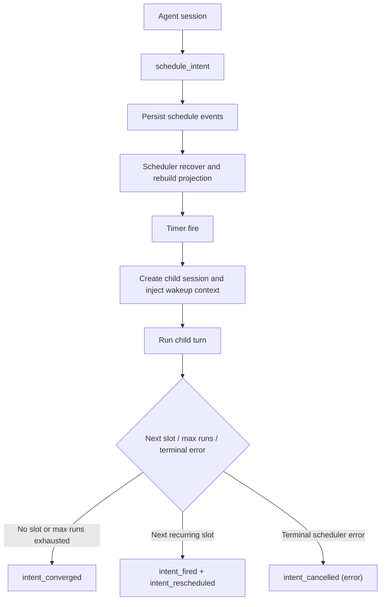

# Journey: Intent-Driven Scheduling

## Audience

- operators using `schedule_intent` and `--daemon`
- operators using `follow_up`, `schedule_intent`, and scheduler control-plane pause/resume
- developers reviewing scheduler behavior, child session continuity, and
  convergence semantics

## Entry Points

- `schedule_intent`
- `follow_up`
- `brewva --daemon`
- `brewva gateway scheduler-pause`
- `brewva gateway scheduler-resume`

## Objective

Describe how an agent declares future execution intent and how the daemon
continues running child sessions until an explicit convergence condition is
met.

## In Scope

- follow-up wrapper create / cancel / list
- schedule intent create / update / cancel / list
- daemon recovery and re-arm
- child session continuity
- recurrence re-arm behavior
- configured but currently-deferred lease, catch-up, convergence-predicate, retry,
  and circuit-break hardening

## Out Of Scope

- detached subagent worker merge → `background-and-parallelism`
- channel ingress / egress → `channel-gateway-and-turn-flow`
- gateway control-plane daemon → `gateway-control-plane-lifecycle`

## Flow

## Key Steps

1. The agent declares one-shot or recurring intent through `follow_up` or `schedule_intent`.
2. The runtime records schedule-intent events and updates the rebuildable
   schedule projection.
3. On startup, the daemon runs recovery to rebuild projection state and re-arm
   eligible persisted intents.
4. When a timer fires, the daemon creates a child session, injects wakeup
   context, and runs one turn.
5. After the child run completes, the daemon advances recurrence from the
   event-carried schedule state: re-arm while another slot remains and `maxRuns`
   allows it, otherwise converge. Lease, catch-up, convergence-predicate, retry,
   and circuit-break hardening remains configured but not yet consumed by the daemon
   driver.

## Execution Semantics

- the target can be expressed as `runAt` / `delayMs` or as `cron` plus
  `timeZone`
- recurring cron-backed intents persist a deterministic forward-jittered
  `nextRunAt`; replay treats the event-carried `nextRunAt` as authoritative
- a recurring intent re-arms at its next slot after each fire while
  `runCount < maxRuns` (emitting `intent_rescheduled`, which keeps it active),
  and converges only when no slot remains; a failed run still advances and
  re-arms so a transient error does not silently end recurrence
- `cron` accepts a bounded per-field grammar — `*`, a single literal, or `*/N`
  steps — covering minute/hour steps, day-of-week (`0 9 * * 1`, Monday), and
  day-of-month/month; the schedule projection and daemon driver compute
  `nextRunAt` from one shared helper so they cannot drift
- `follow_up` is the bounded ergonomic layer; `schedule_intent` remains the
  precise control surface
- `continuityMode=inherit` carries the parent `TaskSpec`, operational claims, and
  anchor context
- `continuityMode=fresh` intentionally does not inherit parent state
- convergence conditions are explicit user-authored predicates, not a runtime
  planner:
  - `claim_resolved`
  - `task_phase`
  - `max_runs`
  - `all_of`
  - `any_of`
- scheduling remains an explicit control surface; it does not turn the runtime
  into a hidden optimizer

## Failure And Recovery

- recurring cron-backed intents settle every fire by either emitting
  `intent_rescheduled` for the next slot or converging when no slot remains
- a failed recurring child run still advances and re-arms when another slot
  remains; transient child failure does not silently end recurrence
- unparseable cron expressions fail safe by declining to arm rather than firing at
  a wrong time
- `leaseDurationMs`, `maxConsecutiveErrors`, `maxRecoveryCatchUps`, and
  `staleOneShotRecoveryThresholdMs` are normalized config fields but currently
  have no daemon consumer; duplicate-fire prevention, circuit open behavior,
  bounded recovery catch-up, and stale one-shot deferral remain deferred scheduler
  hardening
- convergence-predicate evaluation and retry backoff policy remain deferred
  hardening; the current implemented terminal bound is the event-carried
  recurrence state plus `maxRuns`
- child session iteration facts remain in the child session; they are not
  mirrored back into the parent session
- `brewva gateway scheduler-pause` / `brewva gateway scheduler-resume` are
  incident-control latches
  for live execution only; it is not a durable config replacement for
  `schedule.enabled`

## Observability

- core events:
  - `schedule_intent`
  - `schedule_recovery_deferred`
  - `schedule_recovery_summary`
  - `schedule_wakeup`
  - `schedule_child_session_started`
  - `schedule_child_session_finished`
  - `schedule_child_session_failed`
- inspection surfaces:
  - `HostedRuntimeAdapterPort.ops.schedule.intents.getProjectionSnapshot()`

## Code Pointers

- Tool contracts: `packages/brewva-tools/src/families/workflow/follow-up.ts`,
  `packages/brewva-tools/src/families/workflow/schedule-intent.ts`
- Scheduler service: `packages/brewva-gateway/src/daemon/schedule-runner.ts`
- Schedule events: `packages/brewva-vocabulary/src/schedule.ts`
- Schedule projection: `packages/brewva-tools/src/runtime-port/schedule.ts`
- Cron / timezone: `packages/brewva-gateway/src/daemon/schedule-runner.ts`
- Scheduler daemon dispatch: `packages/brewva-cli/src/index.ts`
- Scheduler daemon implementation: `packages/brewva-cli/src/commands/noninteractive/daemon.ts`
- Live scheduler controls: `packages/brewva-gateway/src/admin/internal/cli.ts`

## Related Docs

- CLI: `docs/guide/cli.md`
- Gateway daemon guide: `docs/guide/gateway-control-plane-daemon.md`
- Runtime API: `docs/reference/runtime.md`
- Configuration reference: `docs/reference/configuration.md`
- Background delegation: `docs/journeys/operator/background-and-parallelism.md`
