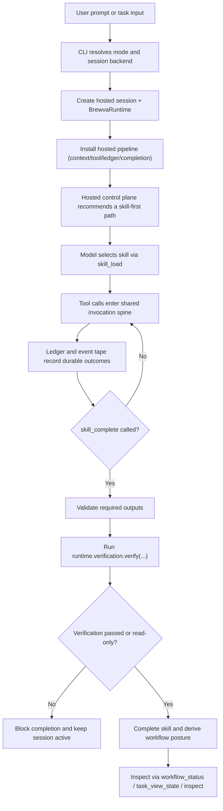

# Journey: Interactive Session

## Audience

- operators using interactive `brewva` sessions
- developers reviewing the CLI, hosted runtime pipeline, and skill-completion flow

## Entry Points

- `brewva`
- `brewva --print`
- `skill_load`
- `skill_complete`

## Objective

Describe how a standard interactive task moves from CLI input into a hosted
session, through skill activation, tool execution, verification, and
completion, and ends in explicit inspection surfaces backed by event tape and
evidence-ledger records.

## In Scope

- CLI mode resolution and hosted session creation
- skill activation, tool execution, and ledger / event persistence
- `skill_complete` output validation and the verification gate
- workflow inspection surfaces derived from session activity

## Out Of Scope

- `brewva inspect` / `--replay` / `--undo`
- `brewva gateway ...`
- channel ingress / egress
- detached subagent and scheduler daemon flows

## Flow

## Key Steps

1. The CLI resolves the active mode and creates a hosted session.
2. The hosted pipeline installs context transform, quality gate, ledger writer,
   and completion guard handlers.
3. Hosted control-plane logic first derives a skill-first recommendation from
   the loaded catalog and current task context.
4. The model activates the current skill through `skill_load`; the runtime does
   not inject a stage machine.
5. Every tool call enters the shared invocation spine and is evaluated for
   access, budget, compaction, ledger writes, and event persistence.
6. When the skill match is strong and no skill is active, the hosted path
   narrows the default tool surface so the turn resolves to `skill_load` before
   deeper repository work.
7. `skill_complete` validates required outputs before calling
   `runtime.verification.verify(...)`.
8. After verification passes, the runtime completes the skill and exposes the
   resulting workflow posture through explicit inspection surfaces.

## Execution Semantics

- workflow remains an advisory surface, not a runtime-owned stage machine
- `managedToolMode=runtime_plugin` and `managedToolMode=direct` only change how
  managed tools are registered; they do not change the hosted lifecycle spine
- `skill_complete` closes only when required outputs are valid, verification
  passes or the session is read-only, and the completion guard has not surfaced
  a new hard blocker
- delegated `qa` remains separate from `runtime.verification.*`: QA provides
  executable break-it evidence, while the runtime verification gate decides
  whether the session has sufficient fresh evidence to complete
- canonical QA outcome data preserves `pass`, `fail`, and `inconclusive`
  instead of flattening inconclusive validation into failure
- verification freshness is evaluated against the latest
  `verification_write_marked` boundary, not against any historical passing run

## Failure And Recovery

- Missing required outputs cause `skill_complete` to reject immediately; the
  runtime does not create a half-complete state.
- Missing verification evidence blocks completion explicitly instead of being
  hidden behind workflow posture.
- Critical context pressure trips the compaction gate before ordinary tool work;
  the interrupted turn may resume after compaction.
- Session recovery after interruption depends on event tape replay, not on an
  in-memory session snapshot.

## Observability

- primary inspection surfaces:
  - `workflow_status`
  - `task_view_state`
  - `ledger_query`
  - `brewva inspect`
- primary durable records:
  - event tape records for tool execution, verification, and completion
  - ledger rows containing tool outcomes and verification evidence

## Code Pointers

- CLI entrypoint: `packages/brewva-cli/src/index.ts`
- Hosted session creation: `packages/brewva-gateway/src/host/create-hosted-session.ts`
- Hosted runtime plugins: `packages/brewva-gateway/src/runtime-plugins/index.ts`
- Completion tool: `packages/brewva-tools/src/skill-complete.ts`
- Workflow derivation: `packages/brewva-runtime/src/workflow/derivation.ts`
- Verification gate: `packages/brewva-runtime/src/verification/gate.ts`

## Related Docs

- CLI: `docs/guide/cli.md`
- Runtime plugins: `docs/reference/runtime-plugins.md`
- Runtime API: `docs/reference/runtime.md`
- Inspect / replay / undo: `docs/journeys/operator/inspect-replay-and-recovery.md`
