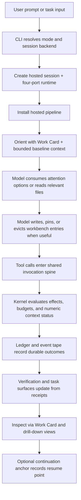

# Journey: Interactive Session

## Audience

- operators using interactive `brewva` sessions
- developers reviewing the CLI, hosted runtime pipeline, workbench context, and
  receipt flow

## Entry Points

- `brewva`
- `brewva --print`
- ordinary model-facing tools
- workbench tools

## Objective

Describe how a standard interactive task moves from CLI input into a hosted
session, through model-operated context management, tool execution,
verification, and durable inspection surfaces backed by event tape and
tape-ledger projection records.

Interactive shell command ownership follows the narrowed slash contract:
high-frequency entrypoints such as `/model`, `/inbox`, `/inspect`,
`/context`, `/authority`, `/skills`, `/handoff`, `/transcript`, and
session-history actions stay in the shell slash surface. `/inspect` opens the
shared Work Card first; `/context`, `/authority`, `/skills`, `/inbox`, `/diff`,
and raw replay are drill-downs. `/diff` and `/export` are read-only evidence
surfaces: `/diff` combines Git state with replay/patch attribution, while
`/export` assembles a session continuation bundle. Confirming or mutating actions
such as manual compaction live in the command palette or view-local actions,
while headless and channel command grammars remain separate control planes.

## In Scope

- CLI mode resolution and hosted session creation
- model-operated tool visibility
- workbench note and eviction flow
- ledger / event persistence
- workflow inspection surfaces derived from session activity
- Work Card, attention option, and continuation-anchor product surfaces
- final assistant-answer presentation in the interactive transcript

## Out Of Scope

- `brewva inspect` / `--replay` / `--undo` → `inspect-replay-and-recovery`
- `brewva gateway ...` → `gateway-control-plane-lifecycle`
- channel ingress / egress → `channel-gateway-and-turn-flow`
- detached subagent and scheduler daemon flows → `background-and-parallelism`
  and `intent-driven-scheduling`

## Flow

## Key Steps

1. The CLI resolves the active mode and creates a hosted session.
2. The hosted pipeline adapts the four-port runtime into narrowed gateway and
   tool facades, then installs context transform, quality gate, ledger writer,
   workbench context, and recovery handlers.
3. Hosted control-plane logic does not hold the model at a bootstrap gate. The
   model sees useful non-operator tools immediately.
4. The workbench context tail renders bounded baseline facts, model-authored
   notes, compacted baseline references, latest continuation anchor, and numeric context
   status.
5. The model reads local instructions, repository files, recall results, or
   repository precedents only when it decides they are relevant. Unbounded
   sources appear first as attention option cards.
6. The model records important working state through `workbench_note` and
   evicts stale spans through `workbench_evict`.
7. Every tool call enters the shared invocation spine and is evaluated for
   access, budget, compaction, ledger writes, and event persistence.
8. Accepted turns also materialize durable presentation receipts:
   `turn_input_recorded` when the turn is admitted and
   `turn_render_committed` when the turn reaches a terminal outcome.
9. Verification remains explicit runtime authority. It is derived from fresh
   evidence and does not depend on an active skill slot.
10. When assistant text reaches stable transcript state, the CLI presentation
    boundary renders Markdown tables and Mermaid diagrams through runtime-backed
    presentation artifacts. This does not alter event tape, replay, or runtime
    inspection truth.
11. If the operator submits another prompt while the current turn is still
    streaming, the interactive composer defaults that submission to queued
    delivery instead of requiring an explicit queue mode switch.
12. While queued prompts are waiting, the shell renders up to three one-line
    `(pending)` rows above the model/operator footer. When more than three
    queued prompts exist, the shell appends `+N more · Ctrl+B to manage`.
13. `Ctrl+B` opens the queued-prompt overlay, which lets the operator inspect
    pending prompt details and delete queued entries without aborting the live
    turn.

## Execution Semantics

- workflow remains an advisory surface, not a runtime-owned stage machine
- `managedToolMode=hosted` and `managedToolMode=direct` only change how
  managed tools are registered; they do not change the hosted lifecycle spine
  or the four-port runtime authority boundary
- workbench entries are model-authored notebook entries with source references,
  not typed runtime slots
- recall is an on-demand tool, not a per-turn hidden provider
- delegated `verifier` remains separate from `HostedRuntimeAdapterPort.ops.verification.*`: Verifier
  provides executable break-it evidence, while the runtime verification gate
  decides whether the session has sufficient fresh evidence
- canonical Verifier outcome data preserves `pass`, `fail`, and `inconclusive`
  instead of flattening inconclusive validation into failure
- verification freshness is evaluated against the latest
  `verification_write_marked` boundary, not against any historical passing run
- interactive queue UX remains queue-only: the pending strip and `Ctrl+B`
  overlay surface queued future turns, while explicit `followUp` delivery
  remains a separate continuation primitive rather than a user-visible queue
  item

## Failure And Recovery

- Missing verification evidence blocks acceptance explicitly instead of being
  hidden behind workflow posture.
- Forced-compaction status trips the compaction gate before ordinary tool work;
  the interrupted turn may resume after compaction.
- Session recovery after interruption depends on event tape replay and
  workbench baselines, not on an in-memory session snapshot.
- Replay uses stored sanitized compaction summaries and durable receipts rather
  than regenerating prior model decisions.

## Observability

- primary inspection surfaces:
  - `workflow_status`
  - `task_view_state`
  - `ledger_query`
  - `brewva inspect`
- primary durable records:
  - event tape records for tool execution, verification, and compaction
  - workbench records for model-authored working memory
  - session-wire receipts (`turn_input_recorded`, `turn_render_committed`) for
    frontend/session replay
  - ledger rows containing tool outcomes and verification evidence
- presentation carriers such as Markdown tables and Mermaid diagrams are
  transcript rendering, not durable runtime records

## Code Pointers

- CLI entrypoint: `packages/brewva-cli/src/index.ts`
- Hosted session implementation:
  `packages/brewva-gateway/src/hosted/internal/session/init/session-assembly.ts`
- Hosted behavior installation:
  `packages/brewva-gateway/src/hosted/internal/session/host-api-installation.ts`
- Workbench runtime surface:
  `packages/brewva-gateway/src/hosted/internal/context/workbench-context.ts`
- Workbench tools: `packages/brewva-tools/src/families/memory/workbench.ts`

## Related Docs

- CLI: `docs/guide/cli.md`
- Interactive command surface: `docs/reference/commands/interactive.md`
- Hosted dynamic context: `docs/reference/hosted-dynamic-context.md`
- Context and compaction: `docs/journeys/internal/context-and-compaction.md`
- Session lifecycle: `docs/reference/session-lifecycle.md`
