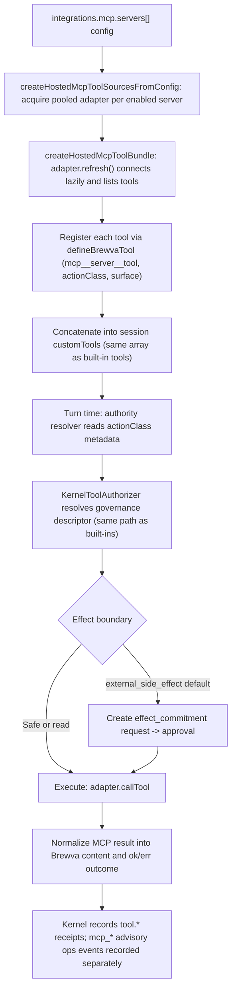

# Journey: MCP Tool Integration

## Audience

- operators declaring external MCP (Model Context Protocol) servers in Brewva
  configuration
- developers reviewing the MCP adapter, the hosted tool surface, and how
  external tool authority enters the kernel governance spine

## Entry Points

- `integrations.mcp.enabled` and `integrations.mcp.servers[]` configuration
  (there is no MCP CLI flag; MCP is configured in the config file only)
- `createHostedMcpToolSourcesFromConfig(...)`
- `createHostedMcpToolBundle(...)`
- `McpToolCatalogAdapter` and `McpAdapterPool`

## Objective

Describe how an operator declares an external MCP server in `integrations.mcp`,
how Brewva connects to it and discovers its tools, how those tools are
namespaced and admitted into the shared hosted tool surface as
`external_side_effect`-classified tools, and how they are then governed,
executed, and recorded by the same kernel spine that governs built-in tools.

The load-bearing fact: MCP integration is not a separate execution path. A
discovered MCP tool becomes an ordinary registered tool in the same tool set as
built-in tools, and is governed by the same `KernelToolAuthorizer`. There is no
MCP-specific invocation spine and no MCP-specific governance bypass.

## In Scope

- MCP server configuration contract and normalization
- adapter lifecycle: connect, list, call, and close, with pooling and
  timeout / abort guards
- tool discovery and hosted-tool registration (namespacing, action-class
  assignment, surface, capability gating)
- entry into the shared invocation spine and kernel governance
- MCP operational (advisory) event recording

## Out Of Scope

- the mechanics of the shared invocation spine, workbench, and verification →
  `interactive-session`. This journey states that MCP tools enter that spine; it
  does not re-document it.
- effect-commitment approval, exact resume, and `PatchSet` rollback semantics →
  `approval-and-rollback`. MCP tools are subject to that path; the default
  `external_side_effect` class is approval-bound with no automatic undo.
- the full tool taxonomy and built-in tool families → `docs/reference/tools.md`.
- channel ingress and turn flow → `channel-gateway-and-turn-flow`.

## Flow

## Key Steps

1. **Configure.** The operator sets `integrations.mcp.enabled = true` and a
   `servers[]` entry. The loader normalizes each entry: the server `id` must
   match a bounded identifier pattern, `transport` is `stdio` or
   `streamable_http`, and duplicate ids fail closed. For stdio servers
   `inheritEnv` has been removed: child environment must be declared through
   `envAllowlist`, so there is no implicit `process.env` inheritance.
2. **Build sources.** `createHostedMcpToolSourcesFromConfig` filters enabled
   servers and acquires one pooled adapter per server. Adapters are pooled and
   ref-counted by a stable transport identity, so identical transports share a
   connection and the last lease closes the underlying adapter.
3. **Connect lazily.** The first `refresh()` or `callTool()` triggers the
   adapter's `connect()`. A server that is down therefore does not block session
   creation; it surfaces at first use.
4. **Discover.** `createHostedMcpToolBundle` calls `adapter.refresh()`, which
   paginates `listTools` into a catalog of `origin: "mcp"` descriptors.
5. **Register.** Each catalog entry becomes a hosted tool via `defineBrewvaTool`
   with a namespaced name `mcp__{serverId}__{toolName}`, an action class, and a
   surface. The hosted name is lowercased, sanitized, and bounded to 64
   characters; an over-length name is truncated and suffixed with a short
   content hash to stay provider-safe.
6. **Merge into the spine.** The bundle's tools are wrapped with hosted
   execution traits and concatenated into the session's `customTools` array
   alongside built-in and provided tools. A duplicate tool name anywhere in the
   combined set throws.
7. **Govern.** At turn time the hosted authority resolver looks up the
   registered tool, reads its `actionClass` metadata, and resolves the
   governance descriptor through the same `KernelToolAuthorizer` path used for
   built-in tools. The MCP tool's action class drives boundary, approval,
   receipt, and recovery policy identically.
8. **Invoke.** On admission the tool's `execute` calls `adapter.callTool` under
   the operation guard, then normalizes the MCP result into Brewva content parts
   and an `ok` or `err` outcome.
9. **Record.** The tool action itself rides the normal kernel `tool.*` receipts
   and ledger. MCP operational events (connect, disconnect, refresh, call
   failure) are recorded separately as advisory ops receipts. Session disposal
   closes the adapters under a bounded timeout.

## Execution Semantics

- MCP tools are governed identically to built-in tools: same `customTools`
  array, same hosted authority resolver, same `KernelToolAuthorizer`. There is
  no MCP-specific admission or execution path
- the default MCP action class is `external_side_effect`, which is approval-bound
  and high-risk with no automatic undo: its admission default is `ask`, it
  requires a commitment receipt, and its recovery policy is
  `manual_recovery_evidence`. By default an MCP call therefore creates an
  `effect_commitment` request and cannot be reversed by `rollback_last_patch`
- an operator can lower the class only through an explicit per-tool
  `toolPolicies.<tool>.actionClass` (validated against the action-class set). A
  server-supplied annotation such as `readOnlyHint` is carried as descriptor
  metadata only and never lowers the action class
- namespacing is mandatory and provider-safe-bounded (`mcp__server__tool`, at
  most 64 characters, content-hash suffix on overflow)
- duplicate tool names fail closed at three points: adapter refresh, bundle
  build, and the full session tool set
- adapters are pooled and ref-counted by transport identity; the last lease
  closes the underlying connection
- the replay-authoritative records for an MCP tool action are the kernel
  `tool.*` events and ledger rows, because the tool is an ordinary registered
  tool on the shared spine; the `mcp_*` events are advisory operational receipts
  only

## Failure And Recovery

- every adapter operation runs under a guard that races a per-operation timeout
  (resolved from the call argument, then the adapter, then the 30-second server
  default) and honors abort or cancellation, including forwarding the abort
  signal to the MCP client
- a tool that returns an MCP error result maps to an `err` outcome rather than
  throwing, and emits no failure event; a transport or timeout throw emits
  `mcp_tool_call_failed` and is re-thrown
- a failed `connect()` resets the connect promise so a later operation retries;
  because connection is lazy, a server that is unreachable surfaces at first
  use rather than at session creation, while an unreachable server during the
  initial bundle build rejects the build
- session disposal closes adapters under a 5-second timeout; a timeout or error
  records an `mcp_server_disconnected` carrying a dispose-failed marker
- there is no automatic reconnect or health-check loop: after a close the next
  operation reconnects lazily, and there is no retry or backoff supervisor

## Observability

- adapter-level protocol events (internal, not operator-facing):
  `server_connected`, `server_disconnected`, `tool_list_refreshed`,
  `tool_call_failed`
- hosted operational events (operator-facing, renamed from the adapter events):
  - `mcp_server_connected`
  - `mcp_server_disconnected`
  - `mcp_tool_list_refreshed` (carries `toolCount`)
  - `mcp_tool_call_failed` (carries `toolName` and `error`)
- the `mcp_*` events are durable advisory ops receipts, tagged with an advisory
  source so authority-facing projections refuse to treat them as canonical
  kernel events. The replay authority for the tool action remains the kernel
  `tool.*` events on the event tape
- there is no MCP-specific inspection surface or dedicated artifact path; MCP
  events land in the canonical event tape and are read through ordinary runtime
  event inspection

## Code Pointers

- MCP transport and protocol adapter:
  `packages/brewva-mcp-adapter/src/index.ts`
  (`McpToolCatalogAdapter`, `McpAdapterPool`, `createMcpTransport`)
- Hosted MCP tool bundle, namespacing, and action class:
  `packages/brewva-gateway/src/hosted/internal/session/init/mcp-tools.ts`
  (`createHostedMcpToolBundle`, `buildHostedMcpToolName`,
  `DEFAULT_MCP_ACTION_CLASS`, `createHostedMcpToolSourcesFromConfig`)
- MCP event recorder and disposal:
  `packages/brewva-gateway/src/hosted/internal/session/init/mcp-lifecycle.ts`
- MCP tools merged into the session tool set:
  `packages/brewva-gateway/src/hosted/internal/session/init/session-assembly.ts`
- Kernel authority binding for registered tools:
  `packages/brewva-gateway/src/hosted/internal/turn-adapter/runtime-turn-authority.ts`
- Kernel tool authorizer:
  `packages/brewva-runtime/src/runtime/kernel/impl.ts`
- External-side-effect action policy:
  `packages/brewva-runtime/src/runtime/kernel/policy/tool-admission-policy.ts`
- Tool authority resolution:
  `packages/brewva-runtime/src/runtime/kernel/policy/tool-decision.ts`
- Action-class taxonomy:
  `packages/brewva-runtime/src/governance/policy-types.ts`
- MCP config types and normalization:
  `packages/brewva-runtime/src/config/types.ts`,
  `packages/brewva-runtime/src/config/normalize-integrations.ts`
- MCP config defaults: `packages/brewva-runtime/src/config/defaults.ts`
- Advisory ops event recording:
  `packages/brewva-tools/src/runtime-port/four-port/events.ts`
- Tool definition surface: `packages/brewva-tools/src/registry/tool.ts`

## Related Docs

- MCP integration reference: `docs/reference/mcp-integration.md`
- Configuration: `docs/reference/configuration.md`
- Interactive session: `docs/journeys/operator/interactive-session.md`
- Approval and rollback: `docs/journeys/operator/approval-and-rollback.md`
- Tools reference: `docs/reference/tools.md`
- Proposal boundary: `docs/reference/proposal-boundary.md`
