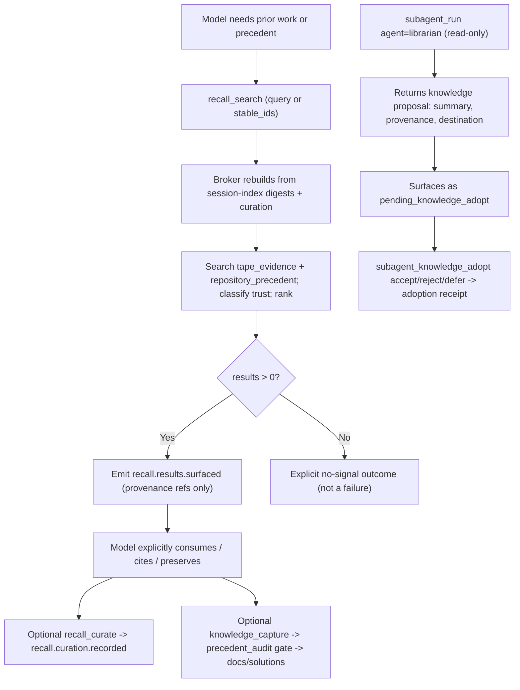

# Journey: Recall And Knowledge Compounding

## Audience

- operators who want prior work, repository precedent, and durable runtime
  receipts retrieved on demand
- operators delegating institutional-knowledge research to a `librarian` child
  and deciding whether to adopt its proposals
- developers reviewing the recall broker, ranking and curation, knowledge
  search, and the knowledge proposal to adoption-receipt lifecycle

## Entry Points

- `recall_search` — search or inspect on-demand recall
- `recall_curate` — record operator feedback on surfaced recall items
- `recall_expand` — recover exact previously-visible content behind a reversible
  eviction reference
- `knowledge_search` — search repository-native solutions and docs with source
  typing and authority ranking
- `knowledge_capture` — materialize or update canonical `docs/solutions/**`
  records
- `precedent_audit` / `precedent_sweep` — audit one record / sweep the
  repository for stale documents
- `subagent_knowledge_adopt` — record an accept / reject / defer receipt for a
  librarian proposal
- `subagent_run` / `subagent_fanout` with `agent: "librarian"` — spawn the
  read-only knowledge-research child

## Objective

Describe how a session retrieves prior knowledge explicitly on demand
(source-typed, provenance-bearing, ranked), how durable repository knowledge is
written and maintained, and how a librarian child's knowledge proposal becomes
authoritative only through an explicit parent adoption receipt — never through
hidden injection or silent promotion.

The load-bearing fact: recall is explicit-pull, not hidden injection. `recall_search`
is an on-demand model tool; surfacing records provenance refs only and does not
inject content into the prompt. A result enters the answer path only when the
model explicitly consumes, cites, injects, or preserves it in workbench state.

## In Scope

- on-demand recall across two fixed source families (`tape_evidence`,
  `repository_precedent`)
- the recall broker, ranking, curation, and stable-id inspection
- the explicit-pull versus hidden-injection distinction
- knowledge search source typing, authority ranking, and freshness
- durable knowledge write via `knowledge_capture` behind the precedent-audit gate
- repository precedent maintenance (`precedent_audit`, `precedent_sweep`)
- the librarian knowledge proposal to explicit adoption-receipt flow
- RDP replay-distilled promotion candidates as a warm staging input

## Out Of Scope

- model-authored workbench notes, eviction, and the numeric context tail →
  `interactive-session` (workbench is warm model-authored memory; this journey
  covers cold/durable memory and retrieval). `recall_expand` appears here only
  as the recall-side recovery of evicted spans.
- session-index SQLite projection internals and CJK tokenization →
  `@brewva/brewva-session-index` and `@brewva/brewva-search`
- worker patch merge and apply adoption → `background-and-parallelism` (distinct
  from knowledge adoption)
- compaction and context-tail mechanics → `context-and-compaction`

## Flow

## Key Steps

1. The model pulls recall explicitly via `recall_search` with either `query` or
   `stable_ids` (mutually exclusive). No turn loop injects recall.
2. The recall broker rebuilds its state from session-index digests and curation
   aggregates; it reads session-index evidence rows, not raw event text.
3. Retrieval is source-typed into exactly two families: `tape_evidence` (from
   session-index rows) and `repository_precedent` (from a knowledge search over
   the workspace). Session and root visibility is orthogonal metadata, not a
   third family.
4. Each result carries provenance and a trust classification (kernel claim and a
   fixed strong-event set rank strong; other current-session memory and advisory
   posture rank weak), plus session scope, freshness, and a stable id.
5. Ranking blends source weight, evidence strength, semantic overlap, freshness,
   intent, and a curation adjustment. Curation feedback decays with a 45-day
   half-life and feeds future ranking.
6. Surfacing is not admission: when results exist, `recall_search` records
   provenance refs (stable id, source family, scope, root) — not the content
   body. The model decides what to use.
7. `recall_expand` recovers an evicted span from committed tape behind a
   reversible-content reference, fail-closed; only a fully resolved snapshot
   counts as recovered.
8. `knowledge_search` is source-typed (`solution`, `stable_doc`, `research_note`,
   `troubleshooting`, `incident_record`) with per-intent authority ranking;
   durable knowledge is written only through `knowledge_capture` under
   `docs/solutions/**`, behind a precedent-audit gate that rejects on a failing
   verdict and refuses to overwrite a conflicting record.
9. The librarian is a read-only role that returns a knowledge proposal (summary,
   provenance, proposed destination, conflict notes) and never writes
   authoritative artifacts itself.
10. Adoption is an explicit receipt: `subagent_knowledge_adopt` records
    accept / reject / defer, and an accept requires at least one artifact ref
    (knowledge-capture, worker-patch, or final). Knowledge adoption is a
    separate disposition from worker patch adoption.

## Execution Semantics

- the two recall source families are fixed; visibility scope is orthogonal
  metadata, not a third family
- recall results are advisory, not authority — `tape_evidence` and
  `repository_precedent` are recall, not kernel claims
- the `prior_work` intent is the neutral default and adds no ranking boost
- curation weights decay with a 45-day half-life and each signal's effect is
  bounded
- knowledge proposals are read-only and never auto-promoted; the parent must
  explicitly adopt, and the adoption disposition is derived purely from the
  recorded decision
- `knowledge_capture` is idempotent: identical normalized content returns a
  skipped status; solution statuses are `active`, `stale`, or `superseded`,
  making stale/superseded routing explicit
- maintenance is never a default or hidden path: `precedent_sweep` and
  `precedent_audit` are explicit and read-only, and their findings are
  repository-maintenance guidance, not runtime claims or hidden planner state
- three memory temperatures coexist: cold durable (`docs/solutions/**` via
  `knowledge_capture`), warm staging (RDP promotion candidates under
  `.brewva/knowledge/rdp/**`), and warm model-authored (workbench, out of scope
  here). RDP candidates become recall-visible only after `knowledge_capture`
  promotes them — RDP is never authority on its own

## Failure And Recovery

- a recall miss is not a failure: empty results return an explicit no-signal
  outcome with `ok: true`
- an unavailable session index surfaces as a typed `session_index_unavailable`
  error; `recall_search` argument errors are explicit
- `recall_expand` fails closed: unknown entry, no reversible reference,
  unresolvable or unavailable event each surface explicitly, and a digest
  mismatch is rejected
- `knowledge_search` with no hit returns an inconclusive result, not an error
- `knowledge_capture` gate failures are explicit (invalid record, invalid path,
  precedent-audit failure, target not a file, solution-id conflict)
- an `accept` adoption without any artifact ref errors and records no receipt;
  unknown decisions normalize to `defer`
- the runtime never auto-applies or auto-promotes: a pending knowledge proposal
  stays `pending_knowledge_adopt` until the parent records a decision
- broker state is rebuildable and dirty-tracked off durable events; after
  restart it re-derives from session-index digests and curation events

## Observability

- durable events:
  - `recall.results.surfaced` (provenance refs, not content)
  - `recall.curation.recorded`
  - `subagent.knowledge_adoption.recorded`
- `recall.utility.observed` is defined and consumed (it invalidates broker state
  and contributes to curation aggregation) but has no confirmed product-code
  emitter; the operator-visible curation path is `recall.curation.recorded` via
  `recall_curate`
- inspection surfaces:
  - `recall_search` itself, in inspect mode via `stable_ids`
  - the delegation workboard and inbox: a `pendingKnowledgeAdoptions` bucket and
    an explicit-pull `librarian_knowledge` inbox item, with knowledge
    disposition states `pending_knowledge_adopt`, `adopted`, `rejected`,
    `deferred`
- `knowledge_capture` result fields include capture status, solution doc path
  and id, discoverability, the precedent-audit verdict, and maintenance
  recommendation

## Code Pointers

- Recall core: `packages/brewva-recall/src/`
  (`types.ts`, `broker/broker.ts`, `broker/ranking.ts`, `broker/curation.ts`,
  `evidence/classification.ts`, `evidence/rcr.ts`, `knowledge/search.ts`,
  `knowledge/rdp.ts`)
- Recall and knowledge tools: `packages/brewva-tools/src/families/memory/`
  (`recall.ts`, `knowledge-search.ts`, `knowledge-capture.ts`,
  `precedent-audit.ts`, `precedent-sweep.ts`, `solution-record.ts`)
- Knowledge adoption tool:
  `packages/brewva-tools/src/families/delegation/subagent-knowledge-adopt.ts`
- Librarian role and contract:
  `packages/brewva-gateway/src/delegation/catalog/registry.ts`,
  `packages/brewva-gateway/src/delegation/catalog/constitutions.ts`,
  `packages/brewva-gateway/src/delegation/protocol.ts`
- Knowledge / adoption projection:
  `packages/brewva-session-index/src/projection/delegation.ts`
- Event-type constants:
  `packages/brewva-vocabulary/src/internal/iteration.ts` (recall events),
  `packages/brewva-vocabulary/src/internal/delegation.ts` (adoption event)

## Related Docs

- Memory and recall reference: `docs/reference/tools/memory-and-recall.md`
- Interactive session: `docs/journeys/operator/interactive-session.md`
- Background and parallelism: `docs/journeys/operator/background-and-parallelism.md`
- Context and compaction: `docs/journeys/internal/context-and-compaction.md`
