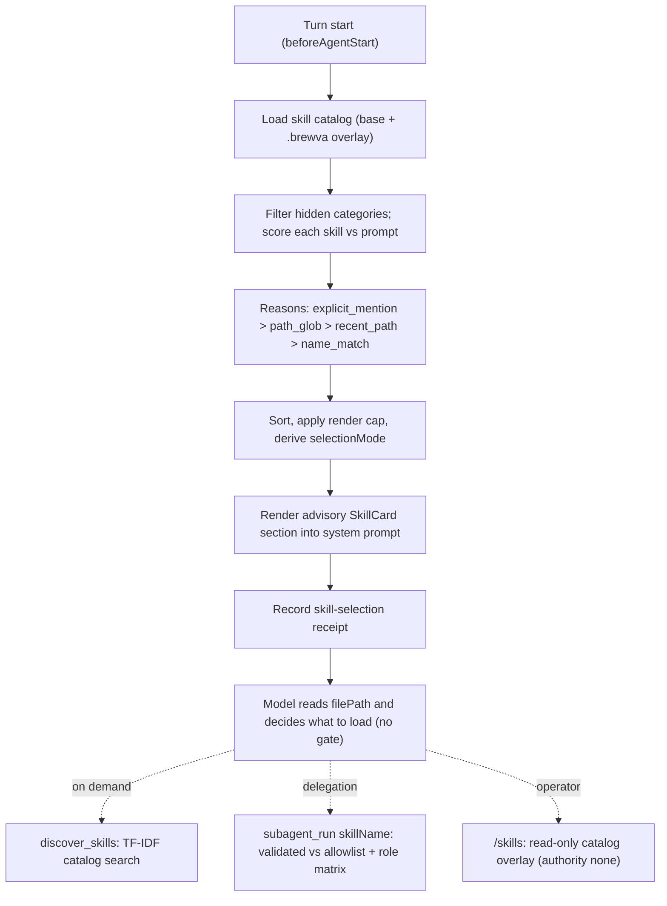

# Journey: Skill Routing And Activation

## Audience

- operators and developers who need to understand how Brewva surfaces skill
  knowledge to the model, why no command "activates" a skill, and how a
  delegated worker's `skillName` differs from hosted advisory shortlisting

## Entry Points

- hosted turn `beforeAgentStart` skill-selection lifecycle (implicit, every turn)
- model-invoked `discover_skills` tool
- interactive `/skills` overlay
- delegated `skillName` on `subagent_run` / `subagent_fanout`
- `brewva skills` CLI subcommand (catalog and migration, not session routing)

## Objective

Describe how Brewva gives the model the smallest relevant set of skill
instructions as bounded, turn-scoped prompt context, plus an on-demand catalog
search, while keeping all authority (tools, accounts, budgets, effects) in the
separate capability control plane.

The load-bearing fact: skills route attention; they never gate execution or
completion. There is no activation step. The hosted shortlist appends advisory
prompt text and grants nothing — the render header itself states the SkillCards
do not grant tools, permissions, budgets, side effects, or runtime authority,
and a SkillCard binds only the current turn. The one place a skill name is
validated rather than merely suggested is a delegated `skillName`, and even
there it grants no authority (see Execution Semantics).

## In Scope

- skill discovery and metadata loading
- the hosted advisory shortlist (selection reasons, scoring, render cap, budget)
- the `discover_skills` catalog search
- the `/skills` read-only catalog surface
- delegated `skillName` validation and child-prompt assembly
- category derivation
- the skill-selection event family

## Out Of Scope

- capability selection and external authority → `docs/reference/skill-routing.md`
  capability-selection priority, `docs/reference/skills.md` capability defaults
- delegation lifecycle, fan-out, and adoption mechanics →
  `background-and-parallelism`
- interactive session UX broadly → `interactive-session`
- verification, finishing, and recovery (runtime-owned, not skills) →
  `docs/guide/category-and-skills.md`
- orient-time requirement injection — a task-ledger concern that shares the
  `beforeAgentStart` lifecycle with skill selection but routes requirements, not
  skills → `verification-and-independent-review`

## Flow

## Key Steps

1. The catalog is loaded from two roots — `<cwd>/skills` (base) and
   `<workspaceRoot>/.brewva/skills` (overlay) — by scanning `SKILL.md` files.
   Category is directory-derived from the first path segment under the root and
   defaults to `core`; overlay files merge by name onto base; parse failures are
   collected rather than thrown.
2. Skill metadata is the routing contract: accepted SkillCard fields are
   `name`, `description`, `selection.when_to_use`, `selection.path_globs`,
   `references`, `scripts`, `invariants`, `argument_hints`, and
   `output_artifacts`. Removed authority-era fields (and `selection.triggers` /
   camelCase / `intent`) are rejected at load.
3. Each visible skill is scored by four DETERMINISTIC selection reasons in
   priority order: `explicit_mention` (a whole-word `$skill-name`), `path_glob`
   (prompt paths), `recent_path` (`selection.path_globs` against recently touched
   tool paths), and `name_match` (a whole-word skill name). There is no fuzzy
   prose matching — the auto-selector never mints `text_match`, and there is no
   CJK keyword bridge; surfacing a card by description/when-to-use overlap is
   `discover_skills`' explicit job, and the always-visible catalog keeps every
   card legible regardless.
4. The shortlist sorts by score, applies a render cap (default 8), and computes
   a `selectionMode`. If explicit mentions exceed the cap, all explicit
   candidates are retained and an over-budget reason is recorded.
5. The selected section is appended to the system prompt as advisory context and
   a durable skill-selection receipt is recorded. The model then reads each
   card's `filePath` and decides what to load. Nothing is gated.
6. `discover_skills` is an on-demand model tool that TF-IDF-ranks the catalog
   (excluding internal skills) and records a discovery-mode selection.
7. `/skills` opens a read-only overlay that renders cards with an explicit
   authority posture of `none`; selecting a card may insert a `$skill` mention
   into the composer. There is no "run skill" action.
8. A delegated `skillName` is trimmed into the run request, validated against a
   closed allowlist and the role-to-skill matrix, re-checked against the runtime
   catalog, and rendered into the child prompt.

## Execution Semantics

- skill selection is advisory, not gating, confirmed at three layers: the hosted
  shortlist only appends prompt text and disclaims authority; `discover_skills`
  is admitted as a read-only observe tool; the `/skills` overlay renders every
  card with authority `none`
- there is no activation tool and no completion gate keyed on skill state; a
  SkillCard binds the current turn only and must be re-selected to carry forward
- a skill record never carries capability authority — its capability references
  are always empty
- a delegated `skillName` is validated but still non-authoritative: an unknown
  name throws `unknown_skill`, a name outside the agent's allowed set throws
  `incompatible_agent_skill`, and a conflict with an explicit agent spec throws.
  `skillName` only influences child-prompt assembly, the default consult kind,
  and result mode — it does not set the child's tool surface or envelope. A
  child owns the skill only when `skillName` is set and the result mode is not
  `consult`
- "available SkillCard" counters (selected cards) are distinct from
  "skill-surface tool" counters (managed tools whose surface is `skill`); the
  two must not be conflated

## Failure And Recovery

- no candidate skills: no SkillCard block is injected and the receipt records a
  guidance-only selection mode; the runtime relies on its stable operating
  contract rather than an empty block
- `discover_skills` with no matches returns an inconclusive result and records
  no event; an empty query returns an explicit error
- a skill that fails to parse is captured in the load report and omitted; the
  run continues
- delegated `skillName` errors are explicit throws (`unknown_skill`,
  `incompatible_agent_skill`, conflicting agent spec)
- recovery posture uses event tape and workbench baselines, not an active skill
  slot — consistent with no activation state existing

## Observability

- durable skill-selection event: the runtime emit form is the dotted
  `skill.selection.recorded`; the canonical persisted / projected form is the
  underscore `skill_selection_recorded` (folded by the session-index
  projection). Both forms are real — the dotted form is the in-process runtime
  kind, the underscore form is the canonical event-family name
- the receipt carries the selection id, trigger, explicit mentions, candidate /
  rendered / omitted counts, `selectionMode`, prompt paths, rendered reasons,
  invocation records, and a rendered-context budget summary
- `selectionMode` values: `shortlist_prompt_context`,
  `explicit_over_budget_prompt_context`, `discover_guidance_receipt_only`,
  `discover_only_projection`
- a hidden trace message (`brewva-skill-selection`, excluded from context)
  carries the same selection summary, and the summary is mirrored onto the
  `tool.surface.resolved` trace (`explicitSkillMentionNames`, `skillSelectionId`,
  `skillSelectionMode`)
- delegated skill provenance appears as `delegatedSkill` / `delegatedSkillName`
  in delegation records and as a `Delegated skill:` prompt line

## Code Pointers

- Hosted advisory shortlist:
  `packages/brewva-gateway/src/hosted/internal/session/skills/skill-selection.ts`
- Catalog load and category derivation:
  `packages/brewva-gateway/src/hosted/internal/session/runtime-ops-builders/skills.ts`
- Skill metadata contract (parse, accepted/rejected fields):
  `packages/brewva-vocabulary/src/internal/skills.ts`
- Catalog search tool:
  `packages/brewva-tools/src/families/skills/discover-skills.ts`,
  family barrel `packages/brewva-tools/src/families/skills/api.ts`
- Delegated `skillName` surface:
  `packages/brewva-tools/src/families/delegation/subagent-run/api.ts`,
  `packages/brewva-tools/src/families/delegation/subagent-run/schemas.ts`
- Delegation skill validation:
  `packages/brewva-gateway/src/delegation/target-resolution.ts`,
  `packages/brewva-gateway/src/delegation/catalog/registry.ts`,
  `packages/brewva-gateway/src/delegation/entry.ts`
- `/skills` overlay:
  `packages/brewva-cli/src/shell/domain/overlays/projectors/interactive-command-surfaces.ts`,
  `packages/brewva-cli/src/shell/commands/shell-command-registry.ts`
- `discover_skills` admission as observe:
  `packages/brewva-runtime/src/runtime/kernel/policy/tool-admission-policy.ts`
- Skill-selection projection fold:
  `packages/brewva-session-index/src/projection/harness.ts`

## Related Docs

- Skill routing reference: `docs/reference/skill-routing.md`
- Skills reference: `docs/reference/skills.md`
- Category and skills guide: `docs/guide/category-and-skills.md`
- Skill playbook: `docs/guide/skill-playbook.md`
- Interactive session: `docs/journeys/operator/interactive-session.md`
- Verification and independent review: `docs/journeys/operator/verification-and-independent-review.md`
- Background and parallelism: `docs/journeys/operator/background-and-parallelism.md`
