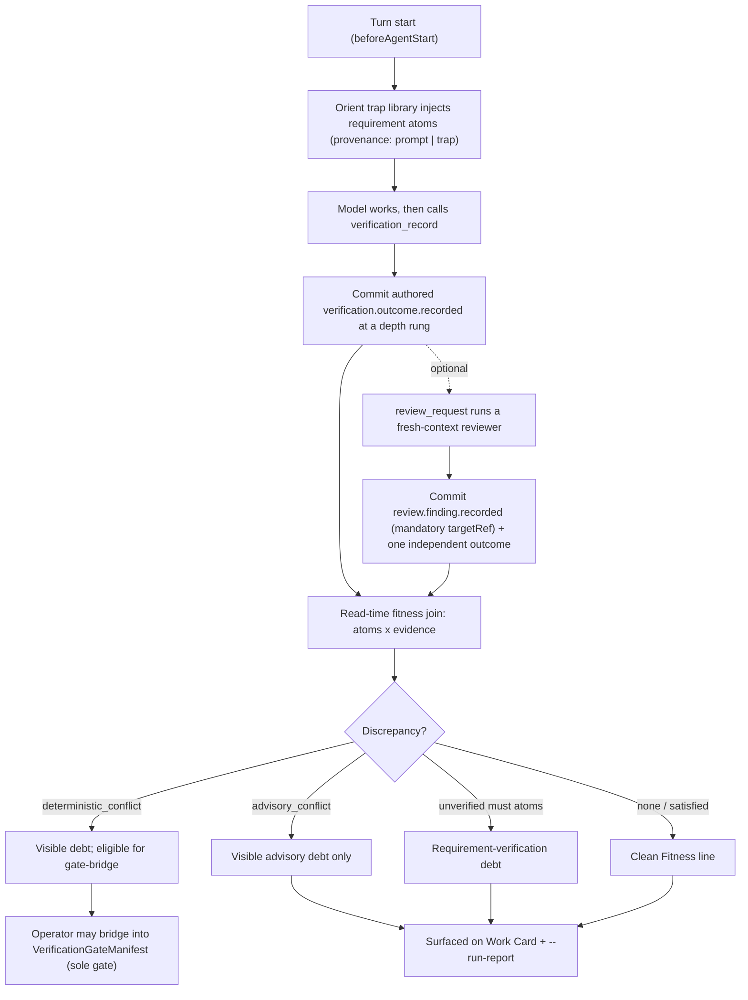

# Journey: Verification, Requirement Fitness, And Independent Review

## Audience

- operators reading Evidence, Fitness, and review-debt on the Work Card and
  `brewva inspect --run-report`
- developers reviewing the verification receipt plane, requirement atoms, the
  authored-vs-independent perspective split, and the read-time fitness join

## Entry Points

- `verification_record` (model-facing producer of the authored outcome and its
  depth rung)
- `review_request` (bounded fresh-context reviewer that commits findings plus one
  `independent` outcome)
- hosted turn `beforeAgentStart` orient-requirement injection (implicit, every
  turn; seeds requirement atoms from the trap library)
- `brewva inspect` Work Card Evidence / Fitness / review-debt lines
- `brewva inspect --run-report` Fitness and verification sections
- operator gate-bridge promotion of a recurring `deterministic_conflict` into a
  `VerificationGateManifest` (see `docs/reference/extensions.md`)

## Objective

Describe how Brewva accounts for whether work realized its intent without adding
a second blocking path: requirement atoms and verification receipts are graded
against each other into a re-derivable fitness view, an independent reviewer can
contribute an `independent`-perspective receipt a model cannot forge for itself,
and the only gate that ever blocks stays the operator-promoted
`VerificationGateManifest`.

## In Scope

- the verification depth ladder on `verification.outcome.recorded` and its
  `authored` vs `independent` perspective
- requirement atoms as task-ledger artifacts and their orient-time injection
- `review_request` findings (`review.finding.recorded`) and the independent
  outcome, including review debt
- the read-time fitness join that grades atoms × evidence into discrepancies
- run-report and Work Card surfaces that re-derive fitness over the whole tape

## Out Of Scope

- delegation lifecycle, slot budget, fan-out, and worker adoption →
  `background-and-parallelism`
- effect-commitment approval and rewind that invalidates evidence →
  `approval-and-rollback` and `inspect-replay-and-recovery`
- skill shortlisting and `discover_skills` (routing, not requirements) →
  `skill-routing-and-activation`
- the sole promoted completion gate as a runtime mechanism →
  `docs/reference/extensions.md`

## Flow

## Key Steps

1. At `beforeAgentStart` the orient trap library matches the prompt and task goal
   and records implicit domain requirements as `task.requirement.recorded` atoms
   with `provenance: "trap"`; prompt-derived atoms carry `provenance: "prompt"`.
   Injection is advisory, deduped against existing atoms, and never mutates the
   prompt or gates the turn.
2. `verification_record` is the first model-facing producer of the receipt plane.
   It commits `verification.outcome.recorded` at a depth rung
   (`exit_code -> diagnostics -> artifact -> requirements -> runtime_smoke`) and
   carries `checks`. A model cannot record itself as `independent`:
   `verification_record` has no perspective input, so its outcome is always
   `authored`.
3. `review_request` runs a bounded fresh-context reviewer and commits
   `review.finding.recorded` (with a mandatory `targetRef`) plus exactly one
   `independent` outcome carrying a non-empty `independenceBasis[]`. A finding
   with a stale or missing `targetRef` contributes nothing to a violation.
4. A pure fitness join grades requirement atoms against evidence at read time,
   producing `deterministic_conflict` or `advisory_conflict` discrepancies and an
   `unverifiedMustAtoms` set. `verification_record` annotates a `pass`@
   `requirements` receipt with these while recording the outcome exactly as
   claimed — the cross-check annotates, it never refuses.
5. Run-report's Fitness section and the Work Card line RE-DERIVE fitness over the
   whole tape via `buildTapeRequirementFitness`, not off the latest receipt, so a
   later independent atoms-review's `satisfied` half surfaces even though no
   single receipt carries it. This stores nothing new.
6. Review debt (`no_independent_receipt` / `independent_receipts_stale`) clears only
   when an independent receipt matches the tree and covers the fresh-touched file
   universe. Separately, an artifact-green run with ungraded `must` atoms carries
   requirement-verification debt (`unverified_after_requirements`) rather than a
   clean pass.
7. Only a recurring `deterministic_conflict` is eligible for an operator to bridge
   into a `VerificationGateManifest`. LLM findings and advisory conflicts gate
   nothing. The promoted manifest stays the sole blocking gate.

## Execution Semantics

- perspective is a dimension of evidence, not a workflow: `authored` and
  `independent` are different receipt kinds keyed by producer, and independence is
  structural (no perspective input on `verification_record`)
- "green" is receipt-only and latest-only for the authored outcome; fitness counts
  are a re-derivable view, not commitment memory, and are never stored
- requirement atoms, findings, discrepancies, traps, and lenses derive views, never
  authority — they add no new blocking path (design axiom 18)
- a stale or unbacked atom reads `unverified` and a contradicted pass reads as
  visible debt; the surfaces are honest rather than a fake pass/fail (axiom 7)
- a lens surfaces a stance, never asserts a defect; the precision guard lives in the
  fitness join, not in trap surfacing, and the trap library gates nothing
- act-on-review closure is the complement of review debt: review debt asks "was an
  independent read OWED"; the act-on-review advisory asks "did a review that HAPPENED
  get acted on". A `review.finding.recorded` is UNADDRESSED when the code IT flagged
  still stands — none of the files named in its `anchors` was mutated after the
  finding's own timestamp (Finding P1-A). It is ANCHOR-scoped, deliberately NOT
  whole-`targetRef`-scoped: a review usually records a whole-repo `file_digests`
  snapshot, so a whole-tree rule would clear every finding the moment the model
  touched ANY file — letting a defect ship past an unrelated edit (observed: game_8's
  keycode finding would clear when the model edited `Package.swift`, though
  `FnKeyMonitor.swift` was never fixed). An anchorless finding falls back to the coarse
  whole-tree rule. It renders at turn tail as the `review_closure` runtime-brief
  section, advisory (axiom 18, derives no gate) and self-clearing negative feedback —
  editing an anchored file ages the finding out, so the line falls silent the moment
  the model acts; it never forces a fix (a false positive is cleared by refuting or
  editing). Reads findings directly, so an unattributed finding (`atomRefs: []`) —
  invisible to the atom-keyed fitness `discrepancies` — is still counted. Deliberately
  has NO anti-nag cadence (unlike the delegation advisory): a concrete open finding
  SHOULD persist every turn until closed
- receipts, atoms, and outcomes are the durable source of truth; every read surface
  rebuilds from them and reads no filesystem (axioms 5, 6)

## Failure And Recovery

- a finding whose `targetRef` no longer matches the tree contributes nothing, so
  stale reviews cannot manufacture or clear debt
- a truncated or ungraded requirement window reports `unverified` rather than a
  fake zero-debt pass
- world-changing rewind detaches patch-set-keyed evidence, so outcomes fall to a
  `stale`/`missing` posture by consequence rather than through an
  authority-bearing event (see `inspect-replay-and-recovery`)
- a receipt or advisory surface is not considered shipped until a producer is wired
  and a liveness fitness asserts a canonical run emits it — the producer-wiring
  invariant is a critical rule, curing "organs without circulation"

## Observability

- primary surfaces:
  - `brewva inspect` Work Card Evidence / Fitness / review-debt lines
  - `brewva inspect --run-report` Fitness and verification sections (verification
    receipts versus observed verification commands: green-without-receipt is debt)
- durable receipts: `verification.outcome.recorded` (with `perspective`, `level`,
  `checks`), `review.finding.recorded` (with `targetRef`), and
  `task.requirement.recorded` atoms
- producer liveness is pinned by
  `test/fitness/hosted-tape-projection-liveness.fitness.test.ts`, which asserts a
  canonical run emits trap-sourced atoms, re-derives fitness over the real tape,
  and fires requirement-verification debt with reason `unverified_after_requirements`
- discrepancy vocabulary: `deterministic_conflict`, `advisory_conflict`. The two
  debt vocabularies are distinct: review-debt reasons are `no_independent_receipt`
  and `independent_receipts_stale` (an independent receipt is missing or no longer
  matches the tree); requirement-verification-debt reasons are
  `ladder_below_requirements` and `unverified_after_requirements` (a `must` atom is
  unverified below or after the `requirements` rung)
- act-on-review closure census: `report:delegation-evidence`'s
  `unaddressedReviewFindings` (`total` / `highOrCritical` / `unattributed`) folds the
  same live-finding read the `review_closure` brief renders. A `total` FALLING across
  an eval's turns is the found-then-fixed loop closing; a flat `total` while reviews
  keep recording findings is the found-but-shipped failure the signal exists to catch

## Code Pointers

- Authored outcome producer: `packages/brewva-tools/src/families/workflow/verification-record.ts`
- Independent reviewer tool: `packages/brewva-tools/src/families/delegation/review-request.ts`
  (packet: `packages/brewva-tools/src/families/delegation/review-request-packet.ts`)
- Review-receipt intake: `packages/brewva-tools/src/families/delegation/review-receipts.ts`
  (gateway observer: `packages/brewva-gateway/src/delegation/review-receipt-observer.ts`)
- Read-time fitness / verification port: `packages/brewva-tools/src/runtime-port/verification.ts`
- Trap library: `packages/brewva-tools/src/shared/trap-library/index.ts`
- Orient requirement injection: `packages/brewva-gateway/src/hosted/internal/session/skills/orient-requirement-injection.ts`
- Perspective receipt builder: `packages/brewva-gateway/src/hosted/internal/session/runtime-ops-builders/verification.ts`
- Requirement / review / fitness vocabulary: `packages/brewva-vocabulary/src/internal/{iteration,review,fitness,task}.ts`
- Fitness re-derive over tape: `packages/brewva-cli/src/operator/inspect/requirement-fitness.ts`
  (summary: `packages/brewva-cli/src/operator/inspect/fitness-summary.ts`)
- Review debt fold: `packages/brewva-cli/src/operator/inspect/review-debt.ts`
- Run report / Work Card: `packages/brewva-cli/src/operator/inspect/{run-report,work-card}.ts`
- Reviewer model routing: `packages/brewva-gateway/src/delegation/model-routing.ts`

## Related Docs

- Decision: `docs/research/decisions/requirement-fitness-and-independent-review.md`
- Decision: `docs/research/decisions/verification-receipt-plane-selection-feedback-and-execution-pacing.md`
- Gate-bridge recipe: `docs/reference/extensions.md`
- Tools reference (`review_request`): `docs/reference/tools.md`
- Distillation flow: `docs/guide/operator-conventions.md`
- Verifier skill and ladder: `skills/core/verifier/SKILL.md`,
  `skills/core/verifier/references/verification-ladder.md`
- Inspect and recovery: `docs/journeys/operator/inspect-replay-and-recovery.md`
- Background and parallelism: `docs/journeys/operator/background-and-parallelism.md`
- Skill routing and activation: `docs/journeys/operator/skill-routing-and-activation.md`
