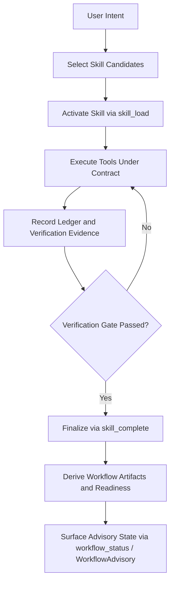

# Journey: Planning To Execution

## Objective

Move from intent to verifiable completion with explicit skill contracts.

## Key Steps

1. Select and activate a skill (`skill_load`)
2. Execute tool calls under contract constraints
3. Collect evidence and satisfy verification requirements
4. Complete the active skill with required outputs
5. Let derived workflow artifacts update planning/review/verification state
6. Use `workflow_status` or the default advisory context to inspect the current
   chain without forcing the next step

## Code Pointers

- Skill activation: `packages/brewva-runtime/src/runtime.ts`
- Load tool: `packages/brewva-tools/src/skill-load.ts`
- Completion + verification: `packages/brewva-tools/src/skill-complete.ts`
- Workflow derivation: `packages/brewva-runtime/src/workflow/derivation.ts`
- Advisory query surface: `packages/brewva-tools/src/workflow-status.ts`
