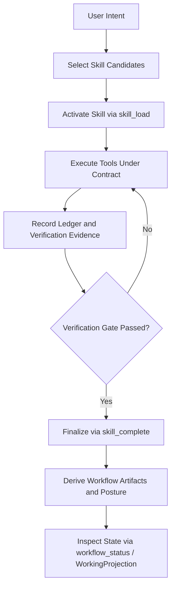

# Journey: Planning To Execution

## Objective

Move from intent to verifiable completion with explicit skill contracts.

One common public-skill chain is:

`discovery -> strategy-review -> design -> implementation -> review -> qa -> ship -> retro`

The runtime does not force this sequence. It derives advisory workflow state
and verification state while the model chooses when to move between these
skills. Workflow inspection remains explicit and pull-based; the default path
does not inject a required lane brief.

## Key Steps

1. Select and activate a skill (`skill_load`)
2. Execute tool calls under contract constraints
3. Collect evidence and satisfy verification requirements
4. Complete the active skill with required outputs
5. Let derived workflow artifacts update discovery/strategy/planning/review/QA/verification/ship state
6. Use `workflow_status` or working projection to inspect the current chain
   explicitly, without forcing the next step or injecting a planner-shaped
   default

## Code Pointers

- Skill activation: `packages/brewva-runtime/src/runtime.ts`
- Load tool: `packages/brewva-tools/src/skill-load.ts`
- Completion + verification: `packages/brewva-tools/src/skill-complete.ts`
- Workflow derivation: `packages/brewva-runtime/src/workflow/derivation.ts`
- Explicit advisory query surface: `packages/brewva-tools/src/workflow-status.ts`
