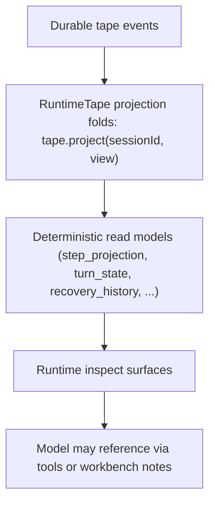

# Reference: Working Projection

## Purpose

Projection state is how durable tape events are folded into bounded, rebuildable
read models for inspection and recovery. It is `rebuildable state`, not a
`durable source of truth`.

It is distinct from the `history-view baseline`: baseline authority comes from
durable `session_compact` receipts, while projections are separate rebuildable
read models over task, claim, and workflow-facing state.

The Work Card may read projection data, but it is a product projection payload,
not a projection storage contract. It can render the active snapshot alongside
capability, verification, workbench, and continuation-anchor refs without making
any of those refs replay truth.

The interactive shell cockpit is another product projection. It composes the
Work Card, context cockpit, operator snapshot, session wire, runtime events,
cost posture, rewind targets, and operator observation cursor into a shell-local
view model. It is rebuildable UI state; it does not add storage authority to the
projections or the event tape.

The interactive shell transcript lane is bounded live UI state, not a
full-history projection. Older transcript evidence stays in explicit archive,
transcript, export, and pager surfaces.

## Session-Index Harness Projection

`HarnessTraceSnapshot` is a session-index projection over canonical tape and
hosted advisory evidence. It is stored in DuckDB table
`session_harness_trace_snapshots` and is rebuilt from events; it is not a
durable source of truth.

Schema version `7` intentionally resets older indexed rows. Rebuild is the
compatibility strategy because the event tape remains authoritative and Harness
snapshot rows are derived state.

Trace patrol reads these snapshots and emits pattern candidates. Candidate
reports remain explicit-pull control-plane artifacts; they do not mutate
runtime prompt construction, provider routing, recall ranking, skill
selection, or tool policy.

## Runtime Behavior

## Runtime Flow

1. The runtime writes events to tape first.
2. Projections are pure deterministic folds over those events:
   `tape.project(sessionId, name)` recomputes a read model on demand from the
   canonical event stream. There is no projection-engine ingest step, no
   append-only unit log, and no resolve-directive lifecycle.
3. Inspect surfaces expose the folded read model, recomputed from tape.
4. Work Card renderers may include active snapshot refs, but opening them does
   not refresh recall, capability selection, provider routing, or model context
   materialization.
5. The shell cockpit may link visible refs into archive/detail overlays, but
   opening those overlays is explicit-pull inspection and does not materialize
   model-visible context.

## Artifacts

- Per-session working file (config `projection.workingFile`, default
  `working.md`, under `projection.dir`, default `.orchestrator/projection`):
  `<projection.dir>/sessions/sess_<base64url(sessionId)>/<projection.workingFile>`.
  It is read by `brewva inspect` when present, but no runtime path writes it
  today — treat it as a defined-but-currently-unwritten artifact. Projection
  correctness does not depend on it.
- Projections themselves are not persisted unit logs; they are recomputed from
  tape on demand.

## Invariants

- projections are `rebuildable state`, not a `durable source of truth`
- the durable source of truth remains tape events, receipts, and authoritative
  task, claim, and schedule events
- projections do not own history rewrite authority; that belongs to the
  receipt-derived history-view baseline
- projection read models are optional rebuildable helpers, not hydration
  prerequisites; removing any projection file must not change replay correctness
- projection entries are keyed by source identity, not by heuristic importance
  classes
- shell cockpit projection is a renderer-facing view model, not a storage
  artifact, planner memory, or model-visible context input
- shell transcript retention is renderer-local live policy and does not define a
  public projection budget or a durable history boundary
- projection source admission is locked by
  `test/fitness/runtime-projection-admission.fitness.test.ts`; new projection
  code must keep its dependency closure free of gateway hosted internals,
  provider packages, tool families, and runtime root/operator port contracts

## Code Pointers

- Tape projection folds and replay baseline:
  `packages/brewva-runtime/src/runtime/tape/impl.ts` (`tape.project`,
  `replayBaseline`); view contract in
  `packages/brewva-runtime/src/runtime/tape/port.ts` (`TapeViewName`)
- Session-index harness projection:
  `packages/brewva-session-index/src/projection/harness.ts`
- Runtime construction: `packages/brewva-runtime/src/runtime/runtime.ts`
- Hosted dynamic context:
  `packages/brewva-gateway/src/hosted/internal/context/workbench-context.ts`

## Related Docs

- Runtime API: `docs/reference/runtime.md`
- Artifacts and paths: `docs/reference/artifacts-and-paths.md`
- Context and compaction: `docs/journeys/internal/context-and-compaction.md`
