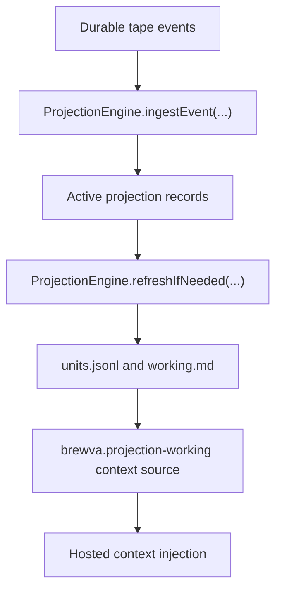

# Reference: Working Projection

## Purpose

`working projection` defines how the projection engine folds durable tape events
into a bounded working snapshot and exposes that snapshot through the
`brewva.projection-working` context source for the hosted context path.

It is `rebuildable state`, not a `durable source of truth`.

## Runtime Behavior

## Runtime Flow

1. The runtime writes events to tape first.
2. `ProjectionEngine.ingestEvent(...)` extracts deterministic, source-backed
   records from those events.
3. `ProjectionEngine.refreshIfNeeded(...)` builds a bounded working snapshot
   from active projection records.
4. The snapshot is persisted under `.orchestrator/projection/...` for
   `brewva.projection-working`.
5. If projection cache files are missing, the runtime rebuilds them on demand
   from durable tape.

## Rebuildable Artifacts

- `.orchestrator/projection/units.jsonl`
- `.orchestrator/projection/sessions/sess_<base64url(sessionId)>/working.md`
- `.orchestrator/projection/state.json`

## Invariants

- working projection is a projection, not a `durable source of truth`
- the durable source of truth remains tape events, receipts, and authoritative task,
  truth, and schedule events
- projection files are optional rebuildable helpers, not hydration
  prerequisites
- checkpoint projection state stores metadata only, not a restorable semantic
  unit snapshot
- projection entries are keyed by source identity, not by heuristic importance
  classes
- working projection is a bounded working snapshot, not planner memory and not
  a default injected workflow brief

## Code Pointers

- Projection engine: `packages/brewva-runtime/src/projection/engine.ts`
- Projection extractor: `packages/brewva-runtime/src/projection/extractor.ts`
- Runtime API: `packages/brewva-runtime/src/runtime.ts`
- Hosted context composition: `packages/brewva-gateway/src/runtime-plugins/context-composer.ts`

## Related Docs

- Runtime API: `docs/reference/runtime.md`
- Artifacts and paths: `docs/reference/artifacts-and-paths.md`
- Context and compaction: `docs/journeys/internal/context-and-compaction.md`
