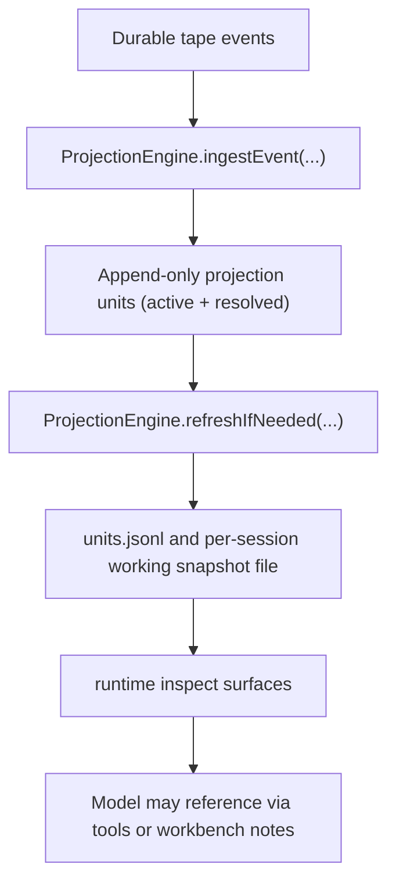

# Reference: Working Projection

## Purpose

`working projection` defines how the projection engine folds durable tape events
into a bounded rebuildable snapshot for inspection and recovery.

It is `rebuildable state`, not a `durable source of truth`.

It is also distinct from the `history-view baseline`: baseline authority comes
from durable `session_compact` receipts, while working projection is a separate
rebuildable execution snapshot for task, claim, and workflow-facing context.

The Work Card may read working projection data, but it is a product projection
payload, not the working projection storage contract. It can render the active
snapshot alongside capability, verification, workbench, and continuation-anchor
refs without making any of those refs replay truth.

The interactive shell cockpit is another product projection. It composes the
Work Card, context cockpit, operator snapshot, session wire, runtime events,
cost posture, rewind targets, and operator observation cursor into a
shell-local view model. It is rebuildable UI state; it does not add storage
authority to the working projection or event tape.

The interactive shell transcript lane is bounded live UI state, not a
full-history projection. Older transcript evidence stays in explicit archive,
transcript, export, and pager surfaces.

## Session-Index Harness Projection

`HarnessTraceSnapshot` is a session-index projection over canonical tape and
hosted advisory evidence. It is stored in DuckDB table
`session_harness_trace_snapshots` and is rebuilt from events; it is not a
durable source of truth.

Schema version `7` intentionally resets older indexed rows. Rebuild is the
compatibility strategy because the event tape remains authoritative and Harness
snapshot rows are derived state.

Trace patrol reads these snapshots and emits pattern candidates. Candidate
reports remain explicit-pull control-plane artifacts; they do not mutate
runtime prompt construction, provider routing, recall ranking, skill
selection, or tool policy.

## Runtime Behavior

## Runtime Flow

1. The runtime writes events to tape first.
2. `ProjectionEngine.ingestEvent(...)` extracts deterministic, source-backed
   records from those events and appends them to `units.jsonl`.
3. Resolve directives mark stale units as `status="resolved"` in the append-only
   unit log; they do not delete historical rows.
4. `ProjectionEngine.refreshIfNeeded(...)` builds a bounded working snapshot
   from the `active` subset only.
5. Inspect surfaces expose the runtime-refreshed active snapshot, not the full
   projection-unit log.
6. Work Card renderers may include active snapshot refs, but opening them does
   not refresh recall, capability selection, provider routing, or model context
   materialization.
7. The shell cockpit may link visible refs into archive/detail overlays, but
   opening those overlays is explicit-pull inspection and does not materialize
   model-visible context.
8. The per-session working snapshot file (config `projection.workingFile`,
   default `working.md`) is a write-through artifact persisted under
   `.orchestrator/projection/...`; it mirrors the current snapshot but is not
   the reload source for `brewva.projection-working`.
9. If the in-memory working snapshot is absent,
   `ProjectionEngine.refreshIfNeeded(...)` recomputes it from persisted
   projection units when those units already exist.
10. If projection units for the session are also absent, runtime replays
    durable tape events to rebuild projection state, then refreshes the working
    snapshot.

## Rebuildable Artifacts

- `.orchestrator/projection/units.jsonl`
- `.orchestrator/projection/sessions/sess_<base64url(sessionId)>/<projection.workingFile>`
- `.orchestrator/projection/state.json` metadata (`schemaVersion`,
  `lastProjectedAt`), not a restorable working snapshot

## Invariants

- working projection is a projection, not a `durable source of truth`
- the durable source of truth remains tape events, receipts, and authoritative task,
  claim, and schedule events
- working projection does not own history rewrite authority; that belongs to
  the receipt-derived history-view baseline
- projection files are optional rebuildable helpers, not hydration
  prerequisites
- the per-session working snapshot file (default `working.md`) is a
  write-through artifact, not a reload source of truth; on restart the runtime
  recomputes the working snapshot from projection state (or tape replay when
  projection state is absent)
- checkpoint projection state stores metadata only, not a restorable semantic
  unit snapshot
- `units.jsonl` is an append-only recovery log; resolved units remain on disk as
  `status="resolved"` entries instead of being deleted
- projection entries are keyed by source identity, not by heuristic importance
  classes
- working projection is a bounded working snapshot, not planner memory and not
  a default injected workflow brief
- shell cockpit projection is a renderer-facing view model, not a working
  projection artifact, planner memory, or model-visible context input
- shell transcript retention is renderer-local live policy and does not define
  a public projection budget or a durable history boundary
- the per-session working snapshot file and `brewva.projection-working`
  materialize only the current `active` subset, not the full unit log
- workflow projection convergence is driven by `projection_group` resolves that
  mark stale `workflow_artifact:*` keys resolved; it does not truncate older
  rows from the append-only log
- projection source admission is locked by
  `test/fitness/runtime-projection-admission.fitness.test.ts`; new projection
  files must update that allowlist, and the relative TypeScript dependency
  closure must not import gateway hosted internals, provider packages, tool
  families, or runtime root/operator port contracts

## Code Pointers

- Projection engine: `packages/brewva-runtime/src/runtime/tape/impl.ts`
- Projection extractor: `packages/brewva-runtime/src/runtime/tape/impl.ts`
- Runtime API: `packages/brewva-runtime/src/runtime/runtime.ts`
- Hosted dynamic context: `packages/brewva-gateway/src/hosted/internal/context/workbench-context.ts`

## Related Docs

- Runtime API: `docs/reference/runtime.md`
- Artifacts and paths: `docs/reference/artifacts-and-paths.md`
- Context and compaction: `docs/journeys/internal/context-and-compaction.md`
