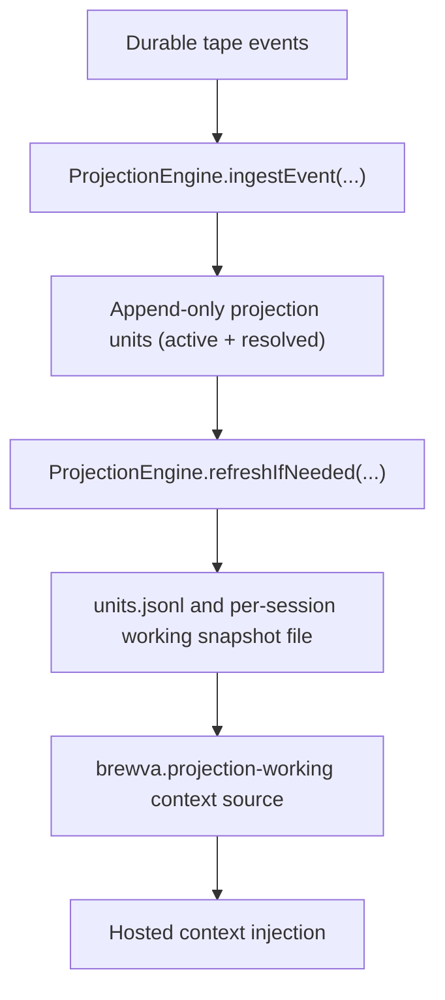

# Reference: Working Projection

## Purpose

`working projection` defines how the projection engine folds durable tape events
into a bounded working snapshot and exposes that snapshot through the
`brewva.projection-working` context source for the hosted context path.

It is `rebuildable state`, not a `durable source of truth`.

It is also distinct from the `history-view baseline`: baseline authority comes
from durable `session_compact` receipts, while working projection is a separate
rebuildable execution snapshot for task, truth, and workflow-facing context.

## Runtime Behavior

## Runtime Flow

1. The runtime writes events to tape first.
2. `ProjectionEngine.ingestEvent(...)` extracts deterministic, source-backed
   records from those events and appends them to `units.jsonl`.
3. Resolve directives mark stale units as `status="resolved"` in the append-only
   unit log; they do not delete historical rows.
4. `ProjectionEngine.refreshIfNeeded(...)` builds a bounded working snapshot
   from the `active` subset only.
5. `brewva.projection-working` exposes the runtime-refreshed active snapshot,
   not the full projection-unit log.
6. The per-session working snapshot file (config `projection.workingFile`,
   default `working.md`) is a write-through artifact persisted under
   `.orchestrator/projection/...`; it mirrors the current snapshot but is not
   the reload source for `brewva.projection-working`.
7. If the in-memory working snapshot is absent,
   `ProjectionEngine.refreshIfNeeded(...)` recomputes it from persisted
   projection units when those units already exist.
8. If projection units for the session are also absent, runtime replays
   durable tape events to rebuild projection state, then refreshes the working
   snapshot.

## Rebuildable Artifacts

- `.orchestrator/projection/units.jsonl`
- `.orchestrator/projection/sessions/sess_<base64url(sessionId)>/<projection.workingFile>`
- `.orchestrator/projection/state.json` metadata (`schemaVersion`,
  `lastProjectedAt`), not a restorable working snapshot

## Invariants

- working projection is a projection, not a `durable source of truth`
- the durable source of truth remains tape events, receipts, and authoritative task,
  truth, and schedule events
- working projection does not own history rewrite authority; that belongs to
  the receipt-derived history-view baseline
- projection files are optional rebuildable helpers, not hydration
  prerequisites
- the per-session working snapshot file (default `working.md`) is a
  write-through artifact, not a reload source of truth; on restart the runtime
  recomputes the working snapshot from projection state (or tape replay when
  projection state is absent)
- checkpoint projection state stores metadata only, not a restorable semantic
  unit snapshot
- `units.jsonl` is an append-only recovery log; resolved units remain on disk as
  `status="resolved"` entries instead of being deleted
- projection entries are keyed by source identity, not by heuristic importance
  classes
- working projection is a bounded working snapshot, not planner memory and not
  a default injected workflow brief
- the per-session working snapshot file and `brewva.projection-working`
  materialize only the current `active` subset, not the full unit log
- workflow projection convergence is driven by `projection_group` resolves that
  mark stale `workflow_artifact:*` keys resolved; it does not truncate older
  rows from the append-only log

## Code Pointers

- Projection engine: `packages/brewva-runtime/src/projection/engine.ts`
- Projection extractor: `packages/brewva-runtime/src/projection/extractor.ts`
- Runtime API: `packages/brewva-runtime/src/runtime.ts`
- Hosted context composition: `packages/brewva-gateway/src/runtime-plugins/context-composer.ts`

## Related Docs

- Runtime API: `docs/reference/runtime.md`
- Artifacts and paths: `docs/reference/artifacts-and-paths.md`
- Context and compaction: `docs/journeys/internal/context-and-compaction.md`
